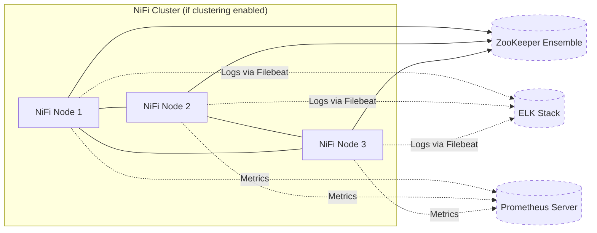

# apache_nifi Ansible Role

**Table of Contents**

* [Overview](#overview)
* [Supported Operating Systems/Platforms](#supported-operating-systemsplatforms)
* [Role Variables](#role-variables)
* [Tags](#tags)
* [Dependencies](#dependencies)
* [Example Playbook](#example-playbook)
* [Testing Instructions](#testing-instructions)
* [Known Issues and Gotchas](#known-issues-and-gotchas)
* [Security Implications](#security-implications)

## Overview

This role installs and configures **Apache NiFi**, a powerful data flow management system. It handles all tasks needed to get NiFi running on a target host, including installing NiFi binaries, setting up the service user, configuring NiFi for standalone or cluster mode, and integrating with optional monitoring and logging components. Key features of this role include:

* **Flexible installation methods:** Supports installing NiFi via OS packages (APT) or by downloading the tarball. By default, it uses the **package** method for Debian/Ubuntu systems, but you can switch to **tarball** if needed.
* **Cluster (HA) support:** Easily deploy NiFi in a cluster. When configured for clustering, NiFi nodes will automatically join a cluster using **ZooKeeper** for coordination. The role sets the necessary cluster properties (node mode, cluster communication port, ZooKeeper connection string).
* **Security and TLS:** Out-of-the-box, the role is geared for secure deployments. NiFi is configured to run over **HTTPS** (TLS) by default, with placeholders for keystore and truststore files. It also sets up NiFi to use **LDAP** for user authentication (via NiFi’s login identity provider). You can adjust these settings to fit your environment (or disable TLS for a quick development setup).
* **Logging (ELK) integration:** Optionally integrate NiFi with the **Elastic Stack (ELK)**. If enabled, the role will install and configure **Filebeat** on the NiFi host to ship NiFi logs to your ELK stack. This helps centralize logs for monitoring and analysis.
* **Metrics (Prometheus) integration:** Prepares for integration with **Prometheus** monitoring. When enabled, NiFi can be configured (outside this role) to expose metrics that Prometheus can scrape or receive. The role includes a toggle for Prometheus integration, allowing for future expansion or custom hooks.
* **System setup:** Ensures required dependencies and best practices. The role will install **OpenJDK 11** (NiFi’s runtime dependency) if not present, create a dedicated **`nifi`** system user and group (with no login shell) to run the service, and set appropriate file permissions on NiFi directories. Configuration files are templated for NiFi’s properties and security settings, and a service (if using package install) will be ready to manage NiFi.

Overall, this role aims to be **idempotent** and robust. Running it multiple times should result in the same system state (no unwanted changes if NiFi is already configured), making it safe for repeated use (e.g., in CI/CD or as part of a larger play). It allows extensive customization via variables while providing sane defaults for a typical NiFi deployment.

> **Diagram:** The following diagram illustrates a typical deployment scenario using this role, with NiFi in a cluster of nodes and optional integrations. NiFi nodes use ZooKeeper to coordinate in a cluster, and can send logs to ELK and expose metrics to Prometheus if those integrations are enabled.



*(In the above, ZooKeeper is required only for clustered NiFi. ELK and Prometheus components are optional and not installed by this role — see Integration sections.)*

## Supported Operating Systems/Platforms

This role is tested on and supported with the following Linux distributions (64-bit):

* **Debian** – 11 (Bullseye) and 12 (Bookworm)
* **Ubuntu** – 20.04 LTS (Focal Fossa) and 22.04 LTS (Jammy Jellyfish)

> **Note:** The target hosts must be Debian/Ubuntu systems because NiFi installation (especially the package method) is tailored to Debian-based package management. Red Hat/CentOS or other OS families are *not* directly supported by this role. NiFi itself is a Java application and could run on many systems, but you would need to adapt the role or use a different approach for non-Debian OS.

## Role Variables

Below is a list of important variables for this role, along with their default values (defined in **`defaults/main.yml`**) and descriptions:

<!-- markdownlint-disable MD033 -->

<details>
<summary>Role Variables (defaults)</summary>

| Variable                           | Default Value                                                                         | Description                                                                                                                                                                                                                                                                                                                                                                                                                                                                                                                   |
| ---------------------------------- | ------------------------------------------------------------------------------------- | ----------------------------------------------------------------------------------------------------------------------------------------------------------------------------------------------------------------------------------------------------------------------------------------------------------------------------------------------------------------------------------------------------------------------------------------------------------------------------------------------------------------------------- |
| **`nifi_version`**                 | `"2.0.0"`                                                                             | Version of Apache NiFi to install. By default, this role installs NiFi 2.0.0. You can change this to any available version. Ensure the version you specify is available for the chosen install method (package or tarball).                                                                                                                                                                                                                                                                                                   |
| **`nifi_install_method`**          | `"package"`                                                                           | Installation method for NiFi. Options are `"package"` or `"tarball"`. <br>- **package:** (Default) Installs NiFi using an OS package manager (APT). This assumes a NiFi `.deb` package is obtainable (see **Known Issues** regarding the default repo). <br>- **tarball:** Downloads NiFi as a tar.gz archive and extracts it to `nifi_home`. Use tarball if an apt package is not available or if you prefer a manual installation.                                                                                          |
| **`nifi_use_apt_repo`**            | `true`                                                                                | Whether to add the NiFi APT repository (defined by `nifi_apt_repo`) to the system before installing. If `true`, the role will configure an apt source for NiFi. If `false`, it assumes you have already set up the NiFi package source (or you’ll use tarball install). Typically keep this `true` when using `nifi_install_method: "package"`.                                                                                                                                                                               |
| **`nifi_apt_repo`**                | `"deb [trusted=yes] https://archive.apache.org/dist/nifi/{{ nifi_version }}/bin/ ./"` | The APT repository source for NiFi packages. By default, this points to Apache’s official NiFi release directory for the specified version. The `trusted=yes` flag is used to allow installing without GPG signature verification (since the Apache archive may not provide a signed Release file). If you maintain an internal mirror or repository for NiFi, you can override this URL.                                                                                                                                     |
| **`nifi_user`**                    | `nifi`                                                                                | The system username under which NiFi will run. The role will create this user if it doesn’t exist. NiFi files and processes will be owned by this user. You can change it if needed (e.g., to comply with a naming convention), but ensure it’s a non-privileged account.                                                                                                                                                                                                                                                     |
| **`nifi_group`**                   | `nifi`                                                                                | The system group name for NiFi. The role creates this group and puts the `nifi_user` in it. File permissions on NiFi directories will reference this group.                                                                                                                                                                                                                                                                                                                                                                   |
| **`nifi_home`**                    | `/opt/nifi`                                                                           | The installation directory for NiFi. All NiFi program files will reside here. If using the tarball method, NiFi will be extracted into this path. If using the package method, the .deb might also install NiFi into this location (or create a symlink) depending on how it’s built. You can adjust this path if needed (e.g., to use a different volume or directory structure).                                                                                                                                            |
| **`nifi_conf_dir`**                | `"{{ nifi_home }}/conf"`                                                              | The configuration directory for NiFi. NiFi’s config files (nifi.properties, bootstrap.conf, etc.) will be placed here. If you change `nifi_home`, this will automatically change unless you explicitly override it.                                                                                                                                                                                                                                                                                                           |
| **`nifi_cluster_enabled`**         | `false`                                                                               | Whether to enable NiFi cluster mode. **Set this to `true` if deploying multiple NiFi nodes as a cluster.** When `true`, the role will configure cluster settings in nifi.properties (e.g., enabling node mode and setting the cluster protocol). You must also provide `nifi_zookeeper_connect` and ensure a ZooKeeper service is available (the role does not install ZooKeeper itself).                                                                                                                                     |
| **`nifi_zookeeper_connect`**       | *Empty string* `""`                                                                   | The connection string for the ZooKeeper ensemble (required if NiFi is clustered). Format is a comma-separated list of host\:port pairs, e.g., `"zk1.example.com:2181,zk2.example.com:2181,zk3.example.com:2181"`. Each NiFi node will use this to connect to ZooKeeper. **This must be set when `nifi_cluster_enabled: true`.** Leave it empty for standalone (non-clustered) NiFi.                                                                                                                                           |
| **`nifi_cluster_protocol_port`**   | `11443`                                                                               | The TCP port that NiFi nodes use to communicate with each other in a cluster (for the cluster coordination protocol). This port should be open between all NiFi nodes (firewall/internal network) but typically does not need to be exposed to users. If 11443 is in use or needs to be changed, update this to an appropriate free port. This is only relevant when NiFi is clustered.                                                                                                                                       |
| **`nifi_enable_https`**            | `true`                                                                                | Whether to run NiFi in HTTPS mode. Default is `true` for security (encrypted communication and authentication). When `true`, NiFi will listen on `nifi_secure_port` and expect valid keystore/truststore files for TLS. If set to `false`, NiFi will run in HTTP mode on `nifi_listen_port` and **no user authentication** will be required (NiFi runs insecurely). Disable HTTPS **only for testing or internal/trusted environments**.                                                                                      |
| **`nifi_listen_port`**             | `8080`                                                                                | The HTTP port NiFi will listen on if `nifi_enable_https` is `false`. Default 8080. This port is ignored when NiFi is running in HTTPS mode. You can change it if 8080 is not suitable (or if running multiple NiFi instances on one host in dev scenarios).                                                                                                                                                                                                                                                                   |
| **`nifi_secure_port`**             | `9443`                                                                                | The HTTPS port NiFi will listen on if `nifi_enable_https` is `true`. Default 9443. You may change this if needed (for example, if 9443 conflicts with another service or if you want a standard port like 443 behind a reverse proxy). Make sure to also update firewall rules to allow this port for legitimate users.                                                                                                                                                                                                       |
| **`nifi_keystore_path`**           | `"{{ nifi_conf_dir }}/keystore.jks"`                                                  | Filesystem path to NiFi’s Java keystore file (JKS format) containing NiFi’s server certificate and private key for TLS. By default, it’s expected to be in NiFi’s conf dir as `keystore.jks`. **You must provide/populate this file** if running in HTTPS mode. (The role does not generate certificates.) You can override this path to point to a pre-existing keystore in a different location.                                                                                                                            |
| **`nifi_keystore_password`**       | `changeme`                                                                            | Password for the NiFi keystore. Default is `"changeme"` (a common default in NiFi docs), which **should be changed** for production. You can supply a secure value (consider using Ansible Vault to encrypt it). NiFi will use this password to open the keystore at startup.                                                                                                                                                                                                                                                 |
| **`nifi_truststore_path`**         | `"{{ nifi_conf_dir }}/truststore.jks"`                                                | Filesystem path to NiFi’s Java truststore file (JKS format) containing certificates of trusted CAs or other NiFi nodes. Defaults to `truststore.jks` in the NiFi conf dir. If your NiFi needs to trust a custom Certificate Authority (for incoming client certs or node certs), put that CA cert in this truststore. In many LDAP auth setups, this may contain your LDAP server’s CA if using LDAPS, etc. This file must exist if running NiFi in HTTPS mode.                                                               |
| **`nifi_truststore_password`**     | `changeme`                                                                            | Password for the NiFi truststore. Default `"changeme"`. Like the keystore password, you should change this to a secure value in real deployments. If you place a custom truststore, ensure the password here matches it.                                                                                                                                                                                                                                                                                                      |
| **`nifi_ldap_url`**                | *Empty string* `""`                                                                   | URL of the LDAP server for NiFi authentication (if using LDAP integration). Example: `"ldaps://ldap.example.com:636"` or `"ldap://ldap.example.com:389"`. If left blank, NiFi’s LDAP provider config will be incomplete – NiFi will not be able to authenticate users via LDAP. **Required** if you want NiFi to authenticate users. Use the `ldaps://` scheme for secure LDAP.                                                                                                                                               |
| **`nifi_ldap_bind_dn`**            | *Empty string* `""`                                                                   | The Distinguished Name of the user NiFi should bind as when searching the LDAP directory, e.g., `"CN=NiFi Service Account,OU=Users,DC=example,DC=com"`. This is needed if your LDAP requires authentication to search for users. Leave blank if anonymous bind is allowed (not common in production). Make sure this DN has permissions to read the user entries.                                                                                                                                                             |
| **`nifi_ldap_bind_password`**      | *Empty string* `""`                                                                   | Password for the above bind DN. This will be stored in plain text in NiFi’s config (see Security Implications). Use Ansible Vault or other means to keep it secure on the Ansible side. Leave blank if `nifi_ldap_bind_dn` is blank or if no password is needed for LDAP bind.                                                                                                                                                                                                                                                |
| **`nifi_ldap_user_search_base`**   | *Empty string* `""`                                                                   | The base DN under which user accounts are searched in LDAP. For example, `"OU=Users,DC=example,DC=com"`. NiFi will search within this base for user entries. Required for LDAP auth to work – must be set to your directory’s user OU/container. Leave blank if not using LDAP auth.                                                                                                                                                                                                                                          |
| **`nifi_ldap_user_search_filter`** | *Empty string* `""`                                                                   | LDAP search filter for finding a user by username. NiFi uses `{0}` in place of the username. For example, `"(sAMAccountName={0})"` for Active Directory, or `"(uid={0})"` for OpenLDAP. Must be set appropriately for NiFi to locate users in your directory. Leave blank if not using LDAP auth.                                                                                                                                                                                                                             |
| **`nifi_admin_identity`**          | *Empty string* `""`                                                                   | The *identity of the initial NiFi admin user*. This is typically a full DN or username that NiFi will recognize via the configured login identity provider. On first startup, NiFi grants this identity administrative privileges. **It is crucial to set this** to an actual user you control (usually your admin account in LDAP, or a specific NiFi admin service identity). If left empty, and NiFi security is on, you may not have any admin user by default. Example value: `"CN=NiFi Admin,OU=IT,DC=example,DC=com"`. |
| **`nifi_elk_integration`**         | `false`                                                                               | Whether to enable integration with an ELK (Elastic) stack for log forwarding. If `true`, this role will include tasks to install Filebeat (via the Elastic-provided role) and deploy a NiFi-specific Filebeat config to send NiFi logs to your ELK. Requires that the `elastic.filebeat` role is available. When `false`, no log shipping integration is performed (NiFi will still log locally to files).                                                                                                                    |
| **`nifi_prometheus_integration`**  | `false`                                                                               | Whether to enable integration with Prometheus for metrics. If `true`, you *intend* to expose or collect NiFi metrics for Prometheus. **Note:** Currently, this role does not configure NiFi’s internal metrics reporting (it’s a placeholder for future use or custom extension). To actually use Prometheus integration, you may need to manually configure a Prometheus reporter in NiFi or run a Prometheus JMX exporter. When `false`, no Prometheus-related changes are made.                                            |

</details>
<!-- markdownlint-enable MD033 -->

Most of the above variables can be left at defaults for a basic installation, but **secure and cluster setups require specific configuration**:

* When **enabling cluster mode** (`nifi_cluster_enabled: true`), you **must** set `nifi_zookeeper_connect` to point to your ZooKeeper nodes. Without ZooKeeper, NiFi nodes cannot form a cluster. Ensure the `nifi_cluster_protocol_port` is open between the NiFi nodes and that ZooKeeper is running and reachable.
* When running NiFi in **secure mode** (HTTPS, which is the default), you need to provide a valid keystore (`nifi_keystore_path` file with a certificate and key) and set `nifi_admin_identity` and LDAP settings so that at least one user can log in. If these are not provided, NiFi’s UI will not be accessible (or you will have no admin user to start managing NiFi).
* If you prefer to run NiFi **in unsecured mode** for testing, set `nifi_enable_https: false`. This will allow NiFi to start up without requiring certificates or authentication, but **use it only in isolated dev environments** since it opens NiFi to anyone who can access the port.
* The **ELK and Prometheus integration** toggles (`nifi_elk_integration`, `nifi_prometheus_integration`) are optional. Leave them `false` if you don’t intend to set up log shipping or metrics collection. If you enable them, read the relevant sections below (Dependencies and Gotchas) to ensure the external components (Filebeat/Elastic, Prometheus) are properly in place.

## Tags

This role defines several Ansible tags that can be used to run or skip subsets of tasks:

* **`nifi`** – A general tag applied to *all tasks* in this role. (You can use `--tags nifi` to run the role tasks, though simply including the role has the same effect. More practically, you might use `--skip-tags nifi` in combination with other tags to skip all NiFi tasks when running a larger playbook.)
* **`java`** – Tags the task that installs Java (OpenJDK 11). Use this if you want to specifically run or skip Java installation. For example, `--skip-tags java` if you already manage Java elsewhere.
* **`users`** – Tags the tasks that create the NiFi **unix user and group** accounts. You might skip these if those accounts are pre-created, or run only these if debugging permission issues.
* **`repo`** – Tags the task that adds the NiFi APT repository. Useful if you want to isolate repository setup or skip it (e.g., `--skip-tags repo` if you have already added the repo externally).
* **`install`** – Tags the tasks responsible for **installing NiFi** (either via apt package or tarball download/extraction). Running with `--tags install` will perform NiFi installation steps (along with prerequisites like repo, if not skipped).
* **`permissions`** – Tags the task that fixes ownership/permissions on NiFi installation directory. You normally wouldn’t run this alone, but it’s tagged for completeness. It ensures `nifi:nifi` owns all files under `nifi_home`.
* **`config`** – Tags the tasks that deploy NiFi configuration files (nifi.properties, bootstrap.conf, authorizers.xml, login-identity-providers.xml). Use `--tags config` to apply config templates without reinstalling, for example if you changed a setting.
* **`elk`** – Tags the tasks related to ELK integration. This includes calling the Filebeat role and placing the Filebeat config for NiFi. You can run `--tags elk` if you only want to (re)configure log shipping, or `--skip-tags elk` to avoid touching Filebeat even if `nifi_elk_integration` is true.

All tasks run by default when you run the role (you do **not** need to specify any tags explicitly to get normal behavior). These tags are provided to help in situations where you want to run a portion of the role or explicitly skip certain parts. For example, if you set `nifi_elk_integration: true` but temporarily don’t want to run the Filebeat-related steps, you could run your play with `--skip-tags elk`.

## Dependencies

**Ansible Collections / Roles:**

* **Ansible version** – This role requires **Ansible 2.11+** (and has been tested on 2.13 and above). It makes use of newer syntax and modules introduced around Ansible 2.11. Please ensure your Ansible controller is up to date.
* **External role: Filebeat** – If `nifi_elk_integration` is enabled, this role depends on the **Elastic Filebeat** Ansible role being available. The task `include_role: name=elastic.filebeat` is used to install Filebeat. You should install this role (for example, via Ansible Galaxy) before running the NiFi role with ELK integration. Typically, you can do:

  ```bash
  ansible-galaxy install elastic.filebeat
  ```

  (Alternatively, include it in a `requirements.yml` for your project.) This will provide the `elastic.filebeat` role that sets up Filebeat on Debian/Ubuntu.
* **No built-in collection requirements** – All modules used (e.g., `apt`, `apt_repository`, `unarchive`, etc.) are part of Ansible’s built-in modules (or the `ansible.builtin` namespace). You do not need additional collections like `community.general` for core functionality of this role.
* **ZooKeeper** – NiFi clustering requires a running ZooKeeper ensemble. **This role does *not* install ZooKeeper.** You should deploy ZooKeeper separately (e.g., using another role or play). If you have a ZooKeeper Ansible role (for instance, a `zookeeper_role` in this repository or a Galaxy role), use it to set up the ZK nodes prior to running the NiFi cluster setup. Ensure the `nifi_zookeeper_connect` string in your variables matches the hosts of your ZK ensemble.
* **Prometheus server** – If you plan to enable `nifi_prometheus_integration` and collect NiFi metrics, you will need a Prometheus server (and optionally Grafana) set up separately. You can use the provided **`prometheus`** role in this repository to install a Prometheus server, and configure it to scrape or receive NiFi metrics. (Note that additional NiFi configuration might be needed to actually expose metrics, as discussed later.)

**External Packages:**

* **Java JDK** – NiFi runs on the Java Virtual Machine. This role will install **OpenJDK 11** on the target by default (using the system package `openjdk-11-jdk`). Ensure your package repositories are available and can provide this. If you need a different Java version, you may have to customize the role (the package name is currently hard-coded).
* **NiFi Binaries** – The role will download NiFi either via apt or via direct URL for tarball. By default it pulls from `archive.apache.org` (the Apache Software Foundation archive). **Internet connectivity on the target hosts** is required to fetch these files (and to retrieve the apt repository metadata). If your servers cannot access the internet, you should supply the NiFi installer via other means (e.g., host the NiFi package on an internal repo, or download the tarball to an accessible location and adjust `nifi_apt_repo` or the download URL accordingly).
* **Filebeat (optional)** – If using ELK integration, the Filebeat role will install the Filebeat package, which typically comes from Elastic’s apt repository. The Filebeat role should handle adding the repo and installing the package, but keep in mind this also requires internet access (or prior setup of Elastic’s repositories internally).

Apart from the above, there are no other role dependencies. The **meta/main.yml** of this role does not list any required Ansible Galaxy roles or collections, meaning you only need to ensure the external Filebeat role (for ELK) is present when you want that integration. Everything else (like ensuring Apache NiFi service installation and configuration) is self-contained.

## Example Playbook

Here is an example of how to use the `apache_nifi` role in a playbook. This example sets up a single NiFi instance in an unsecured mode (for simplicity):

```yaml
- hosts: nifi_nodes
  become: yes
  vars:
    nifi_enable_https: false   # Disable HTTPS for a quick setup (NiFi will run on HTTP port 8080 with no authentication)
  roles:
    - apache_nifi
```

In the above play, we target hosts in the `nifi_nodes` group and apply the `apache_nifi` role. We set `nifi_enable_https: false` to run NiFi without TLS, which means NiFi’s UI will be accessible at **http://<host>:8080** without login. This configuration is suitable for a development or testing environment where convenience matters more than security. **Do not use unsecured NiFi in production.**

For a production-ready deployment, you would **enable HTTPS and configure LDAP authentication**. For example, in your inventory or playbook vars you might set:

* `nifi_keystore_path`, `nifi_truststore_path` and their passwords to point to actual JKS files containing your NiFi server certificate and trusted CA.
* `nifi_admin_identity` to the DN of your NiFi admin user, and the `nifi_ldap_*` variables to connect to your LDAP/AD server (URL, bind DN, search base, etc.).
* `nifi_cluster_enabled: true` if you are deploying multiple NiFi nodes, along with `nifi_zookeeper_connect` set to your ZooKeeper ensemble’s addresses.

For example, a **clustered NiFi** setup in inventory might include:

```yaml
nifi_cluster_enabled: true
nifi_zookeeper_connect: "zk1.internal:2181,zk2.internal:2181,zk3.internal:2181"
nifi_admin_identity: "CN=nifi-admin,OU=Admins,DC=example,DC=com"
nifi_ldap_url: "ldaps://ldap.example.com:636"
nifi_ldap_bind_dn: "CN=NiFi Bind,OU=Service Accounts,DC=example,DC=com"
nifi_ldap_bind_password: "your_ldap_bind_password"
nifi_ldap_user_search_base: "OU=Users,DC=example,DC=com"
nifi_ldap_user_search_filter: "(sAMAccountName={0})"
```

You would also run a ZooKeeper role or play on the hosts `zk1.internal`, etc., before installing NiFi on the `nifi_nodes`. (See the provided `nifi-cluster.yml` playbook in this repository for a reference on ordering.)

After applying the role with proper variables, each NiFi node will come online in a secure, authenticated cluster. You can then open NiFi’s UI in a browser at **https://<host>:9443/nifi** and log in using an LDAP account (the one matching `nifi_admin_identity` will have administrator rights initially).

## Testing Instructions

It is recommended to test this role using **Molecule** (with the Docker driver) to verify its behavior before applying it to production systems. Molecule allows you to run the role in a disposable container and check if everything configures as expected. Below are the general steps to test the `apache_nifi` role:

1. **Install Molecule and Docker:** Ensure you have Molecule installed on your development machine, as well as Docker. You can install Molecule (plus the Docker driver) with pip:

   ```bash
   pip install molecule[docker] ansible-core
   ```

   Also, make sure the Docker service is running, since Molecule will create containers for testing.
2. **Prepare a test scenario:** This role may come with a default Molecule scenario (e.g., in `roles/apache_nifi/molecule/default/`). If so, you can use that directly. If not, you can create one by running:

   ```bash
   molecule init scenario -r apache_nifi -d docker
   ```

   This will generate a `molecule/default` directory with a basic scenario (Docker container config and a simple playbook to apply the role). You might need to edit `molecule.yml` to use a Debian/Ubuntu Docker image (since NiFi is supported on those OS). For example, use an image like `geerlingguy/docker-debian11-ansible:latest` or `ubuntu:20.04` as the base.
3. **Configure test variables (if needed):** In the Molecule scenario’s converge playbook (`molecule/default/converge.yml`), you may want to set some variables for testing. For instance, you might disable HTTPS for the test or use a self-signed cert. A simple approach is to add `nifi_enable_https: false` under the role in the converge play so that NiFi starts in unsecured mode (avoiding the need for real certificates in a test container). Also, if you want to test ELK integration, ensure the `elastic.filebeat` role is installed on your control machine and accessible to Molecule.
4. **Run the Molecule converge:** Execute:

   ```bash
   molecule converge
   ```

   Molecule will launch a container and apply the `apache_nifi` role inside it. Watch the output for any errors. This will perform the installation and configuration steps just as they would run on a real server.
5. **Verify the results:** After the converge step, you have a few ways to check that the role worked:

   * **Container shell:** You can open a shell into the test container (e.g., `docker exec -it <container_id> /bin/bash`). Once inside, verify that NiFi was installed. Check that the `/opt/nifi` directory exists and has files, and look at `/opt/nifi/conf/nifi.properties` to ensure the settings (like ports, cluster flags, etc.) match what you expect from your variables. You can also verify that the `nifi` user was created (`id nifi`). If you left HTTPS enabled and provided dummy certs, you could even try starting NiFi (`/opt/nifi/bin/nifi.sh start` or checking if a service is running) – though in a Docker test environment without systemd, the service might not auto-start.
   * **Molecule verify (optional):** If you have written any test cases (using Ansible, Testinfra, or other frameworks in Molecule), run `molecule verify` to execute them. For example, you might test that NiFi is listening on the correct port or that the NiFi user exists. (By default, a newly inited scenario may not have any tests defined.)
   * **Idempotence test:** You can run `molecule converge` again (or `molecule idempotence`) to ensure that applying the role a second time results in "ok" for all tasks (no changes made). This checks that the role doesn’t re-run actions unnecessarily.
6. **Cleanup:** Once you’re done testing, run:

   ```bash
   molecule destroy
   ```

   This will stop and remove the test container, cleaning up the environment. You can also run the full test sequence (create, converge, verify, destroy) in one go with `molecule test` if you’ve set up everything and want an automated run.

**Tips for testing:** During Molecule testing, you might want to **adjust certain variables** to fit the test environment. For example, as noted, setting `nifi_enable_https: false` can simplify bringing NiFi up in a container (since generating or managing certificates for a test can be complex). You might also leave `nifi_ldap_url` and related settings at defaults (empty) for testing, which effectively means NiFi’s auth is not fully configured – which is fine if NiFi is running insecurely. The goal in testing is to ensure the role completes without error and configures files correctly; you don’t necessarily need NiFi fully functional with security in a test container.

Also, consider that NiFi is a heavy application – if you want to actually start NiFi inside the Docker container to see it run, ensure you allocate enough memory to the container and potentially reduce NiFi’s memory usage (e.g., set environment variable to override Java heap). For configuration verification, this is usually not required.

Using Molecule helps catch issues like missing packages or incorrect file templates in an isolated environment. It’s a good practice to run Molecule tests for your roles to ensure reliability.

## Known Issues and Gotchas

* **HTTPS and Certificates:** By default, NiFi is set to run with `nifi_enable_https: true`, but the role does **not** generate or provide TLS certificates. The default `nifi_keystore_path` and `nifi_truststore_path` are placeholders (`conf/keystore.jks` and `conf/truststore.jks` with password "changeme"). If you run the role without changing these, NiFi **will not start** successfully in HTTPS mode (it won’t find a valid keystore). To use HTTPS in production, you must supply a real keystore/truststore with NiFi’s server certificate (and update the passwords/paths accordingly). If you just want to get NiFi running quickly (for a demo or test), set `nifi_enable_https: false` to run NiFi in HTTP mode. **Never expose an HTTP (unsecured) NiFi instance on an untrusted network.**
* **Initial Admin Identity & LDAP:** NiFi’s access control is bootstrapped by the `nifi_admin_identity`. If this is not set correctly to a real user identity, you may end up locked out of NiFi’s UI after installation. Double-check that the value you use for `nifi_admin_identity` exactly matches the identity provided by your authentication method. For example, if using LDAP and your users authenticate with their DN, use that DN here. If using certificates for auth, use the DN from the cert. On first startup, NiFi will create an entry in its `authorizations.xml` granting this identity full admin rights. If it’s wrong or empty, no one will have admin and you’ll have to manually fix the files or reconfigure NiFi. Also, ensure your `nifi_ldap_url` and other LDAP settings are correct – if NiFi can’t connect to LDAP (wrong URL/port or bind credentials), nobody will be able to log in. This role doesn’t test connectivity to LDAP, so errors will only show up in NiFi logs at runtime. Always test NiFi authentication after deploy.
  *If you do get locked out*, one workaround is to stop NiFi, edit the `conf/authorizers.xml` to set a new admin identity (or use the NiFi Toolkit to set an initial user), and start NiFi again – but it’s best to avoid this by setting the variables correctly from the start.
* **Cluster Mode Requires ZooKeeper:** When `nifi_cluster_enabled: true`, NiFi expects to reach ZooKeeper. Make sure you have a ZooKeeper ensemble up and specified in `nifi_zookeeper_connect`. A common pitfall is to forget the port or have a typo in the connect string, leading NiFi to fail cluster coordination. Another issue can be firewall rules: NiFi nodes need to talk to ZooKeeper on its client port (usually 2181) and to each other on the cluster protocol port (default 11443). Ensure these ports are open between the machines. If NiFi can’t form a cluster, check the NiFi app log – it will often log ZooKeeper connectivity issues or cluster protocol binding issues. This role doesn’t configure any OS-level clustering (like no load balancers or etc.); it simply sets NiFi’s internal cluster config. You as the deployer must provide the external requirements (ZK service, networking).
* **Tarball Installation and Service Management:** If you use `nifi_install_method: "tarball"`, be aware that the role will download and unpack NiFi, but it **does not create a system service** for NiFi in this mode. The NiFi tarball provides scripts (like `bin/nifi.sh`) to run NiFi, but there won’t be an automatic startup on boot or a managed service without additional steps. In contrast, the Debian package (if used) typically installs a systemd service named `nifi` which starts on boot. If you install via tarball in a production scenario, you should manually set up a NiFi service unit or some mechanism to run NiFi as the `nifi` user on startup. On the flip side, tarball mode gives you control and is useful in environments where you can’t use the apt repo. Just remember: after tarball extraction, NiFi is installed but not started by this role. You need to start it (e.g., run `sudo -u nifi /opt/nifi/bin/nifi.sh start`) or create a service file.
* **NiFi APT Repository Quirks:** The default APT repository defined by `nifi_apt_repo` points to Apache’s release archives. This is not a typical apt repository with signed metadata; it’s basically a directory listing. The role adds it with `trusted=yes` to allow apt to use it. In some cases, apt might have issues updating or finding the NiFi package from this location (for example, if the archive directory doesn’t contain a proper `Packages` index or if the apt client requires certain structures). If you run the role and NiFi is not installed (apt can’t find the package `nifi`), you may be hitting this issue. Solutions include: (a) Switch to `nifi_install_method: "tarball"` (which bypasses apt entirely), or (b) manually download the NiFi .deb for your version and host it on an internal apt repository or use `dpkg -i` in a custom step. The role defaults to apt for convenience, but depending on NiFi version and Apache’s repository format, it may not always work out of the box. Keep an eye on the task **“Install/upgrade NiFi via package”** output; if it reports “package not found”, that’s a sign to use an alternate method.
* **Filebeat/ELK Integration Expectations:** When `nifi_elk_integration: true`, the role will call the `elastic.filebeat` role and then drop off a config file `/etc/filebeat/conf.d/nifi.yml` (with NiFi-specific log paths and tags) on the host. It will also notify a restart of Filebeat. It assumes that the Filebeat role starts the service and that you have an ELK endpoint for Filebeat to send data to. **Important:** The provided NiFi Filebeat config (template) is generic; you might need to adjust it to point to your Logstash or Elasticsearch. By default (check `templates/filebeat-nifi.yml.j2`), it likely defines log paths for NiFi and maybe a log index name, but not the output. Usually, the `elastic.filebeat` role expects you to configure outputs via variables. So, ensure that when you include this NiFi role (with ELK enabled), you also provide Filebeat role variables as needed (perhaps in your play or inventory) to send logs to the right place (e.g., `filebeat_output_elasticsearch_host` or similar, depending on that role’s interface). If Filebeat isn’t shipping logs after deployment, double-check its config and logs. This NiFi role’s responsibility is mainly to integrate the Filebeat role and drop NiFi-specific configuration; the actual ELK stack setup is beyond its scope.
* **Prometheus Integration (manual steps required):** Setting `nifi_prometheus_integration: true` by itself doesn’t automatically expose NiFi metrics. As of now, this variable is more of a flag for future use. NiFi can produce metrics for Prometheus, but you need to configure NiFi’s reporting tasks. For instance, NiFi offers a PrometheusReportingTask (in newer NiFi versions) that can push metrics to a Prometheus PushGateway, or you could use a JMX exporter to have Prometheus scrape NiFi’s JMX beans. The role does **none of these** steps for you yet. So, consider this variable as a no-op in the current version – you might use it in your own extended playbooks or if you write a small task to drop a Prometheus configuration when it’s true. In short, don’t expect that setting it true will magically integrate NiFi with Prometheus without additional setup. Keep an eye on future updates of this role, as this functionality might be implemented down the line.
* **Resource Usage & Tuning:** NiFi is a heavyweight application (built for handling large scale data flows). Out of the box, the role sets NiFi’s Java heap to 512 MB min / 2 GB max (see `bootstrap.conf.j2`). If you are running on a small VM or container for testing, 2 GB heap might be too high – NiFi could fail to start or the OS might kill it. For production, 2 GB might be too low for real workloads. Be prepared to tune NiFi’s memory settings by editing `conf/bootstrap.conf` (after installation, or provide your own template override if managing via Ansible) to match your system’s RAM and NiFi usage. Also, consider other tunings: NiFi often benefits from higher open file limits (`ulimit -n`) if handling many files/sockets. This role does not adjust system limits or JVM tuning beyond the basics. Monitor NiFi’s logs (nifi-app.log, nifi-bootstrap.log) for any signs of resource issues (like out of memory errors or too many open files) and adjust accordingly.
* **Firewall and Access Control:** After installation, NiFi will be listening on port 8080 or 9443. The role doesn’t configure any firewall (iptables/ufw) rules. Be mindful of securing access. It’s a common “gotcha” that NiFi is up but unreachable due to cloud security group settings or firewall rules on the host. Ensure port 9443 (or 8080) is open to the IPs/users that need to reach NiFi. Conversely, if you don’t want NiFi accessible broadly, restrict that port. Similarly, if running a cluster, ensure the cluster protocol port (11443) is open between NiFi nodes but ideally closed to outside access. For LDAP, NiFi (as a client) needs to reach the LDAP server on the network; make sure that is allowed in your network environment.
* **Upgrades and Idempotency:** This role is written to install NiFi fresh or upgrade to a newer version. If `nifi_version` is changed to a higher version, the apt method will attempt to upgrade the package (if the repository has that version) or the tarball method will download the new version. However, it does not explicitly backup old NiFi config or data. NiFi’s flows are stored in `conf/flow.xml.gz` and database directories under `NiFi_home`. Be careful when re-running the role for upgrades: the role won’t delete your flow files or databases, but if you switch from tarball to package or vice-versa, you might end up with two installations or a different directory structure. Always test the upgrade process in a non-prod environment. Also, NiFi sometimes changes config file formats between versions (especially in the XML files for security). The templates provided by this role are based on NiFi 2.0.0 defaults; if you upgrade NiFi to a much newer version and the config structure changes, you might need to update the templates accordingly or temporarily disable template deployment during the upgrade.

## Security Implications

Deploying NiFi with this role will have several security impacts on the system and network. It’s important to understand these and plan accordingly:

* **System User and Privileges:** This role creates a system user **`nifi`** (and group `nifi`) under which the NiFi service runs. The user has no login shell (`/usr/sbin/nologin`) and is meant to own NiFi files and processes. All NiFi application files (under `/opt/nifi` by default) are owned by `nifi:nifi` with restrictive permissions (generally 0755 for directories, 0640 for config files). This principle of least privilege means NiFi cannot modify system files outside its directory and cannot be directly accessed via SSH. If NiFi were compromised, the attacker would gain access as the `nifi` user, which limits damage to mostly the NiFi application itself and data it can reach. This is a security positive, as NiFi does not run as root. However, note that the NiFi process will run as `nifi` and thus anything NiFi executes (e.g., processors that run scripts or shell commands) will also run with `nifi` user privileges. It’s wise to ensure the `nifi` user is not in any privileged groups and has only the permissions it needs (the role takes care of basic setup, but avoid manually adding `nifi` to, say, `sudoers` or other sensitive groups).
* **Listening Ports and Network Access:** By default, NiFi installed by this role will listen on **port 9443 (HTTPS)** for the UI and API (or 8080 if you turned off TLS). These ports are the primary interfaces to NiFi. **Ensure that these are appropriately firewalled or access-controlled.** In a typical deployment, you would allow 9443 from trusted networks (e.g., your internal network or via a VPN) and deny access from the public internet. NiFi’s UI, if exposed, could be a target for unauthorized access or brute force attempts. If you need to expose NiFi to the internet, strongly consider putting it behind a reverse proxy with additional authentication or IP whitelisting. The role configures NiFi’s internal policies such that authentication is required (when TLS/LDAP are used), but network-level security is your responsibility.
  In cluster mode, NiFi nodes also listen on **port 11443** (by default) for cluster communications. This port should **only** be accessible by other NiFi nodes. It does not need to be open to users or the internet. If using cloud infrastructure, you might put NiFi nodes in a security group and allow 11443 only within that group. ZooKeeper (external to NiFi) typically listens on **2181**, which NiFi nodes must reach; again, that port on ZK should only be open to NiFi nodes, not public.
* **Authentication and Authorization:** With `nifi_enable_https: true` and LDAP configured, NiFi will require users to authenticate. The role sets NiFi’s `authorizers.xml` to use file-based authorization and to recognize a single initial admin (from `nifi_admin_identity`). This means when NiFi first starts, that admin identity is the only one with full access; that admin can then create other users/groups/policies via the UI. If you configure LDAP, NiFi will authenticate users against your directory but still use its internal authorization (managed by that initial admin). It’s important to manage those NiFi authorizations carefully – NiFi can define fine-grained permissions (who can view/change data flows, etc.). By default, aside from the initial admin, no one else has any privileges until granted. From a security standpoint, this is good (least privilege), but it means as an admin you must explicitly grant access to other users or they won’t be able to do anything (or even see the canvas, in some cases). Plan out your NiFi user/groups in LDAP and how you will map them to NiFi privileges. The role doesn’t automate any user setup beyond the initial admin for security reasons.
* **Unsecured Mode Risks:** If you deliberately run NiFi with `nifi_enable_https: false` (no TLS, no auth), NiFi will allow **anonymous access with full privileges** by default. This is extremely dangerous on any multi-user or networked environment. It essentially means anyone who can connect to NiFi’s port can view/modify data flows, create processors, access any data NiFi is handling, or even execute arbitrary code via NiFi’s scripting processors. Only run in this mode in a throwaway environment (like a dev VM that is not accessible to others). If you accidentally left a NiFi in production in HTTP mode, you should consider it compromised and secure it immediately. The role defaults to HTTPS specifically to prevent this scenario.
* **Data Encryption in Transit:** With HTTPS enabled, all communications with NiFi’s UI and API are encrypted using TLS. Users will interact with NiFi through a secure channel (you should use a certificate signed by a trusted CA or have your users import the self-signed cert to avoid man-in-the-middle risks). However, note that NiFi’s internal cluster communication (on 11443) also uses the same TLS certificates if running in secure mode – so node-to-node traffic is encrypted and mutually authenticated. If running insecure (HTTP), then obviously cluster communications are not protected either. Also, NiFi’s communication with ZooKeeper by default is unencrypted (unless you have a secure ZK setup). ZooKeeper traffic isn’t typically sensitive beyond cluster coordination info, but if needed, NiFi and ZK can be configured for TLS – not covered by this role currently.
* **Sensitive Information in Files:** Some sensitive values are stored in NiFi config files by this role:

  * The LDAP bind password is in **`conf/login-identity-providers.xml`** (in plain text).
  * The keystore and truststore passwords are in **`conf/nifi.properties`** (in plain text, as NiFi requires them in the properties file).
    These files are owned by `nifi` and not accessible to others (permissions 0640, group `nifi`). Nevertheless, treat the host as sensitive. Anyone with root access (or who can become the `nifi` user) on the host can read those configs and obtain the credentials. Use OS-level security best practices to protect the NiFi host. For example, limit who can sudo on that box, use disk encryption if appropriate, etc. Within NiFi, you have the option to encrypt sensitive processor properties (using a NiFi “sensitive properties key”), but that’s beyond the scope of this role’s setup. Bottom line: the role secures the files as much as basic Unix permissions allow, but those secrets are present on disk; handle accordingly.
* **Ansible Vault for Secrets:** While not a feature of the role per se, it’s worth noting: when you supply things like `nifi_keystore_password` or `nifi_ldap_bind_password` in your playbooks or inventory, consider using **Ansible Vault** to encrypt these secrets. This prevents exposure of credentials in version control or logs. The role will happily accept vaulted variables (it sees only the decrypted value at runtime). This keeps your NiFi environment secure from the start.
* **Integration Components Security:** If you enable the ELK integration, Filebeat will be installed and run likely as root (the default for Filebeat service on Debian). The NiFi log files it ships could contain sensitive data (such as filenames, processor names, maybe even snippets of data if log level is verbose). Ensure your Elastic Stack (Elasticsearch, Logstash, etc.) is secured (restricted access, TLS enabled, etc.) because those logs might reveal information about your NiFi flows or the data passing through NiFi. Similarly, if and when you integrate Prometheus, consider how metrics are exposed. A Prometheus endpoint might reveal information like JVM memory usage, queue sizes, etc. Usually not highly sensitive, but still part of your operational security to consider (e.g., don’t expose Prometheus metrics publicly without auth if it includes internal details).
* **Outbound Access:** NiFi, once running, may make outbound connections (to source or destination systems in dataflows, to LDAP, to other services like Kafka, etc.). This role doesn’t restrict any of that. From a security perspective, you might want to control what NiFi can connect to using network policies. At the OS level, NiFi (running as `nifi` user) could be restricted by mechanisms like AppArmor or using firewall rules to limit outbound traffic, depending on your needs. That goes beyond what this role sets up, but be aware of it if your NiFi is in a sensitive environment. The role does ensure NiFi uses the truststore for trusting TLS connections (so if NiFi connects to an HTTPS endpoint, the cert needs to be in the truststore). Populate `nifi_truststore.jks` with any internal CA certs as needed for NiFi to trust those endpoints.

In summary, this role lays the groundwork for a secure NiFi installation by using a non-root service account, enabling TLS/encryption by default, and integrating with enterprise auth (LDAP). However, the ultimate security of the system depends on the correct configuration of credentials, careful network exposure, and maintaining the environment (patching NiFi for security updates, monitoring logs, etc.). Always review the NiFi security guidelines in the official documentation in addition to the above points, and tailor the deployment to meet your organization’s security policies.

