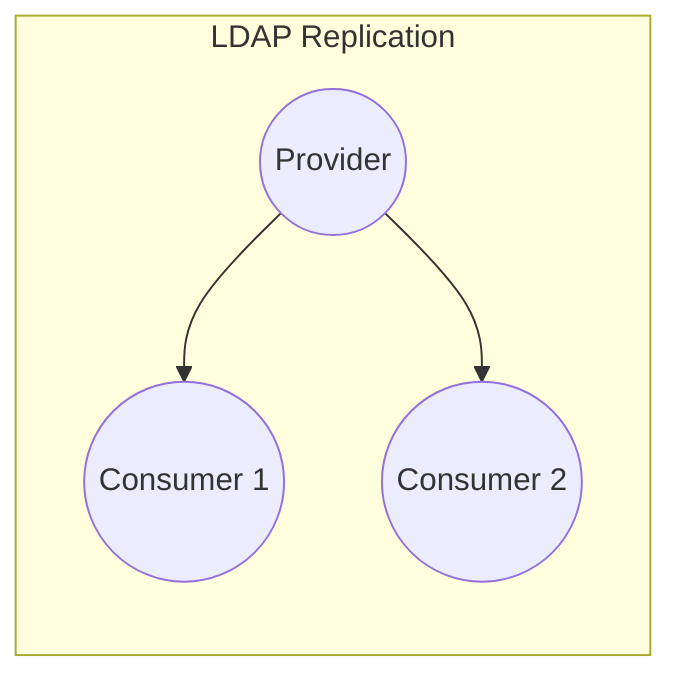

# openldap_replication

**Overview:** The **openldap_replication** role installs and configures OpenLDAP replication (provider/consumer) on a host. It sets up the LDAP provider (master) and one or more consumers (replicas) using syncrepl (LDAP sync replication), including creating dedicated replication user accounts with appropriate read/write permissions. This enables changes on the primary LDAP server to be automatically replicated to the secondary server(s).



## Supported Operating Systems/Platforms

This role is designed and tested for Debian/Ubuntu Linux systems. In practice, it installs packages via APT, so Debian (Bullseye, Bookworm, etc.) and Ubuntu (20.04 LTS, 22.04 LTS, etc.) are supported. Other Debian-derived systems may work, but RHEL/CentOS would require modifications (the role assumes an APT-based package manager).

## Role Variables

<details>
<summary>Default variables (see <code>defaults/main.yml</code>)</summary>

This role does not introduce custom variables beyond the standard OpenLDAP defaults. See `defaults/main.yml` for full details. For example, you would configure replication domains, hostnames, and credentials in the defaults file. In the absence of explicit variables, sensible built-in defaults apply (e.g. default ports and base DN).

</details>

## Tags

No special Ansible tags are applied by default (role tasks run unconditionally). All tasks execute when the role is invoked unless conditions are specified at the playbook level. (You may still apply playbook-level tags if desired, but the role itself does not define reusable tags.)

## Dependencies

* **Ansible Collections/Roles:** None required. This role uses only core Ansible modules. (Any necessary helper roles would be listed in `meta/main.yml`, but none are specified.)
* **System Packages:** The role will install and manage OpenLDAP packages as needed (e.g. `slapd`, `ldap-utils`) internally to enable replication. No pre-installed collection or role dependencies are needed.

## Example Playbook

Here is a minimal playbook snippet showing how to apply this role to your LDAP servers. It assumes you have enabled replication via a variable (e.g. `ldap_replication: true` in inventory or group_vars):

```yaml
- hosts: ldap_servers
  become: yes
  vars:
    ldap_replication: true
  roles:
    - openldap_server
    - openldap_content
    - openldap_replication
```

The above example corresponds to including this role in a play. Adjust hosts, variables, and order as needed for your environment.

## Testing Instructions

This role includes a Molecule test scenario. To run the tests:

1. Install Molecule with Docker support and test requirements:

   ```bash
   pip install "molecule[docker]" pytest testinfra
   ```
2. Ensure any dependent roles are installed via `ansible-galaxy` (not needed here since there are no external role deps).
3. Change directory into the role’s folder (e.g. `roles/openldap_replication`) and run:

   ```bash
   molecule test
   ```

This will spin up containers, apply the role, and verify idempotence and other checks.

## Known Issues and Gotchas

* **Firewall:** This role does *not* configure any firewall rules. Ensure that your firewall permits the LDAP service port (389 for LDAP or 636 for LDAPS) so that replication traffic is allowed.
* **Time Synchronization:** Replication assumes clocks are in sync between servers. (If clocks drift significantly, replication may fail.)
* **Credentials:** The password for the replication user must not expire and must be kept secret. A common pitfall is password expiration or misconfiguration, which breaks replication.
* No other specific issues are documented in the role, but replication setup is inherently sensitive to correct ACLs, ports, and certificates.

## Security Implications

This role creates dedicated LDAP user accounts for the replication process. Typically it creates one account with read permissions for replication and one with write permissions to manage entries. These users are granted privileges on the LDAP server to synchronize data; protect their credentials carefully. The role does **not** open any new network ports (it uses the standard OpenLDAP port 389/636). It also does not set up TLS/SSL by itself – enabling encryption is the user's responsibility. Finally, note that this role itself does not configure a firewall, so you must ensure that only authorized hosts can reach the LDAP replication port.

## Cross-Referencing

This role is part of a larger OpenLDAP suite in this repository. Related roles include:

* **openldap_server** – sets up the primary LDAP server (slapd).
* **openldap_content** – manages LDAP directory entries and schema.
* **openldap_client** – configures LDAP client authentication on machines.
* **openldap_logging** – configures LDAP audit/logging settings.
* **openldap_backup** – provides backup and restore for LDAP data.

Each of the above can be used in concert with **openldap_replication** to build a complete replicated LDAP service.

**Sources:** This documentation is based on the role’s README and related materials and on common OpenLDAP replication practices.
