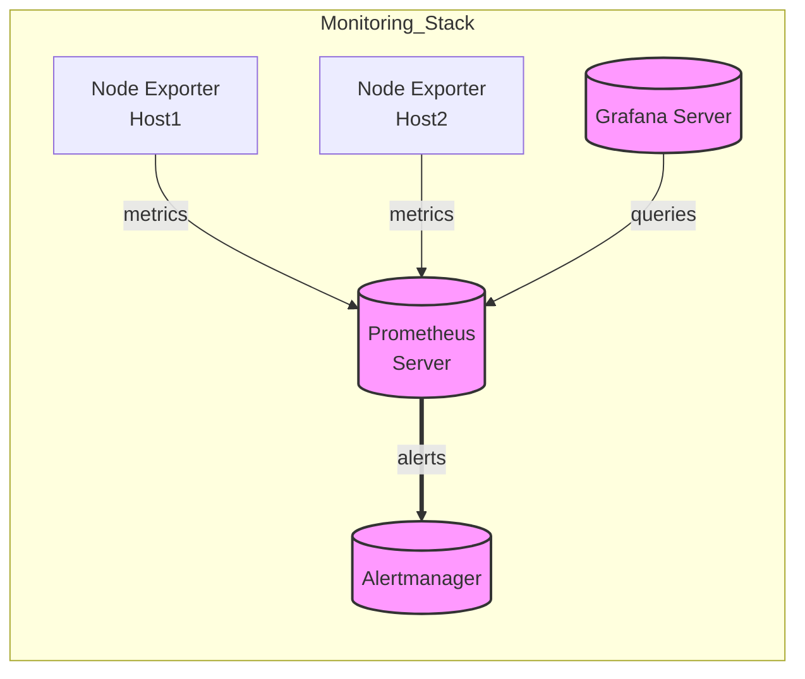

# Ansible Role: Prometheus

**Table of Contents**

* [Overview](#overview)
* [Supported Operating Systems/Platforms](#supported-operating-systemsplatforms)
* [Role Variables](#role-variables)
* [Tags](#tags)
* [Dependencies](#dependencies)
* [Example Playbook](#example-playbook)
* [Testing Instructions](#testing-instructions)
* [Known Issues and Gotchas](#known-issues-and-gotchas)
* [Security Implications](#security-implications)
* [Cross-Referencing](#cross-referencing)

## Overview

The **Prometheus** role installs and configures the [Prometheus](https://prometheus.io/) monitoring system on target hosts. It handles installation via OS packages (Debian/Ubuntu), sets up Prometheus as a systemd service, and deploys a basic configuration for scraping metrics. By default, Prometheus will scrape itself (the Prometheus server on port 9090) and a Node Exporter for host metrics. This role is designed to be **idempotent** and customizable via variables, allowing you to define which targets to monitor, alerting rules, retention period, and integrations with alert managers or dashboards. Key features include:

* **Package Installation:** Installs the Prometheus server and a Node Exporter agent via apt, ensuring both are present on the host. The Node Exporter is automatically started as a service so that Prometheus can collect local host metrics out-of-the-box.
* **Configuration Management:** Deploys a generated `prometheus.yml` (main config) and an `alert.rules` file from Jinja2 templates. The configuration sets global scrape and evaluation intervals, defines default scrape jobs (Prometheus itself and node exporter targets), and includes any additional jobs or Alertmanager endpoints you configure via variables. An example alert rule is provided by default (triggering if any instance is down for 5 minutes) to demonstrate alerting functionality.
* **Service Setup:** Ensures the Prometheus service is enabled and running under a dedicated **`prometheus`** system user. The role installs a systemd unit override that configures Prometheus to use the specified data directory and retention time, and to listen on port 9090 on all interfaces. The service is set to automatically restart on failure and includes sensible defaults for resource limits and security protections (via systemd settings).
* **Alerting Integration:** Supports integration with an external **Alertmanager** – you can supply one or more Alertmanager addresses (e.g. `alertmanager:9093`) via variables, and the role will configure Prometheus to send alerts to those endpoints. By default, no Alertmanager is configured (alerts will remain pending in Prometheus unless an Alertmanager is provided).
* **Extensibility:** Allows adding custom scrape targets and jobs through the `prometheus_additional_scrape_configs` variable (in YAML format). This means you can easily extend Prometheus to monitor other exporters or services by defining additional `scrape_configs` without modifying the core template. The role also supports setting **external labels** (such as cluster name or replica ID) to aid in federation or high-availability setups.

In summary, this role will result in a running Prometheus server (listening on port 9090) with a baseline configuration and metrics collection from the local system. You can tailor it to scrape multiple hosts and exporters and to send alerts to an Alertmanager. Apply this role to a dedicated monitoring host (or hosts) after your basic system setup, and combine it with a visualization tool like Grafana (see **Cross-Referencing** below) to build a full monitoring stack.

## Supported Operating Systems/Platforms

This role is tested on and supported with the following 64-bit Linux distributions (using the APT package manager):

* **Debian** – 11 (Bullseye) and 12 (Bookworm)
* **Ubuntu** – 20.04 LTS (Focal Fossa) and 22.04 LTS (Jammy Jellyfish)

> **Note:** The role uses Debian/Ubuntu conventions (APT for package installation and systemd for service management). It will **not** work on RHEL, CentOS, or other non-Debian systems without modification. Ensure your target hosts are running one of the supported Debian/Ubuntu versions. The target should also have network access to the appropriate package repositories (internet or internal mirror) to install Prometheus and related packages.

## Role Variables

Below is a list of key variables for this role, along with their default values (as defined in **`defaults/main.yml`**) and descriptions. You can override these in your inventory or playbook to customize the Prometheus deployment:

<!-- markdownlint-disable MD033 -->

<details>
<summary>Role Variables (defaults)</summary>

| Variable                                   | Default Value                           | Description                                                                                                                                                                                                                                                                                                                                                                                                                                                                                                                                                                                                                                                                                                                |
| ------------------------------------------ | --------------------------------------- | -------------------------------------------------------------------------------------------------------------------------------------------------------------------------------------------------------------------------------------------------------------------------------------------------------------------------------------------------------------------------------------------------------------------------------------------------------------------------------------------------------------------------------------------------------------------------------------------------------------------------------------------------------------------------------------------------------------------------- |
| **`prometheus_version`**                   | *Empty string* `""`                     | Version of Prometheus to install. By default this is empty, meaning the **latest available version from the OS repositories** will be installed. You can specify a version string (e.g. `"2.41.0-1"`) to pin Prometheus to that version (the role will attempt to install that exact package version via apt, assuming it’s available in the repos).                                                                                                                                                                                                                                                                                                                                                                       |
| **`prometheus_scrape_interval`**           | `60s`                                   | Global scrape interval for targets. This defines how often Prometheus collects metrics from each target. The default is 60 seconds. You can increase this for lower-frequency scraping (to reduce load) or decrease it for more frequent data (at the cost of higher load).                                                                                                                                                                                                                                                                                                                                                                                                                                                |
| **`prometheus_evaluation_interval`**       | `60s`                                   | Global evaluation interval for rules. This is how often Prometheus will evaluate alerting and recording rules. Default is 60 seconds (meaning rules are evaluated once per minute).                                                                                                                                                                                                                                                                                                                                                                                                                                                                                                                                        |
| **`prometheus_retention_time`**            | `30d`                                   | Time to retain metrics data on disk. The Prometheus TSDB will keep data for 30 days by default, after which older data is purged. Adjust this based on your storage capacity and needs (e.g., shorter if disk is limited, or longer if you need more historical data). This value is passed to Prometheus via the `--storage.tsdb.retention.time` flag in the systemd service.                                                                                                                                                                                                                                                                                                                                             |
| **`prometheus_data_dir`**                  | `/var/lib/prometheus`                   | Directory to store Prometheus data (TSDB files). By default, this uses the standard path from distro packages. The role ensures this directory exists with proper ownership and permissions (`prometheus:prometheus`, mode 0755). You can change this to use a different filesystem or mount point (e.g., if you have a dedicated volume for metrics data). Make sure the Prometheus user has write access to whatever path you choose.                                                                                                                                                                                                                                                                                    |
| **`prometheus_node_targets`**              | `["localhost:9100"]`                    | List of Node Exporter target addresses that Prometheus will scrape for host metrics. By default it includes only the local host (assuming a Node Exporter running on port 9100 on the same machine). You should **override this list** to add other hosts or endpoints you want to monitor. Each entry should be in the format `"hostname:9100"` (or appropriate port). Ensure that each target in this list is running a Node Exporter or equivalent metrics endpoint on the specified port.                                                                                                                                                                                                                              |
| **`prometheus_additional_scrape_configs`** | *Empty list* `[]`                       | Additional scrape configuration(s) to merge into the Prometheus config. This should be a YAML list or dictionary that follows Prometheus `scrape_configs` format. By default it’s empty (no extra jobs). If you have other exporters or services to monitor, you can define them here. The content you provide will be inserted verbatim under the `scrape_configs` section of `prometheus.yml`. For example, you could add a job to scrape an **Apache exporter** or **MySQL exporter** by supplying the proper YAML config in this variable. Maintain correct YAML structure (indentation) when providing this value.                                                                                                    |
| **`prometheus_alertmanager_urls`**         | *Empty list* `[]`                       | List of Alertmanager URL targets for Prometheus to send alerts to. Default is empty (no Alertmanager integration). If you have one or more Alertmanager instances, set this to their addresses (e.g., `["alertmanager1.example.com:9093"]` or include the scheme like `["http://alertmanager1:9093"]`). The role will configure these under the `alerting -> alertmanagers` section of Prometheus config. If multiple addresses are provided, Prometheus will send alerts to each. Leave this empty if you do not use Alertmanager (alerts will simply remain in Prometheus’s state and logs).                                                                                                                             |
| **`prometheus_external_label_monitor`**    | `""`                                    | External label to identify the “monitor” name for this Prometheus instance. This sets a label `monitor: <value>` on all metrics and alerts from this server (if provided). It’s useful when you have multiple Prometheus servers (e.g., in different datacenters or clusters) and you want to distinguish their data in a global view. Default is empty (no `monitor` label). Set it to a short name identifying this monitoring system if you plan to use federation or aggregation of multiple Prometheus instances.                                                                                                                                                                                                     |
| **`prometheus_external_label_replica`**    | `""`                                    | External label to identify the replica ID of this Prometheus instance. Default is empty. This is typically used in **high-availability pairs** of Prometheus servers: if you run two Prometheus servers with identical configuration scraping the same targets, you should set each one with a different `replica` label (e.g. `"A"` and `"B"`). This allows an Alertmanager to know that alerts from both servers are the same issue and deduplicate them. If you are not running multiple Prometheus instances for HA, leave this blank.                                                                                                                                                                                 |
| **`prometheus_alert_rules`**               | *(Multi-line YAML)* See default content | YAML-formatted string defining Prometheus alerting rules. By default, this includes an example rule file with one alert group (`example.rules`) and a single alert **InstanceDown** that fires if any scraped instance is down for >5 minutes. You should customize this with your own alert definitions. You can directly define the YAML here or use an external file and set this variable via a lookup (ensuring the content ends up as valid YAML). The role will deploy whatever rules content you provide to the target file (see `prometheus_rules_file`). **Note:** If you leave this at the default, you will get a test alert for any down instance – consider removing or replacing the example in production. |
| **`prometheus_rules_file`**                | `/etc/prometheus/alert.rules`           | File path where the alert rules (from `prometheus_alert_rules`) will be written on the target host. The Prometheus config is set to load this file (via `rule_files` entry). By default it uses `/etc/prometheus/alert.rules`, which is the conventional location. You can change this path if needed (for example, if following a different filesystem layout); the role will ensure the Prometheus config points to the new location by using this variable.                                                                                                                                                                                                                                                             |

</details>

<!-- markdownlint-enable MD033 -->

*All the above defaults are defined in the role’s* `defaults/main.yml` *for reference. Most variables are optional – you only need to override them when you want to change the behavior. For a minimal installation, you can run the role with no extra variables, and it will install Prometheus with default settings (scraping only the local node). However, to be useful, you’ll likely want to define at least: (a) additional scrape targets (`prometheus_node_targets` or use `prometheus_additional_scrape_configs`), and (b) your own alerting rules (`prometheus_alert_rules`).*

## Tags

This role defines a couple of tags that can be used to control task execution:

* **`install`** – Applies only the installation tasks. Use this tag if you want to install Prometheus and Node Exporter packages without running the configuration steps (for example, `--tags install` will run package installation tasks).
* **`exporters`** – Applies tasks related to managing the exporter service(s). In this role, it ensures the Node Exporter service is enabled and started. You might run with `--tags exporters` if you only want to (re)start or enable the exporter without reinstalling everything.

All other tasks (configuration, service setup) have no dedicated tags and will run by default. If you run the role normally (without specifying tags), **all tasks execute** in the intended order. You can combine tags or exclude them (e.g., `--skip-tags exporters` if for some reason you want to install and configure Prometheus but not start the Node Exporter service).

## Dependencies

**Ansible Version:** This role requires Ansible **2.12** or higher. It uses features and modules from modern Ansible (e.g., `ansible.builtin.apt`, `service`, etc.), which are available in core Ansible 2.12+. It is recommended to use the latest stable Ansible for best compatibility.

**Collections:** No external Ansible collections are required. All modules used (such as `apt`, `template`, and `service`) are part of Ansible’s built-in modules. Ensure you have the standard Ansible plugins available. (If running an extremely minimal Ansible installation, note that apt module requires the target host to have Python and apt utilities, which is normally the case on Debian/Ubuntu).

**Roles:** This role has no dependencies on other Ansible roles (as noted in `meta/main.yml`). It is self-contained.

**OS Packages:** The target host needs access to the Debian/Ubuntu package repositories to install Prometheus. The role will automatically install the following packages on the host:

* **prometheus** – The Prometheus server binary and default configuration, installed via apt.
* **prometheus-node-exporter** – The Node Exporter agent for host metrics, installed via apt.

These are standard packages in Debian 11+/Ubuntu 20.04+ official repos. No additional package repository is added by this role (unlike some roles that use upstream sources). Ensure the default apt repositories (or your internal mirrors) provide these packages. On Ubuntu, the packages reside in the “universe” repository which is typically enabled by default.

There are no other prerequisites. The role will update the apt cache if needed and then install the above packages. **Internet access:** If your servers are in an offline environment, you’ll need to mirror the apt repositories or pre-download the .deb files for Prometheus and Node Exporter and make them available to apt.

## Example Playbook

Here is an example of how to use the `prometheus` role in a playbook to set up a Prometheus server. In this example, we configure Prometheus to scrape metrics from several hosts (which must be running Node Exporter on port 9100) and integrate with an Alertmanager:

```yaml
- hosts: monitoring_servers
  become: yes
  vars:
    prometheus_node_targets:
      - "localhost:9100"         # include the Prometheus server's own node exporter
      - "app-server-1.example.com:9100"
      - "db-server-1.example.com:9100"
    prometheus_alertmanager_urls:
      - "alertmanager.example.com:9093"
    prometheus_retention_time: "15d"        # keep 15 days of metrics
    prometheus_alert_rules: |              # define a custom alerting rule
      groups:
        - name: demo.rules
          rules:
            - alert: HighLoad
              expr: node_load1 > 4
              for: 5m
              labels:
                severity: warning
              annotations:
                description: "High load on {{ $labels.instance }} (1m load > 4 for 5m)"
  roles:
    - prometheus
```

In the above play:

* We target a host group `monitoring_servers` (which would contain one or more hosts where we want Prometheus installed, typically a single Prometheus server).
* We elevate privileges with `become: yes` since installing packages and editing system files requires root.
* We override `prometheus_node_targets` to list a few hosts (`app-server-1` and `db-server-1`) whose metrics we want to scrape, in addition to the local host. These hosts should have Node Exporter running. We keep `localhost:9100` as well so Prometheus monitors its own host.
* We provide an `alertmanager.example.com:9093` URL in `prometheus_alertmanager_urls` so that any alerts will be forwarded to our Alertmanager service (replace this with your actual Alertmanager address, or omit it if you don’t have one).
* We adjust `prometheus_retention_time` to 15 days to limit data retention (shorter than default 30d, for example purposes).
* We define a simple custom alert rule (`HighLoad`) under `prometheus_alert_rules`. This alert fires if the 1-minute load average (`node_load1` metric from Node Exporter) exceeds 4 for 5 minutes on any instance, labeling it as a warning. (In a real scenario, you would include whatever alerts are relevant to your environment.)

When you run this playbook, the Prometheus role will install Prometheus on the hosts in `monitoring_servers`, start the service, and apply the configuration. Prometheus will then begin scraping metrics from itself and the two specified servers, and it will send any firing alerts (like “HighLoad” if triggered) to the Alertmanager at the given address.

## Testing Instructions

It is highly recommended to test this role in a safe environment (such as a local VM or Docker container) before deploying to production. The role includes (or can be used with) **Molecule** for automated testing. Here’s how you can test the `prometheus` role using Molecule with the Docker driver:

1. **Install Molecule** (and Docker): Ensure you have Molecule and its Docker support installed on your dev machine. For example, use pip:

   ```bash
   pip install molecule[docker]
   ```

   Also install Docker and ensure the Docker daemon is running.

2. **Prepare a test scenario:** If this role comes with a Molecule test scenario (e.g., in `molecule/default/`), you can use that. If not, you can initialize one yourself:

   ```bash
   molecule init scenario -r prometheus -d docker
   ```

   This will create a basic `molecule/default` directory with a generic playbook to apply the role inside a container.

3. **Run the Molecule converge:** Execute Molecule to create a container and apply the role:

   ```bash
   molecule converge
   ```

   Molecule will launch a Docker container (by default, Debian or Ubuntu based) and run the `prometheus` role inside it (using the playbook in the scenario, typically `converge.yml`). This will perform the installation and configuration inside the container.

4. **Verify the results:** After convergence, you can verify that Prometheus was installed and configured correctly:

   * **Services:** Check that the Prometheus service is running. In a Docker container, you might not have systemd fully running, but you can verify the process is running or the binary is present. For example:

     ```bash
     docker exec -it <container_id> pgrep prometheus
     ```

     should return a PID if Prometheus is running. You can also check if port 9090 is listening:

     ```bash
     docker exec -it <container_id> netstat -tulpn | grep 9090
     ```

     and similarly check port 9100 for Node Exporter.
   * **Configuration files:** Verify that `/etc/prometheus/prometheus.yml` exists inside the container and contains the expected scrape configs (e.g., the `prometheus` job and `node_exporter` job). Also check that your custom variables took effect (for instance, if you set a retention time or Alertmanager URL, those should appear in the config or service file). The alert rules file (e.g. `/etc/prometheus/alert.rules`) should also exist and contain the example or provided rules.
   * **Prometheus web UI:** If your test container is reachable (you may map ports to the host), you can try accessing `http://localhost:9090` (or appropriate IP/port) to see if the Prometheus UI is up. This might not be directly accessible in a Docker Molecule scenario without port mapping, but you can exec into the container and `curl http://localhost:9090` to see if you get an HTTP 200 response or HTML content from Prometheus.
   * **Logs:** Look at Prometheus logs (e.g., `journalctl` if systemd is running, or check Docker logs with `docker logs <container_id>`) for any errors. There should be no errors in configuration; any misconfiguration would typically show up here.

   If the role includes automated tests (for example, using Ansible’s **assert** modules or Molecule’s verify step with Testinfra/Inspec), run them with:

   ```bash
   molecule verify
   ```

   (By default, this might be empty for this role; you can write custom tests if needed.)

5. **Cleanup:** After testing, tear down the test container to free resources:

   ```bash
   molecule destroy
   ```

   This will remove the Docker container that was created. You can also run `molecule test` to perform the full cycle (create, converge, verify, destroy) in one command.

**Testing tips:** When running in Docker, you may need a systemd-enabled base image for all services to start properly (since Prometheus and Node Exporter are systemd services). The default Molecule Docker images might not have systemd. If you encounter issues with services not starting, consider using a Docker base image that supports systemd, or adjust the Molecule provisioning to start Prometheus manually for testing purposes. Also, in a test scenario you might reduce the scrape interval or retention if you want to simulate or verify certain behaviors quickly (though the defaults are fine for basic validation).

Using Molecule ensures that the role can be applied on a clean system and is **idempotent** (running it multiple times should result in no changes after the first time, assuming no input variables changed). Always run through a Molecule or staging test to catch any issues with your variable values or environment before rolling out to production.

## Known Issues and Gotchas

* **No Alertmanager by Default:** This role **does not install an Alertmanager**. If you set up alerts (via `prometheus_alert_rules`), they will appear in the Prometheus UI and logs, but unless you configure `prometheus_alertmanager_urls` to point to a running Alertmanager, those alerts won’t be delivered as notifications. Make sure to deploy an Alertmanager (outside this role) if you want email/slack/pager alerts, and set the URL accordingly. Otherwise, consider disabling or removing the default example alert to avoid confusion.

* **Scraping Other Hosts:** By default, Prometheus is only scraping itself and the local Node Exporter. If you add other hosts to `prometheus_node_targets`, ensure that **each of those hosts has a Node Exporter running on the specified port** (9100 by default). This role installs Node Exporter on the Prometheus server node only. For other servers, you’ll need to deploy Node Exporter separately (either by using this role on those hosts, or via another method). If a target in the list is unreachable or not running an exporter, you will see that target marked as “down” in the Prometheus console and the default **InstanceDown** alert will fire for it.

* **Firewall and Access:** Prometheus listens on port **9090** (HTTP) on all network interfaces by default. Likewise, Node Exporter listens on port **9100** (on all interfaces by default). There is **no authentication or encryption** on these endpoints. If your Prometheus server is in an environment with untrusted network access, you should firewall these ports or restrict access (e.g., allow only certain IP ranges or use SSH tunneling/VPN). At a minimum, ensure that port 9090 (and 9100, if needed) is allowed from the networks where you’ll be accessing Prometheus or scraping metrics, and consider blocking it from everywhere else. In internal networks this may be fine, but **do not expose Prometheus’s port directly to the public internet** without additional protections.

* **Data Growth and Retention:** Be mindful of the data volume on disk. The default retention is 30 days, which on a busy Prometheus server could be several gigabytes of data. Monitor the storage usage of `prometheus_data_dir` (`/var/lib/prometheus` by default). If you have many targets or high-frequency metrics, you may need to allocate more disk space or reduce `prometheus_retention_time` to avoid filling the disk. Prometheus will enforce the retention policy by deleting old data, but it doesn’t compress data beyond its normal operation. Ensure your disk I/O is also sufficient for the write load. If you adjust the retention time to a smaller value after running with a larger value, note that Prometheus will gradually purify old data beyond the new retention window (it may not immediately drop everything, but it won’t grow beyond the new limit over time).

* **Prometheus Version (OS vs Latest):** The role installs Prometheus from the OS repositories, which might not be the very latest Prometheus release. For instance, Debian stable often lags behind upstream releases. If you require a newer Prometheus version with specific features or fixes, you have a few options: (1) Check if the version is available in backports or the distro’s updates and set `prometheus_version` accordingly; (2) Manually install Prometheus via other means (download binary/tarball) outside this role; or (3) use a community role that installs directly from upstream. This role does not handle downloading binaries. Pinning a version via `prometheus_version` works only if that version exists in the apt repositories. Always verify the installed version (`prometheus --version`) to ensure it meets your needs.

* **Reloading Configuration:** This role deploys configuration and rule files and then **restarts** Prometheus to apply changes (via a handler). A full restart is used because the Debian/Ubuntu Prometheus service does not support a hot reload via SIGHUP out of the box (and given we often change the service unit or command-line flags, a restart is safer). Be aware that restarting Prometheus will cause a brief downtime in scraping and query availability. In practice, the restart is quick (Prometheus will flush head samples to disk and shut down, then restart and reload data within seconds to a minute). If you update alert rules or configs frequently, consider the impact of these restarts. In an HA setup (two Prometheus servers), you might restart them one at a time to avoid loss of coverage.

* **High-Availability (HA) Considerations:** Prometheus itself is **not clustered** – two Prometheus servers don’t coordinate or replicate data. If you require HA, the common approach is to run two instances in parallel, scraping the same targets. This role provides `prometheus_external_label_replica` to label each instance (so alerts can be deduplicated by Alertmanager), but it does not set up any failover mechanism. If one Prometheus instance goes down, the other continues, but any data on the downed instance is not automatically transferred. For a simple failover of the *service endpoint*, you could use a Virtual IP address with the **keepalived** role (see **Cross-Referencing** below) so that one of the two servers advertises a shared IP (ensuring Grafana or other clients can always reach one Prometheus). However, keep in mind the limitations: the new active server will not have the historical data from the failed one. Plan your monitoring accordingly (e.g., rely on Alertmanager’s deduplication and have Grafana switch data source if needed). Essentially, running multiple Prometheus servers increases redundancy, but each instance stores its own data.

* **Alert Noise from Example Rules:** If you keep the default example alert rule (InstanceDown) and you have targets that are intentionally down or not always reachable (e.g., a test host that’s often off), you will get an alert firing. This is expected behavior. To avoid unnecessary alert noise, remove or silence rules that don’t apply to your environment. The example is mainly there as a template. Before going live, replace it with real alert rules relevant to your systems (disk full, high CPU, service down, etc., via appropriate PromQL expressions). Likewise, ensure each alert has an associated Alertmanager route if you care about notifications for it.

* **Prometheus UI Security:** The Prometheus web interface allows anyone who can access it to query all the metrics and view the status of your targets and alerts. While it’s read-only for metrics (no changes can be made through the UI), those metrics can include sensitive information about your systems (e.g., hostnames, load, memory usage, perhaps even usernames or IPs in some metrics). Make sure access to the UI is limited to trusted users. If necessary, put Prometheus behind an authenticating proxy or VPN for web access. Similarly, the HTTP API exposed on port 9090 could be used to extract data or even push data (remote write is not enabled by default in Prometheus, but keep the surface area in mind).

## Security Implications

* **Dedicated User and Permissions:** Prometheus is installed to run under a dedicated system user account **`prometheus`** (created by the package installation). The role makes use of this user for running the service. All Prometheus files – binaries, data directory, configs – are owned by `prometheus` (or in some cases, root with group `prometheus`). For example, the data directory is created with owner `prometheus:prometheus` and mode 0755, and config files are installed as root:prometheus with mode 0644. Running Prometheus as a non-root user is a fundamental security practice: even if the Prometheus process is compromised, it has limited access to the system. The Prometheus user has no login shell and no privileges beyond managing its own files and process.

* **Open Ports (9090/9100):** After this role is applied, the Prometheus server listens on **TCP port 9090** for its web UI and API, and the Node Exporter listens on **TCP port 9100** for metrics exposition. These ports are by default open to any interface (0.0.0.0), meaning any network client that can reach the host can connect. There is no built-in authentication on these endpoints. **Security impact:** anyone with network access could fetch metrics or view the Prometheus UI. In a secure internal network, this might be acceptable. In a hostile or external environment, you must take precautions: enable firewall rules to restrict access to these ports, or run Prometheus behind a reverse proxy that provides SSL/TLS and authentication. If using a reverse proxy, remember to adjust Prometheus’ `--web.listen-address` if needed (the role’s default is all interfaces; you could change it to localhost and have the proxy handle external access). Also ensure that the Node Exporter’s port 9100 is firewalled from untrusted sources – while it only exposes machine metrics, you generally wouldn’t want arbitrary external parties scraping your server’s metrics.

* **Systemd Service Hardening:** The role’s systemd unit file for Prometheus includes several security hardening features:

  * `ProtectHome=yes` – Prevents the Prometheus process from accessing home directories (`/home`, `/root`, `/run/user`). Prometheus doesn’t need these, so this helps limit its scope.
  * `ProtectSystem=full` – Makes most of the system files (everything under `/usr` and `/etc` aside from a few exceptions) read-only for Prometheus. This ensures Prometheus cannot modify system binaries or configuration. It can still write to `/var`, which is where its data and logs reside.
  * `NoNewPrivileges=yes` (inherited by default on systemd service in Debian) – Ensures the process and any child processes cannot gain new privileges (e.g., via setuid binaries).
  * Resource Limits: `LimitNOFILE=65535` (max open files) and `LimitNPROC=4096` (max processes) are set to high values. These are not so much for security as for reliability (Prometheus can handle many file handles for metrics data; these limits prevent the OS from interfering). However, they also act as a safety so Prometheus can’t accidentally exhaust system resources by opening too many files or processes beyond these limits.

  These settings collectively reduce the risk that an attacker who somehow exploits Prometheus could use it to tamper with the system or escalate privileges. They follow the principle of least privilege for the service.

* **File Permissions and Sensitivity:** The Prometheus config and rules files are world-readable (mode 644) by default, and the data directory is world-executable/traversable (755). This is so that the Prometheus process (running as user `prometheus`) can read the config (owned by root) and so that other services or admins can inspect files if needed. Generally, the data in these files is not secret (metrics and configs). However, consider that metric data might reveal information about your systems. If you have multiple user accounts on the server, those users could potentially read Prometheus’ data files or config. If this is a concern, you could tighten the permissions (e.g., 750 on data dir, 640 on configs) and add the Prometheus user to a specific group. By default, we opt for more open permissions to avoid any operational issues (and because servers typically have limited user access).

* **External Communication:** Prometheus by default doesn’t initiate external network connections except to scrape the configured targets and to send alerts to Alertmanager (if configured). Scraping is usually within your network (your own hosts). Alertmanager endpoints might be within the network as well. Ensure that any endpoints you configure (in `prometheus_alertmanager_urls` or in scrape configs) are secure and trusted. If Prometheus is sending data to an untrusted network (e.g., pushing metrics or alerts to an external service), consider using TLS encryption or a secure channel. This role does not configure TLS for Prometheus or Alertmanager communications. If needed, you’d have to manage certificates and adjust the Prometheus configuration (e.g., add `--web.config.file` for TLS or basic auth, which is beyond scope here).

* **Alerting & Notification Security:** If an Alertmanager is configured, Prometheus will send alert data (which includes metric labels and values that triggered the alert) to the Alertmanager over HTTP. Make sure your Alertmanager is secured (at least within a trusted network or using HTTPS). The content of alerts typically isn’t highly sensitive (mostly operational data), but it could include hostnames, IPs, or incident details you might not want exposed. Protect the Alertmanager endpoint similarly (e.g., with authentication or network controls), since anyone with access to it could potentially silence or manipulate alerts.

* **Integration with Grafana:** Grafana typically will query Prometheus to visualize data. The Grafana role in this repository sets up Grafana with a Prometheus data source pointed at `http://prometheus:9090`. If Grafana is running on a different server, it needs network access to Prometheus’s 9090 port. Consider the security of that connection: in internal networks it’s often HTTP with no auth. If you want to secure it, you could enable TLS or require Grafana to connect through a secure channel. Grafana supports basic auth or token auth towards Prometheus if you configure a reverse proxy in front of Prometheus. By default, however, everything is within a protected network segment and uses plain HTTP. Be aware of who can access Grafana as well – Grafana will reflect whatever data Prometheus has to any logged-in Grafana user.

In summary, after running this role, **Prometheus will be running as an unprivileged service accessible on a network port**. The main security considerations are controlling network access to that port and ensuring the host system’s security is not compromised by the addition of the Prometheus service. Regularly update Prometheus via system packages to get security fixes (the role installs a specific version, and you should update it when the distro provides updates or when you choose to upgrade).

## Cross-Referencing

This repository contains other roles that can complement the **prometheus** role as part of a complete monitoring stack or in related scenarios. You may consider using these in conjunction with **prometheus**:

* **[grafana](../grafana/README.md)** – Sets up the Grafana visualization tool for metrics dashboards. Grafana can use Prometheus as a data source. In fact, the Grafana role in this repository by default provisions a Prometheus data source pointing to `http://prometheus:9090`. By deploying **prometheus** (this role) on a host – ideally with a DNS name or inventory name “prometheus” – and **grafana** on a host that can reach it, you get a seamless integration: Grafana will immediately be able to query metrics from Prometheus. This pairing is the core of many monitoring systems (Prometheus collects and stores metrics, Grafana displays them). Be sure to adjust the Grafana data source URL if your Prometheus server isn’t reachable at the hostname "prometheus" (you can override the Grafana role’s variable for Prometheus URL). Together, these two roles provide metrics collection and visualization out of the box.

* **[keepalived](../keepalived/README.md)** – Provides VRRP-based virtual IP failover (high availability via a floating IP address). While Prometheus itself doesn’t coordinate state with peers, you can run two Prometheus servers in an active-standby setup and use Keepalived to manage a single Virtual IP that points to the “active” Prometheus. The **keepalived** role can configure a virtual IP that fails over between two servers if one goes down. In context of Prometheus, you would apply the prometheus role to two servers (configure them identically except perhaps `prometheus_external_label_replica` set differently), and also apply the keepalived role to manage a shared IP (for example, an IP that Grafana uses to query Prometheus). If the primary Prometheus host fails, the IP shifts to the secondary, and Grafana can continue to query (though the secondary will only have data from the point it started scraping). This setup improves availability of the monitoring stack’s interface. Refer to the keepalived role documentation for how to configure the virtual IP, and ensure both Prometheus instances are scraping the same targets so they have comparable data.

Each of the above roles has its own documentation with more details. When building a monitoring solution, using **prometheus** together with **grafana** is a common approach: Prometheus gathers data and evaluates alerts, while Grafana presents that data in dashboards. If high availability is a concern, consider the keepalived approach for failover, keeping in mind the data consistency caveats discussed. Also, remember to deploy a separate **Alertmanager** (not provided as a role here) if you need to handle alert notifications outside of Prometheus.



*Diagram: How Prometheus fits into the monitoring stack. Prometheus (server) scrapes metrics from Node Exporters on various hosts, sends alerts to an Alertmanager, and is queried by Grafana for visualization.*
