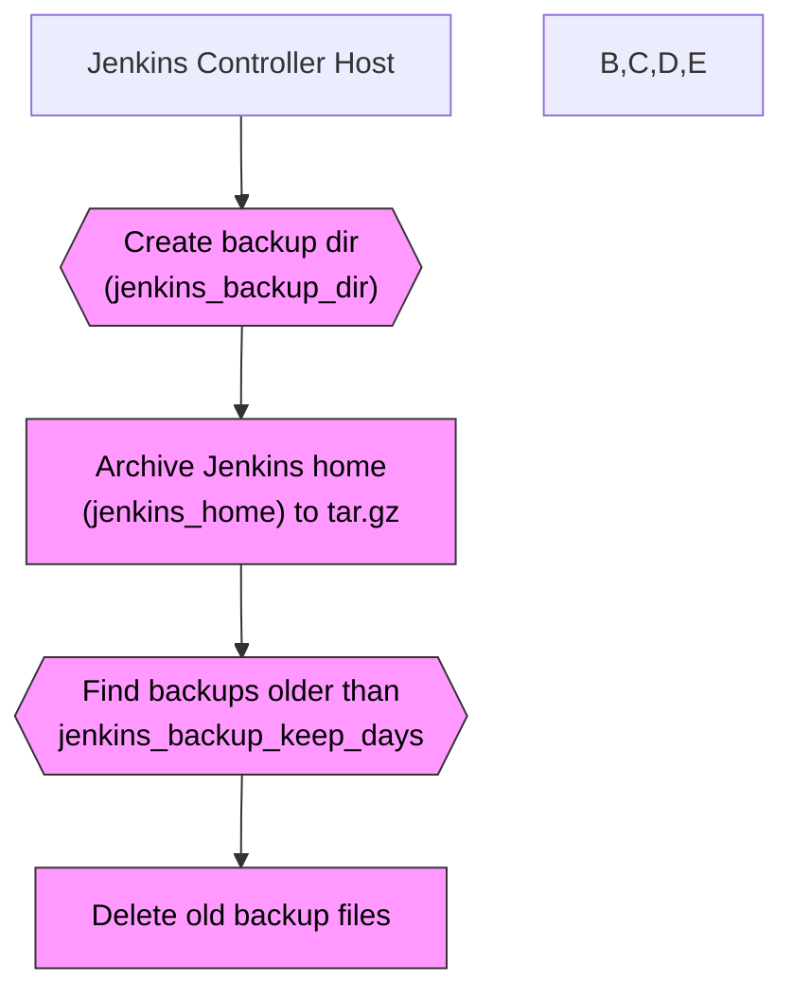

# Ansible Role: Jenkins Backup

**Table of Contents**

* [Overview](#overview)
* [Supported Operating Systems/Platforms](#supported-operating-systemsplatforms)
* [Role Variables](#role-variables)
* [Tags](#tags)
* [Dependencies](#dependencies)
* [Example Playbook](#example-playbook)
* [Testing Instructions](#testing-instructions)
* [Known Issues and Gotchas](#known-issues-and-gotchas)
* [Security Implications](#security-implications)
* [Cross-Referencing](#cross-referencing)

## Overview

The **Jenkins Backup** role provides an automated way to archive a Jenkins Controller’s data directory and manage backup retention. It ensures a backup directory exists on the controller node, compresses the entire Jenkins home directory into a timestamped archive, and prunes old backup files based on a defined retention policy. By running this role (e.g. on a schedule or as needed), administrators can capture Jenkins configuration, job definitions, plugins, and other state from the Jenkins server for disaster recovery or migration purposes.

Key tasks performed by this role include:

* **Backup Directory Creation:** Creates the target backup folder (defaults to `/var/backups/jenkins`) with appropriate ownership and permissions.
* **Jenkins Home Archiving:** Uses Ansible’s archive module to tar and gzip the Jenkins home directory (e.g. `/var/lib/jenkins`) into an archive named `jenkins-<DATE>.tar.gz` in the backup folder. The archive is owned by `root` and stored with read permissions for all users by default.
* **Old Backup Pruning:** Finds any existing backup files matching the naming pattern (e.g. `jenkins-*.tar.gz`) older than the specified retention period (in days) and removes them. This prevents unlimited growth of backup storage by keeping only recent backups.

> **Note:** This role focuses solely on creating and rotating backups. It does **not** install Jenkins itself or schedule recurring backups. It is typically used on Jenkins Controller hosts (masters) that have already been configured (for example, via the `jenkins_controller` role). For continuous backups, you should run this role periodically (e.g. via a cron job, Jenkins job, or automation server) since the role does not set up its own scheduler.



## Supported Operating Systems/Platforms

This role is tested on and designed for **Debian** and **Ubuntu** Linux distributions (64-bit), aligning with the Jenkins official package support:

* **Debian** – 11 (Bullseye) and 12 (Bookworm)
* **Ubuntu** – 20.04 LTS (Focal) and 22.04 LTS (Jammy)

Other Debian-based systems may work as long as Jenkins is installed in the expected manner. The default installation path and backup directory assumptions derive from Debian/Ubuntu conventions. While the backup tasks themselves (file archive and removal) are generic and could operate on any Linux, non-Debian systems are not explicitly tested in this role. In particular, Jenkins installations on Red Hat/CentOS or other non-APT-based OSes would require you to adjust variables (like `jenkins_home`) and ensure the necessary utilities (e.g. GNU tar) are available.

## Role Variables

Below is a list of important variables used by this role, along with their default values and descriptions. These defaults are defined either in this role’s context or provided by the related Jenkins installation role (**`jenkins_controller`**):

| Variable                       | Default Value          | Description                                                                                                                                                                                                                                                                                                                                  |
| ------------------------------ | ---------------------- | -------------------------------------------------------------------------------------------------------------------------------------------------------------------------------------------------------------------------------------------------------------------------------------------------------------------------------------------- |
| **`jenkins_home`**             | `/var/lib/jenkins`     | Path to the Jenkins **home directory** on the controller host (where Jenkins stores its configuration, plugins, job data, etc.). This role will archive this entire directory. By default it is `/var/lib/jenkins` on Debian/Ubuntu installations, but if you have Jenkins installed in a custom location you should override this variable. |
| **`jenkins_backup_dir`**       | `/var/backups/jenkins` | Filesystem path to the **backup directory** where archives will be stored. This role will create the directory if it does not exist, with owner `root` and mode `0755` (owner read-write, others read-only). Ensure this location has sufficient space for the Jenkins tarballs.                                                             |
| **`jenkins_backup_keep_days`** | `7`                    | **Retention period** for backups, in days. Backups older than this number of days will be purged on each run of the role to avoid accumulation. You can increase or decrease this value based on how many historical backups you wish to keep. For example, set `jenkins_backup_keep_days: 14` to keep two weeks of backups.                 |

These variables can be overridden in your inventory or playbook as needed. For instance, if your Jenkins home is in a non-standard location or you want to adjust the retention, you should set the appropriate variable accordingly.

## Tags

This role does not define any task tags by default. All tasks will run whenever the role is invoked. If you need to control execution order or skip this role’s tasks, use playbook-level conditions or invoke the role with Ansible’s `--tags`/`--skip-tags` options as appropriate (tagging would need to be added to the tasks in such a case).

## Dependencies

**No hard dependencies on external roles or collections.** This role is self-contained and uses only built-in Ansible modules (e.g. `ansible.builtin.file`, `ansible.builtin.archive`, `ansible.builtin.find`). There are no Ansible Galaxy roles or collections required beyond the standard Ansible installation.

However, there are some **prerequisites/assumptions** for effective use:

* Jenkins should already be installed and configured on the target host before using this backup role. Typically, you would run the `jenkins_controller` role (which sets up Jenkins and defines the default values for `jenkins_home`, etc.) prior to running backups.
* Sufficient privileges are needed. The role must be run with **privilege escalation** (`become: yes`), because it needs access to the Jenkins home directory (usually owned by a service account) and writes to a system backup location. Ensure your Ansible play or controller user can escalate to root on the Jenkins host.
* The target system should have the necessary utilities for archiving. The Ansible `archive` module uses the system’s tar/gzip capabilities or Python’s libraries. On Debian/Ubuntu, the required tools are normally present by default. No additional packages are installed by this role.

In summary, while the role itself has no explicit Ansible dependencies, it **depends on Jenkins being present** on the host and on being executed with the appropriate permissions.

## Example Playbook

Here is an example of how to use the `jenkins_backup` role in a playbook, backing up a Jenkins controller and customizing the retention period:

```yaml
- hosts: jenkins_controllers
  become: yes
  vars:
    jenkins_backup_keep_days: 14    # keep two weeks of backups instead of one
  roles:
    - jenkins_backup
```

In the above play, we target the `jenkins_controllers` host group (which should contain your Jenkins master server(s)). We elevate privileges to root with `become: yes` because backing up system directories requires it. The role `jenkins_backup` is then applied. We override the default `jenkins_backup_keep_days` to `14` to retain 14 days of backups instead of the default 7. All other variables (such as `jenkins_home` and `jenkins_backup_dir`) will use their defaults unless you override them similarly.

When this playbook runs, it will perform a Jenkins backup on the controller host: creating `/var/backups/jenkins` if needed, archiving `/var/lib/jenkins` into a file like `/var/backups/jenkins/jenkins-<YYYY-MM-DD>.tar.gz`, and deleting any old `jenkins-*.tar.gz` files in `/var/backups/jenkins` older than 14 days.

You can run this playbook manually whenever you need a backup, or schedule it to run regularly (e.g., via cron or an automation server). For example, to run it from the command line against a production inventory:

```shell
ansible-playbook -i inventories/production/hosts.yml playbooks/jenkins/backup.yml
```

*(Assuming `playbooks/jenkins/backup.yml` contains a play similar to the example above.)*

## Testing Instructions

It is recommended to test this role using **Molecule** (with the Docker driver) to ensure it works as expected in an isolated environment before applying to production. The Molecule test can simulate a Jenkins controller host and verify that backups are created. Follow these steps:

1. **Install Molecule** (and Docker) on your development machine, if you haven’t already. For example: `pip install molecule[docker]`. Ensure Docker is running and you have permission to launch containers.
2. **Prepare a test scenario:** If a Molecule scenario is provided with this role (e.g. under `roles/jenkins_backup/molecule/` in the repository), you can use it directly. Otherwise, you can initialize a new scenario for this role with:

   ```shell
   molecule init scenario -r jenkins_backup -d docker
   ```

   This will create a `molecule/default/` directory with a basic configuration for testing the `jenkins_backup` role.
3. **Configure the scenario (if needed):** Edit the generated `molecule.yml` or `molecule/default/converge.yml` to suit the test. For instance, you may want to create a dummy Jenkins home directory in the test container. You can add a task in the converge play to create an empty `/var/lib/jenkins` (to mimic an installed Jenkins) before applying the role, so that the archive module has something to compress. If the role’s Molecule scenario already handles this, you can skip this step.
4. **Run the Molecule test:** Execute `molecule converge` inside the role’s directory (or specify the scenario directory with `-s default` if needed). Molecule will launch a Docker container (by default, a generic Linux like Debian image), and then apply the `jenkins_backup` role to that container. This will run the backup tasks in the container environment.
5. **Verify the results:** After the converge step completes, you can inspect the Docker container to ensure that the backup was performed. For example, run `docker exec -it <container_id> ls -l /var/backups/jenkins` to see the backup directory contents. You should find a file named `jenkins-<date>.tar.gz` in the directory. You might also check that the file has the expected owner (root) and permissions, and possibly open the tar to verify it contains the expected directory structure. If automated tests (e.g., with Ansible `assert` tasks or Testinfra/Inspec) are part of the scenario, run `molecule verify` to execute those.
6. **Cleanup:** Once you have validated the role’s behavior, run `molecule destroy` to tear down the test container and free resources. Alternatively, you can run `molecule test`, which will perform the create, converge, verify (if configured), and destroy steps all in one sequence.

Using Molecule for testing helps ensure the role is **idempotent** (running it multiple times should result in one current backup file and old ones pruned, without errors) and that it works on a clean system. During testing, you may simulate multiple runs on different days to see the retention logic in action (e.g., adjust system time or `jenkins_backup_keep_days` for testing purposes). Also, consider testing on images of the target OS (Debian 11, Ubuntu 22.04, etc.) to match your production environment.

## Known Issues and Gotchas

* **No Automatic Scheduling:** This role does **not** set up a recurring schedule for backups. It performs a backup only when invoked. If you require regular (e.g. daily) Jenkins backups, you must arrange to run this role periodically (for example, via a cron job, Jenkins itself calling Ansible, or AWX/Ansible Controller scheduling). The provided example playbook can be used in a scheduled task.
* **Backup Consistency:** The backup is taken “live” while Jenkins is running. This means Jenkins is not stopped or put in quiet mode during archiving. In most cases, this yields a consistent snapshot of Jenkins data (configs and job data on disk). However, there is a small risk that some data (like in-flight build logs or temporary files) could change during the archive process. For critical scenarios, you might consider briefly pausing Jenkins (or ensuring no active jobs) during the backup window, though this role does not automate that. Generally, config and plugin data will be consistent, but a backup taken during a running build might include partial workspace data or logs.
* **One Backup per Day:** The archive filename includes the date but **not** the time. If you run the backup role more than once on the same day, it will produce the same filename (e.g. `jenkins-2025-05-31.tar.gz` for May 31, 2025) and thus **overwrite** the previous backup from that day. This is by design to have at most one archive per day. If you need multiple backups per day without overwriting, you would have to modify the role (for example, include the timestamp in the filename).
* **Retention Behavior:** The retention mechanism removes files older than *N* days on each run. “Older than 7 days” means that when the role runs, any backup file with a modification timestamp more than 7×24 hours in the past is deleted. Note that if the role is not run for a while, old backups remain on disk until the next execution triggers the cleanup. Conversely, if you run the role infrequently (e.g. weekly) but keep the default `jenkins_backup_keep_days: 7`, it may delete the previous backup (since it could be older than 7 days by the time the next run occurs). Adjust the retention period to match your execution frequency (e.g. set `keep_days` >= days between backups).
* **Disk Space and Performance:** Be mindful of the Jenkins home size. Archiving a large Jenkins home directory (which may include hundreds of job workspaces, build artifacts, and logs) can produce a very large tar file and put strain on disk I/O and CPU (for compression). Ensure the `jenkins_backup_dir` has enough free space to store the tarball, and monitor the time it takes to complete. If your Jenkins data is extremely large or contains lots of ephemeral files, you might want to exclude certain subdirectories or use alternative backup strategies. Currently, this role does not support excluding specific paths – it archives everything under `jenkins_home`. If needed, you could temporarily move or clean out unnecessary files (like massive workspace directories) before running the backup.
* **Idempotence of Archive Task:** Unlike typical configuration roles, a backup role inherently performs actions that change state every run (creating new archives and deleting old ones). This means repeated runs will always report changes (a new tar file is created on each run, except if run twice in the same day which overwrites the tar). This is expected behavior for a backup operation. When using Ansible, consider this when interpreting play results (the changed status will be true on each backup run).
* **Restore Procedure Not Automated:** This role does not provide a restore mechanism. To restore Jenkins from a backup tarball, you would need to manually stop Jenkins, extract the archived files into the Jenkins home directory, and start Jenkins. Always verify that backups created by this role are valid and restorable (e.g., test restoration in a non-production environment) so that you can rely on them in an emergency.

## Security Implications

Performing backups of Jenkins can have security impacts, and this role’s implementation should be reviewed in that context:

* **Sensitive Data in Backups:** Jenkins home directory often contains sensitive information – job configuration files, credentials (encrypted in Jenkins but potentially decryptable with the master key), SSH keys, and user data. The tarball created by this role is effectively a complete snapshot of Jenkins state. **Treat backup files as sensitive assets.** Limit access to them and consider additional protection (encryption at rest, etc.) if needed.
* **File Permissions of Backups:** By default, the backup archive is created with world-readable permissions (`0644`) and owned by root. The backup directory is `0755` (world-accessible for listing/reading). This means on a multi-user system, other users could potentially read the Jenkins backup tar. If this is a concern, you should tighten the permissions. For example, you might override the role’s behavior to set `mode: "0600"` on the archive file and restrict the backup directory to `0700`. Ensure that whatever user or process needs to access the backups (if any) is in an appropriate group or uses elevated privileges.
* **Elevation of Privilege:** The role requires root access (via `become`) to read all files in `jenkins_home` and to write to the system backup directory. This is a necessary privilege for full backup, but it means the Ansible playbook or automation running this role effectively has root rights on the Jenkins server. Protect your Ansible control machine and credentials accordingly. Only trusted administrators should run this role or have access to the playbooks that include it.
* **Impact on Jenkins Service:** This role does not modify any Jenkins settings or user accounts, nor does it open network ports or change firewall rules. Its security impact is mainly that it copies data. It does not stop Jenkins or interfere with its runtime beyond the I/O load of reading files for archiving. Running the backup may temporarily read a large number of files (which could, in theory, slightly slow down Jenkins if the disk is busy, but it does not alter those files). There is no direct impact on network security or user authentication by running the backup.
* **Backup Storage and Transmission:** If you plan to move backup files off the host (for example, uploading to cloud storage or an offsite location), use secure methods. The role itself does not handle transfer or remote storage, so it is up to you to copy the archive somewhere safe. Ensure any transfers are encrypted (e.g., use `scp`/`sftp` or a secure API) and that backups are stored in access-controlled locations.
* **Cleaning up Secrets:** If you rotate or remove backups, consider the residual sensitive data. The role deletes old tar files using standard file deletion. For extra security, some organizations might require shredding or wiping files; this is not done by the role (files are simply removed from the filesystem). If using standard Linux filesystems, a delete does not immediately purge data from disk, though for most, this is acceptable given the file is inaccessible. If it’s a concern, manage this at the infrastructure level (encrypted disks, secure deletion tools, etc.).

In summary, use standard best practices: restrict access to backup files, run this role in a controlled and secure manner, and be aware that the archives contain all Jenkins data and thus should be protected similar to live Jenkins data (or even more strictly, since it’s an offline copy).

## Cross-Referencing

This repository contains other roles related to Jenkins that you may use in conjunction with **jenkins_backup**:

* **[jenkins_controller](../jenkins_controller/README.md)** – *Jenkins Controller (Master) Setup.* This role installs and configures the Jenkins server (controller node) on a host. It handles the Jenkins package installation, initial configuration (including setting up `jenkins_home` and other defaults), and service management. You would typically apply `jenkins_controller` to set up Jenkins, then use **jenkins_backup** to back up the Jenkins data periodically. The two roles are complementary, with `jenkins_controller` preparing the system and `jenkins_backup` safeguarding its state.
* **[jenkins_agent](../jenkins_agent/README.md)** – *Jenkins Agent Node Setup.* This role provisions Jenkins agent nodes (workers) that connect to the Jenkins controller. It is used to set up the agent service, user accounts, and SSH keys or JNLP configurations required for agents. While **jenkins_backup** is focused on the controller, you might also have configuration on agent nodes (though typically agents do not need regular backups since they primarily run builds and store no critical persistent data). Still, it’s part of the Jenkins ecosystem in this repository. Use `jenkins_agent` for setting up your build executors in a Jenkins cluster.

Each of these roles has its own documentation. When designing a full Jenkins deployment playbook, you’d apply `jenkins_controller` (to install Jenkins), possibly `jenkins_agent` (to add agents), and then use `jenkins_backup` on the controller host to protect your Jenkins configuration. Together, these roles help automate a robust Jenkins setup with proper backup strategy.
