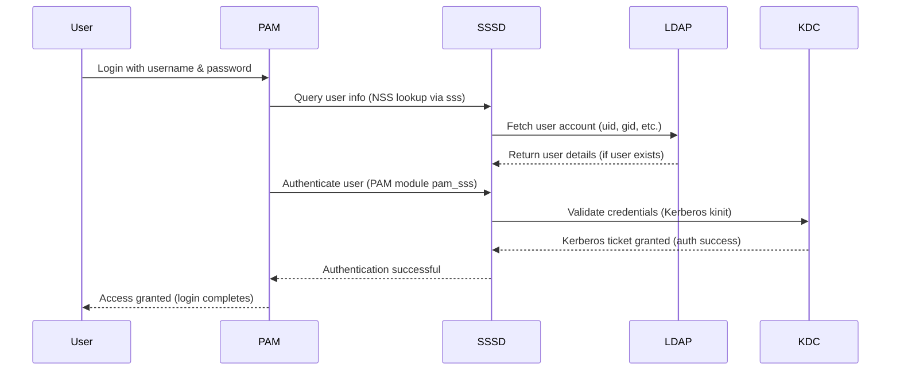

# Ansible Role: OpenLDAP Client

*Ansible role for configuring a Linux system to use OpenLDAP for centralized authentication (with Kerberos integration).*

**Table of Contents**

* [Overview](#overview)
* [Supported Operating Systems/Platforms](#supported-operating-systemsplatforms)
* [Role Variables](#role-variables)
* [Tags](#tags)
* [Dependencies](#dependencies)
* [Example Playbook](#example-playbook)
* [Testing Instructions](#testing-instructions)
* [Known Issues and Gotchas](#known-issues-and-gotchas)
* [Security Implications](#security-implications)
* [Cross-Referencing](#cross-referencing)

## Overview

The **OpenLDAP Client** role installs and configures the necessary components to join a system to an LDAP-based authentication domain. It sets up the host to retrieve user and group information from an **OpenLDAP** directory server and to authenticate user logins via **Kerberos**. By applying this role, you enable centralized identity management on the client: user accounts defined in LDAP will be recognized by the system, and user password verification is offloaded to a Kerberos Key Distribution Center (KDC).

Key features and actions of this role include:

* **Package installation:** Installs the **SSSD** service and related libraries (`sssd-ldap`, `libnss-sss`, `libpam-sss`) as well as the Kerberos client utilities (`krb5-user`). SSSD (System Security Services Daemon) is the core component that interfaces with LDAP and Kerberos on the system.
* **SSSD and Kerberos configuration:** Generates `/etc/sssd/sssd.conf` with the appropriate domain settings (LDAP server URIs, base DN for directory searches, Kerberos realm, etc.), and `/etc/krb5.conf` with the Kerberos realm configuration. The role uses a single SSSD domain (named "LDAP" by default in the template) where `id_provider = ldap` and `auth_provider = krb5`. This means LDAP is used for identity (user accounts, groups) and Kerberos for authentication (password checking).
* **NSS/PAM integration:** Adjusts the system's NSS (Name Service Switch) configuration to include SSSD for user account resolution. Specifically, it modifies the `passwd` entry in `/etc/nsswitch.conf` to use **sss** (SSSD) in addition to the standard methods, so that LDAP users become visible to the system (e.g., commands like `getent passwd` will list LDAP users). It also ensures the **sssd** service is enabled and running so that PAM can consult it for logins. The installed PAM modules (`pam_sss`) are leveraged via SSSD, allowing LDAP/Kerberos users to log in as if they were local accounts.
* **Separation of concerns:** By combining LDAP and Kerberos, the role ensures that **user credentials are not stored in LDAP** – LDAP holds user profiles (usernames, UIDs, group memberships, etc.), while Kerberos handles passwords/tickets. This is a best practice for security and aligns with many enterprise setups (similar to using Active Directory or FreeIPA under the hood). The client will obtain Kerberos tickets at login (via PAM and SSSD), rather than sending passwords to the LDAP server.
* **Idempotent setup:** The role is designed to be safely re-runnable. Configuration templates use variables for flexibility (so you can change the LDAP server or realm by adjusting variables). The SSSD service is only restarted when configuration changes (via handler notification). No changes are made if the system is already correctly configured. This makes it easy to incorporate the role in repeated provisioning runs or to update settings centrally by modifying Ansible vars.

In summary, the OpenLDAP Client role automates the steps needed to join a Linux host to a centralized directory for authentication. After this role runs, administrators can manage user accounts in one place (the LDAP server), and users can log into any configured host with their directory credentials. This role assumes that an OpenLDAP server (with the relevant user database) and a Kerberos KDC are already set up elsewhere – it does **not** install or configure the server side of LDAP or Kerberos, only the client aspect.



The diagram above illustrates the authentication flow after this role is applied. The user’s login process triggers SSSD to retrieve account data from LDAP and to perform authentication via Kerberos. If both steps succeed (user exists in LDAP and password validates with KDC), the login is permitted.

## Supported Operating Systems/Platforms

This role is designed for **Debian-based** Linux distributions (it relies on APT for package management and Debian/Ubuntu package names). It has been used and tested on the following OS releases:

* **Debian**: 11 (Bullseye) and 12 (Bookworm)
* **Ubuntu**: 20.04 LTS (Focal Fossa) and 22.04 LTS (Jammy Jellyfish)

Other Debian or Ubuntu derivatives are likely compatible, as the tasks use standard packages and modules. **Non-APT platforms (e.g., Red Hat, CentOS/RHEL)** are *not supported* by this role without modification. The tasks explicitly use the `apt` module and Debian/Ubuntu package names (`sssd`, `krb5-user`, etc.), which will fail on YUM/RPM-based systems. Ensure your inventory’s target hosts are running one of the supported Debian/Ubuntu versions before applying this role.

## Role Variables

Below is a list of important variables for this role, along with their default values (defined in **`defaults/main.yml`**) and descriptions:

<!-- markdownlint-disable MD033 -->

<details>
<summary>Role Variables (defaults)</summary>

| Variable             | Default Value                 | Description                                                                                                                                                                                                                                                                                                                                                                                                                                                                                                                        |
| -------------------- | ----------------------------- | ---------------------------------------------------------------------------------------------------------------------------------------------------------------------------------------------------------------------------------------------------------------------------------------------------------------------------------------------------------------------------------------------------------------------------------------------------------------------------------------------------------------------------------- |
| **`ldap_servers`**   | `["ldap://ldap.example.com"]` | List of LDAP server URIs that the client should connect to for directory services. Typically this should include the protocol (`ldap://` for unencrypted or `ldaps://` for SSL) and host (and optional port) of your LDAP server(s). If you have multiple redundant LDAP servers, list all of them here. SSSD will try them in order for failover. **By default, this is set to a placeholder pointing to `ldap.example.com`** – you should override it with your actual LDAP server addresses.                                    |
| **`ldap_base_dn`**   | `"dc=example,dc=com"`         | The base distinguished name (DN) for LDAP searches. This is the root of your directory tree under which user and group entries are stored. For example, if your organization’s domain is *example.com*, the base DN might be `dc=example,dc=com`. The client will look under this DN for user entries (and by default expects standard schemas like `inetOrgPerson` and `posixAccount` for user info).                                                                                                                             |
| **`kerberos_realm`** | `"EXAMPLE.COM"`               | The Kerberos realm name (usually in all caps) that the client should use for authentication. This should correspond to your Kerberos domain (often it’s the uppercased DNS domain name). For instance, if your organization’s domain is *example.com* and you have a Kerberos KDC for that domain, the realm could be `EXAMPLE.COM`. This value is placed in the Kerberos config (`/etc/krb5.conf`) as the default realm.                                                                                                          |
| **`kerberos_kdc`**   | `"kdc.example.com"`           | The hostname of the Kerberos Key Distribution Center (KDC) for your realm. This is the server that verifies credentials and issues Kerberos tickets. The role configures the KDC address in `/etc/krb5.conf` based on this variable. In many setups, the KDC hostname might be something like `kdc.example.com` or `kerberos.example.com`. If you have multiple KDCs for redundancy, you can specify one here (Kerberos clients will usually discover others via DNS or additional config, which can be manually added if needed). |

</details>
<!-- markdownlint-enable MD033 -->

**Notes:** The above defaults are mostly placeholders (example values). **You must override** at least some of them to match your environment. In particular, `ldap_servers`, `ldap_base_dn`, and `kerberos_realm`/`kerberos_kdc` should be set to your actual directory domain and authentication realm. If these variables are not correctly configured, the client will not be able to find users or authenticate against your servers. Also note that the role assumes anonymous LDAP binding (or otherwise unrestricted read access) for retrieving user info – it does not set an LDAP bind DN or password. In an environment where the LDAP directory restricts read access, you would need to modify the SSSD config to specify a bind account (this is beyond the default scope of this role).

## Tags

This role does **not define any Ansible tags** in its tasks. All tasks will run whenever the role is invoked. You cannot selectively skip or run parts of this role by tagging internal tasks, since none are tagged. (You can, however, apply your own tags at the role-inclusion level in a play if you want to conditionally run the entire role.)

## Dependencies

* **Ansible Version:** This role has been tested with **Ansible 2.13+** (ansible-core 2.13 and above). It should be compatible with any Ansible 2.10 or later, as it uses standard modules and syntax introduced in the Ansible 2.10+ unified collection format. Using a relatively recent Ansible release is recommended.
* **Collections:** No external Ansible collections are required by this role. It uses only modules from Ansible’s built-in battery (e.g., `ansible.builtin.apt`, `ansible.builtin.template`, etc.). Ensure you have the core Ansible modules available. (For reference, the repository’s top-level `requirements.yml` may list some collections like **community.general** used by other roles, but **OpenLDAP Client** itself does not depend on them.)
* **External Packages:** The role will install the necessary OS packages (via apt) such as **sssd** and **krb5-user**. The target hosts must have access to the appropriate package repositories (e.g., official Debian/Ubuntu repos) to retrieve these. If your servers are offline or behind a proxy, make sure to configure apt or use an internal mirror before running this role.
* **Related Roles:** There are no direct role dependencies in Ansible Galaxy terms. However, in a full deployment you would typically also set up an OpenLDAP server and a Kerberos KDC (which this role does not do). The **OpenLDAP Server** role (and its companion roles for content, replication, etc.) in this repository can be used to deploy the directory server side.

## Example Playbook

Here is an example of how to use the `openldap_client` role in a playbook for systems that need to authenticate against a central LDAP/Kerberos server. In this example, we assume the LDAP domain is **internal.example.com** (base DN `dc=internal,dc=example,dc=com`) and the Kerberos realm is **INTERNAL.EXAMPLE.COM** with a KDC host at `kdc.internal.example.com`:

```yaml
- hosts: ldap_clients
  become: yes  # SSSD setup requires root privileges
  vars:
    ldap_servers:
      - "ldap://ldap01.internal.example.com"
      - "ldap://ldap02.internal.example.com"
    ldap_base_dn: "dc=internal,dc=example,dc=com"
    kerberos_realm: "INTERNAL.EXAMPLE.COM"
    kerberos_kdc: "kdc.internal.example.com"
  roles:
    - openldap_client
```

In the above playbook, we target a host group `ldap_clients` (you would define this in your inventory for machines that should be LDAP/Kerberos clients). We set the necessary variables to point the client at the correct servers and domain. When this play runs, the role will install SSSD and Kerberos client utilities on each host, configure `/etc/sssd/sssd.conf` and `/etc/krb5.conf` according to the provided variables, update NSS to use SSSD, and start the `sssd` service. After convergence, those hosts should be able to accept logins from users present in the LDAP directory (with passwords validated by Kerberos).

## Testing Instructions

This role includes a Molecule test scenario to verify that it configures a client correctly in a containerized test environment. We use **Molecule** (with the Docker driver) to provision a test container and **Testinfra** (pytest) to run assertions. To test the OpenLDAP Client role:

1. **Install Molecule and prerequisites:** Ensure you have Molecule and its dependencies installed on your control machine. For example, using pip: `pip install molecule[docker]` (this installs Molecule and the Docker support). You also need Docker installed (to run the containers), and we recommend installing `pytest` and `testinfra` as well (Molecule will call them for test verification).
2. **Install role dependencies (if any):** The OpenLDAP Client role itself has no external dependencies, but it's good practice to install any collections required by the repository. Run `ansible-galaxy collection install -r requirements.yml` at the repository root to ensure all needed modules for all roles are available. This will, for instance, install **community.general** if not already present (though this particular role doesn’t use it, other roles might).
3. **Run Molecule tests:** From the repository root (where the `molecule/` directory is located), execute the role’s Molecule scenario. The scenario name likely matches the role name (e.g., "openldap_client"). For example:
   `bash
       molecule test -s openldap_client
       `
   This will perform a full test cycle: it will create a fresh Docker container (using a suitable base image, typically Debian or Ubuntu), apply a test playbook that includes the **openldap_client** role, and then run assertions. During the converge step, the role will be applied inside the container just as it would on a real host.
4. **Verification:** Molecule (via Testinfra) will then verify that the role's effects took place. For instance, it may check that the **sssd** package is installed, that the files **`/etc/sssd/sssd.conf`** and **`/etc/krb5.conf`** exist and contain the expected realm/LDAP settings, that **sssd** service is running, and that `nsswitch.conf` has been updated to include "sss". The specifics of the tests can be found in the Molecule scenario (likely under `molecule/openldap_client/molecule.yml` and associated test files).
5. **Cleanup and debug:** After tests pass, Molecule will destroy the test container. If a test fails or you want to inspect the container, you can rerun Molecule in steps. For example, run `molecule converge -s openldap_client` to just create the container and apply the role (leaving the container running), then use `molecule login -s openldap_client` to open a shell inside the container for manual inspection. You can run `molecule verify -s openldap_client` separately to re-run tests on an already converged instance. This can help debug issues by allowing you to examine configuration files or logs inside the container.

A successful test run should end with all assertions passing (Molecule will report "converged" and test results). This indicates that the role works as expected in a default scenario. If you modify the role, you should always re-run its Molecule tests to catch any regressions in functionality.

## Known Issues and Gotchas

* **Debian/Ubuntu only:** As mentioned, this role will not work on Red Hat or other non-APT distributions without changes. If you attempt to run it on an unsupported OS, tasks like package installation (using `apt`) will fail. Make sure your host OS is one of the supported Debian-family versions. If you need similar functionality on RHEL/CentOS, you would have to adapt the role (e.g., use `dnf`/`yum` modules and appropriate package names like `sssd`, `sssd-ldap`, `krb5-workstation`, etc.).
* **Requires existing LDAP/Kerberos infrastructure:** The OpenLDAP Client role *does not set up the server side* of LDAP or Kerberos. You must already have an operational OpenLDAP server containing your user and group entries, and a Kerberos KDC that issues tickets for your users. If either service is misconfigured or unavailable, client logins will fail. For example, if the LDAP server is down, the system won’t find the user’s account; if the KDC is unreachable or the user doesn’t have a Kerberos principal, authentication will not succeed. Ensure network connectivity (and correct DNS resolution) to your LDAP and Kerberos servers from the client.
* **Time synchronization is critical:** Kerberos authentication will fail if the client’s clock is too far out of sync with the KDC (typically a drift greater than 5 minutes by default). All hosts in a Kerberos environment (clients and servers) should be using NTP or another time sync mechanism. If users cannot log in and see “Clock skew too great” or similar errors, check that the system time is synchronized.
* **LDAP over TLS (ldaps://) considerations:** By default, the role’s configuration uses unencrypted LDAP (`ldap://`) on port 389. In many environments, you will want to use **LDAPS** (LDAP over SSL/TLS, usually port 636) or STARTTLS for security. This role does not automatically handle retrieving or trusting LDAP SSL certificates. If you switch `ldap_servers` to an `ldaps://...` URL, make sure the LDAP server’s certificate is trusted by the client (e.g., the CA is added to the system’s certificate store). Otherwise, SSSD may not be able to establish the LDAP connection. You may need to manually configure SSSD’s `ldap_tls_cacert` (path to CA cert) or ensure the CA is in **/etc/ssl/certs**. At present, enabling TLS requires manual certificate distribution – keep this in mind for production deployments.
* **PAM configuration and first login:** The role relies on the installation of `libpam-sss` to integrate with PAM. On Debian/Ubuntu, installing this package typically updates the PAM stack (via **pam-auth-update**) to include SSSD for authentication. However, if you have a custom PAM configuration or the automatic update didn’t occur, LDAP/Kerberos logins might not be enabled in PAM. Symptoms would be that even though SSSD is running and `id username` finds the user, actual login prompts still reject valid credentials. To fix this, ensure that files like **/etc/pam.d/common-auth** and **common-account** include pam_sss entries. Usually this is handled for you, but it’s worth verifying if logins aren’t working. The first login of an LDAP user must be online (connected to LDAP and KDC) to succeed; once a user has logged in, SSSD will cache credentials (by default) to allow offline logins for a period of time.
* **No group lookup by default in nsswitch:** The role specifically adds **sss** to the `passwd:` entry in nsswitch.conf, but it does *not* modify the `group:` entry. This means that while user identities will be fetched from LDAP, group memberships (for LDAP-defined groups) may not be recognized unless you also have `group: files sss` in nsswitch. On a default Ubuntu system, `group` is typically already configured similarly to `passwd`. If your LDAP directory contains custom groups and you want the system to resolve those group names/IDs, verify that **sss** is present for group in nsswitch. You can manually add it or extend the role if needed. Not having SSSD for groups might lead to commands like `id username` not showing all expected group memberships.
* **Access control is wide open (all LDAP users):** Out-of-the-box, SSSD with `access_provider = simple` (and no allow/deny rules specified) will allow any valid LDAP/Kerberos user to log into the system. The role does not set any restrictions (such as allowing only certain groups). In many environments, you may want to limit login access to a subset of directory users (for example, only those in an “admins” group). To implement this, you would need to customize the SSSD configuration after this role runs – for instance, by adding `simple_allow_groups = somegroup` under the domain in **sssd.conf**, or using a different `access_provider` (like LDAP or an AD access filter). Keep in mind that by default, if a user exists in LDAP and has valid credentials, they can attempt to log in to the client. Plan your access controls accordingly.
* **Local administrator account:** When relying on centralized authentication, it’s prudent to have at least one local user with sudo privileges as a fallback (a “break glass” account). This role does not create any local users, so it’s up to you to ensure an admin account exists locally. In case the LDAP/Kerberos services are unreachable (network outage or server down), LDAP users won’t be able to authenticate, and you’ll need a local account to log in for emergency maintenance. Make sure to document and secure this fallback method.
* **Client-side caching and offline logins:** SSSD will cache user credentials and info by default (so that, for example, a user can log in even if the LDAP/KDC is temporarily down, provided they logged in successfully before). The caching defaults (like cache timeout and how many entries to cache) are not tuned by this role. If your environment requires extended offline capability (for laptops, etc.), you might need to adjust SSSD settings (e.g., `offline_credentials_expiration` or `cache_credentials`). On the other hand, if a user’s LDAP info changes (like group membership or shell), there might be a delay before the client picks up the change due to caching. Most of these nuances are handled by SSSD’s defaults, but they are worth noting if you encounter scenarios with stale data or unexpected login availability when offline.

## Security Implications

Enabling LDAP/Kerberos authentication on a client has several security implications, generally positive in terms of centralizing control, but with some caveats to consider:

* **No new network services opened:** This role does not expose any new network ports on the client. SSSD runs as a background service but listens only on local interfaces (for NSS and PAM communication). There is no direct network listener opened to external entities. From a firewall perspective, the client initiates outbound connections to the LDAP server (port 389 or 636) and the KDC (port 88 for Kerberos) but does not accept inbound connections related to SSSD.
* **Centralized authentication = centralized risk:** By using centralized identity, user account management and authentication policies are enforced at the directory/Kerberos server. This is beneficial for consistency and can be more secure (e.g., one place to disable an account or enforce password policy). However, it also means the security of each client is now partially dependent on the security of the LDAP and KDC servers. If those are compromised, an attacker could potentially gain access to all clients. Similarly, if the central services fail, it could lock users out (which is more of an availability concern, but can have security implications if admins then take unsafe shortcuts). It is crucial to secure the LDAP server (with proper ACLs, encryption, etc.) and the Kerberos KDC (which holds credentials), as they become the keys to your kingdom.
* **Kerberos benefits and ticket security:** By utilizing Kerberos, the role avoids transmitting user passwords to the client or over the network after the initial key exchange. Kerberos uses ticket-granting and mutual authentication, which is generally more secure than simple LDAP bind with username/password. Passwords are verified by the KDC, and what the client gets is a ticket (encrypted token). Ensure that your clients and KDC are using strong encryption (modern Kerberos defaults are usually good) and that the Kerberos principals (like host keys) are properly managed. The role sets up a basic Kerberos config; if your realm requires additional hardening (e.g., specific crypto settings or cross-realm trust), you should verify the generated `/etc/krb5.conf` meets those requirements.
* **LDAP communication encryption:** If you do not enable LDAPS or STARTTLS, the information retrieved from LDAP (usernames, group names, etc.) travels in clear text. This may include potentially sensitive metadata (like user full names, phone numbers, etc., if stored in LDAP). While authentication is not done via LDAP in this setup, we recommend using encrypted LDAP connections to protect directory data in transit. This would involve configuring TLS on the LDAP server and then adjusting `ldap_servers` (to use `ldaps://`) and ensuring the client trusts the certificate as noted above. Failure to encrypt LDAP means an eavesdropper on the network could glean info about your users, though not their passwords.
* **User home directories and permissions:** This role does not manage home directory creation or permissions for LDAP users. On a security note, if an LDAP user logs in and no home directory exists, they might get a minimal home or the login could fail. Many setups use something like **pam_mkhomedir** to create a home directory on first login. That is not enabled by default here. If you require automatic home directory creation, consider enabling pam_mkhomedir in your PAM config or adding a task to ensure home directories. Also ensure that file permissions in shared systems are managed properly (multiple users logging into one client will each need a separate home directory with correct ownership).
* **Audit and logging:** After applying this role, authentication attempts will be going through PAM/SSSD. It's important to ensure your system logging (e.g., **/var/log/auth.log** on Ubuntu) is capturing these events. By default, SSSD logs to **/var/log/sssd/** for its own diagnostics and uses the system journal for some messages. Review your logging configuration to make sure any security monitoring or audit policies include these new authentication paths. For instance, failed login attempts for LDAP users should be visible in logs just like local users.
* **Maintaining least privilege:** One advantage of centralized auth is you can easily remove a user’s access to all systems by disabling or deleting their account in LDAP/Kerberos. However, make sure to still adhere to least privilege on the clients. Just because all users can potentially log in doesn’t mean they should all have sudo rights. This role doesn’t touch sudoers or group privileges – it's up to you to manage who is allowed to do what after they authenticate. For example, you might map an LDAP group to the sudoers file if you want centralized sudo control, or continue to manage `/etc/sudoers` locally. The security of each client still depends on properly configured permissions and groups.
* **No direct credential storage on client:** The client doesn’t store user passwords locally (aside from cached Kerberos tickets and optional SSSD credential cache). This is good because a compromise of the client won’t easily yield user passwords (unlike, say, if /etc/shadow had them, which it doesn’t for LDAP users). But note that if an attacker gains root on the client, they could potentially harvest Kerberos tickets or intercept future logins. Standard host security practices (keeping the system patched, limiting root access, etc.) remain critical. The role doesn’t introduce new credentials on the client, but the client’s trust in central services means both need to be secure to maintain overall security.

Overall, using OpenLDAP and Kerberos for authentication can improve security by centralizing credential management and reducing password sprawl. This role implements the client side in a straightforward manner. Administrators should ensure that communications are secured (enable LDAP TLS, maintain Kerberos key secrecy), that fallback methods are in place for availability, and that they continue to enforce proper access controls on each system. The changes made by this role primarily affect authentication flows – these should be reviewed in context of your organization’s security policies (for example, you might have compliance requirements for password handling, which Kerberos helps with, or for user account life-cycle, which centralized LDAP simplifies).

## Cross-Referencing

The **QiMata/ansible** repository contains several related roles that complement or support the OpenLDAP Client role:

* **[openldap_server](../openldap_server/README.md)** – The server-side counterpart to this role. It installs and configures the OpenLDAP server (slapd). If you need to set up an LDAP server from scratch (including creating the directory structure, root DN, etc.), refer to this role. In a typical environment, you would apply **openldap_server** on your directory server(s) and **openldap_client** on all the machines that should authenticate against that directory.
* **[openldap_content](../openldap_content/README.md)** – An ancillary role used to populate LDAP directory data (entries) on an OpenLDAP server. This might load initial organizational units, groups, and user accounts from data files. While not directly used on clients, it’s relevant in that the client relies on those entries being present. If you are bootstrapping a fresh LDAP server, **openldap_content** can help set up base DN entries and default records which the clients will then consume.
* **[openldap_replication](../openldap_replication/README.md)** – Configures multi-master or master-slave replication for OpenLDAP servers. In larger deployments with multiple LDAP servers, replication ensures they stay in sync. Clients typically can be pointed to multiple servers (as we do with `ldap_servers` list) to improve reliability. If you have more than one LDAP server, consider using this role to set up replication between them, so that updates in one are mirrored to others.
* **[openldap_backup](../openldap_backup/README.md)** – Sets up backup routines for OpenLDAP data (such as periodic LDIF exports or hot backups of the database). Again, this is a server-side concern, but it’s mentioned for completeness. A robust central authentication system should have backups; while clients don’t directly interact with this, it’s good operational practice.
* **[openldap_logging](../openldap_logging/README.md)** – Configures logging (for example, sending LDAP logs to a centralized log management system). On the server side, this might involve tools like Filebeat to ship logs. It’s tangentially related to the client role because in auditing you might want to correlate client login attempts with server-side logs. Ensuring proper logging on both sides can help in troubleshooting and security audits.

Together, these roles provide a full solution for LDAP-based identity management: **openldap_server** (and supporting roles) to provide the directory service, and **openldap_client** to consume it on endpoints. Depending on your needs, you might use all of them or just a subset. For instance, if you already have an LDAP/Kerberos infrastructure, you might only use **openldap_client** to enroll new machines. If you are building from scratch, you would start with **openldap_server** (plus content, etc.), then use **openldap_client** on the hosts that should join the domain.

