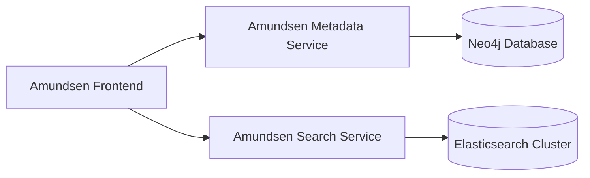

# Ansible Role: Amundsen Metadata

*Ansible role for installing and configuring the **Amundsen Metadata** service (the metadata API backend of the Amundsen data catalog).*

**Table of Contents**

* [Overview](#overview)
* [Supported Operating Systems/Platforms](#supported-operating-systemsplatforms)
* [Role Variables](#role-variables)
* [Tags](#tags)
* [Dependencies](#dependencies)
* [Example Playbook](#example-playbook)
* [Testing Instructions](#testing-instructions)
* [Known Issues and Gotchas](#known-issues-and-gotchas)
* [Cross-Referencing](#cross-referencing)

## Overview

The **Amundsen Metadata** role sets up the Amundsen Metadata service on a target host. Amundsen Metadata is a Flask/Gunicorn-based API service responsible for serving and updating data catalog metadata (such as table/column descriptions, tags, and lineage). It uses a Neo4j graph database as its persistent backend for storing metadata. This role automates the installation of the `amundsen-metadata` Python package (via pip in a virtual environment) and configures it to run as a systemd service listening on a configurable port (default **5002**). It creates a dedicated system user (`amundsen`) to run the service and installs a Gunicorn WSGI server to serve the metadata API.

In a typical Amundsen deployment, the metadata service works in tandem with the Amundsen frontend (web UI) and search service. The frontend calls the metadata service’s API to retrieve or update metadata, while the metadata service in turn communicates with Neo4j to fetch or persist data. For context, the diagram below shows how the Amundsen components interact:



The **Amundsen Metadata** role is generally applied to hosts in the `amundsen_metadata` group (one host or multiple for HA, depending on your inventory). It assumes that a Neo4j database is accessible (either on the same host or remote) and that the appropriate connection credentials are provided. After running this role, the metadata service will be up and running and ready to accept API requests (e.g., the health check at `/healthcheck` should return a status). Typically, you will also run the corresponding **amundsen_search** and **amundsen_frontend** roles on their respective hosts to complete the Amundsen stack (see [Cross-Referencing](#cross-referencing) for more info).

## Supported Operating Systems/Platforms

This role is tested on and designed for **Debian** and **Ubuntu** Linux distributions:

* **Debian**: 11 (Bullseye) and 12 (Bookworm)
* **Ubuntu**: 20.04 LTS (Focal) and 22.04 LTS (Jammy)

Other Debian-based derivatives *may* work as well if they are similar to the above versions. The role relies on `apt` packaging and Python 3, so non-Debian systems (RHEL/CentOS, Alpine, etc.) are not supported without modifications. Ensure you run this role on a supported OS to avoid compatibility issues.

## Role Variables

<details><summary>Click to see default role variables.</summary>

| Variable                        | Default Value                          | Description |
| ------------------------------- | -------------------------------------- | ------------------------------------------------------------------------------------------------------------------------------------------------------------------------------------------------------------------------------------------------------------------------------------------------------------------------------------------------------------------------------------------------------------------------------------------------------------------------------------------------------------------------------------------------------------------------------------------ |
| **`amundsen_metadata_version`** | `"4.0.0"`                              | Version of the **Amundsen Metadata** Python package to install via pip. This should correspond to a valid release of `amundsen-metadata` on PyPI. By default, version **4.0.0** is installed, aligning with Amundsen release 4.0. You can adjust this to pin a specific version of the metadata service (ensure it’s compatible with your Amundsen frontend/search versions). |
| **`metadata_bind_host`**        | `"0.0.0.0"`                            | The network interface the metadata service will bind to. Default is `"0.0.0.0"`, meaning listen on all interfaces (accessible from any network). For restricting access (e.g., if running behind a reverse proxy or on the same host as frontend), you can change this to `127.0.0.1` or a specific interface IP. |
| **`metadata_port`**             | `5002`                                 | TCP port on which the metadata service will listen for API requests. Default **5002**. Make sure this port is accessible to the Amundsen frontend service. If you change it, update the frontend’s `METADATASERVICE_BASE` (metadata API endpoint URL) accordingly in the **amundsen_frontend** role. |
| **`metadata_gunicorn_workers`** | `4`                                    | Number of Gunicorn worker processes to run for the metadata WSGI application. Default **4** (suitable for multi-core systems). Increase for higher throughput or decrease on memory-constrained systems. Gunicorn workers will run in parallel to handle incoming requests. |
| **`metadata_virtualenv`**       | `"/opt/amundsen/metadata/venv"`        | Filesystem path for the Python virtual environment where the metadata service will be installed. By default, `/opt/amundsen/metadata/venv`. The role will create this virtualenv and install the `amundsen-metadata` package inside it. You can change this path if you prefer a different location for the venv. |
| **`neo4j_host`**                | `"localhost"`                          | Hostname or IP address of the Neo4j database that the metadata service will connect to. Default is `"localhost"` (meaning Neo4j is on the same host). Change this to the address of your Neo4j server if it’s running on a separate host. This will be used to set an environment variable for the service. |
| **`neo4j_port`**                | `7687`                                 | Bolt port for the Neo4j database. Default **7687** (Neo4j’s default bolt port). If your Neo4j server uses a non-standard port, set this variable accordingly. This port is injected into the service configuration (environment) so the metadata service knows where to connect. |
| **`neo4j_user`**                | `"neo4j"`                              | Username for Neo4j authentication. Default `"neo4j"`. Typically, Neo4j’s default admin user is `neo4j`. The metadata service will use this username to connect to Neo4j (with the password below). Make sure the user has appropriate privileges to read/write the metadata graph. |
| **`neo4j_password`**            | `"ChangeMe!"`                          | Password for the Neo4j user account. **Default is `"ChangeMe!"`**, which is a placeholder – you **must override this** to the actual password for your Neo4j instance (for security and to allow the metadata service to authenticate successfully). For example, if you used the `neo4j_server` role, set this to the password configured for the Neo4j admin. This value will be stored in the service’s environment variables. |
| **`metadata_config_class`**     | `"metadata_service.config.ProdConfig"` | Python class path for the metadata service configuration. Default uses the Amundsen library’s production config class (`ProdConfig`). This determines things like which backend is used. In most cases you **do not need to change this** (it points to using Neo4j as backend). If you plan to use an alternative metadata backend (e.g., Apache Atlas), you might override this to the appropriate config class that the Amundsen metadata service provides for that backend. The class name is exported to the service via the `METADATA_SVC_CONFIG_MODULE_CLASS` environment variable. |

</details>

Most of the above variables have sane defaults defined in **`roles/amundsen_metadata/defaults/main.yml`**. You can override any of them in your inventory or playbook. For instance, you **must** set a real `neo4j_password` (and possibly `neo4j_host`) to match your environment. If the Neo4j database is on a different host than the metadata service, adjust `neo4j_host`, and ensure network connectivity. Likewise, if you change `metadata_port` or `metadata_bind_host`, remember to reflect that in how other services reach this API (e.g., update Amundsen frontend’s config). Typically, you would define these overrides in a group vars file for the `amundsen_metadata` hosts or in the playbook that includes this role.

## Tags

This role does not define any custom Ansible tags. All tasks in the **amundsen_metadata** role run by default when the role is executed (there are no segments that require special tagging to enable/disable).

* **Required tags:** *None.* There are no required tags needed to run this role – all tasks will run unconditionally as part of the role application.
* **Optional tags:** *None specific to this role.* Since the role’s tasks aren’t individually tagged, you cannot selectively run or skip portions of this role using tags (beyond the usual ability to skip the entire role). If you need to prevent certain tasks, you would have to override variables or handle it outside of tagging. (In practice, this role is small and runs quickly, so fine-grained tagging isn’t necessary.)

## Dependencies

**Ansible collections/roles:** This role has no explicit dependencies on Ansible Galaxy roles or collections. It uses only standard modules from Ansible’s core (like `ansible.builtin.user`, `ansible.builtin.pip`, `ansible.builtin.template`, `ansible.builtin.systemd`, etc.), so no additional collections need to be installed. The role metadata does not list any dependent roles (i.e., `dependencies: []` in meta). All necessary setup is handled within this role or by the playbook that calls it.

**External packages:** The target host **must have Python 3** installed (including the `venv` module) since the role creates a virtual environment and installs a Python package. On Debian/Ubuntu, ensure the package **`python3-venv`** is present (the **Base** role or your base image should cover this). The role will use `python3 -m venv` to create the environment. Also, the host needs network access to PyPI (or an internal mirror) to download the `amundsen-metadata` package and its dependencies. If the host has restricted internet access, you may need to pre-download the wheels or use a proxy.

**Service dependencies:** The Amundsen Metadata service itself depends on a running **Neo4j** database. **This role does not install or configure Neo4j** – it assumes Neo4j is already available. You should ensure that Neo4j is set up (e.g., using the **neo4j_server** role in this repository) before or in tandem with this role, and that the `neo4j_host/port/user/password` variables are set correctly to allow the metadata service to connect. Similarly, if you plan to deploy the full Amundsen stack, you will also need an Elasticsearch service for the search component (which can be deployed via an **elasticsearch** role). These are not strictly “dependencies” in the Ansible sense (they won’t be auto-loaded by this role), but they are prerequisites for a functional Amundsen environment.

## Example Playbook

Here is an example of how to use the **amundsen_metadata** role in a playbook. This assumes you have an inventory group `amundsen_metadata` for the host(s) where the metadata service should run, and that you have set the required variables (like `neo4j_password`) in your inventory or elsewhere.

```yaml
- name: Deploy Amundsen Metadata service
  hosts: amundsen_metadata
  become: yes  # Metadata service setup requires privilege (install packages, create user, etc.)
  vars:
    neo4j_host: "neo4j1.internal.mycompany.com"      # Example: point to remote Neo4j host
    neo4j_password: "{{ vault_neo4j_password }}"     # Example: pulling from an encrypted vault or group var
  roles:
    - role: amundsen_metadata
```

**Notes:** In practice, you might include this role as part of a larger play that sets up the entire Amundsen platform (as shown in the repository’s `deploy_amundsen.yml` playbook). In that case, you’d ensure the Neo4j role runs before this role (if Neo4j is on the same host, or at least that Neo4j is accessible by the time this role runs). Also, it’s good practice to store sensitive variables like `neo4j_password` in an encrypted file or Ansible Vault (rather than plaintext as in the above example).

The above snippet simply applies the role to all hosts in the `amundsen_metadata` group. The role will take care of creating the `amundsen` user, setting up the virtualenv, installing the specified version of Amundsen metadata service, configuring the service, and starting it.

## Testing Instructions

This role comes with (or is designed to work with) **Molecule** for automated testing in a containerized environment. Molecule allows us to verify that the role performs as expected (installing packages, configuring files, starting the service, etc.) on a fresh system. We use the Molecule Docker driver with a Debian-based image (matching the supported OS) for testing.

To run the tests for **amundsen_metadata**:

1. **Install Molecule and requirements:** Ensure you have Molecule and its dependencies installed on your control machine. For example, use pip:

   ```bash
   pip install molecule[docker] pytest testinfra
   ```

   You will also need Docker installed and running, as Molecule will create containers for testing.

2. **Navigate to the role directory (if applicable):** If each role has its own Molecule scenario, you can go to the role’s directory:

   ```bash
   cd roles/amundsen_metadata
   ```

   *(Alternatively, if the repository uses a central `molecule/` directory for all roles, ensure you reference the correct scenario name for this role.)*

3. **Run Molecule test:** Execute the Molecule test command for this role. The scenario name is typically the same as the role name (unless otherwise defined). For example:

   ```bash
   molecule test -s amundsen_metadata
   ```

   This will build a fresh Docker container (using a Debian/Ubuntu image), apply a test playbook that includes the **amundsen_metadata** role, and then run verifications. Molecule will:

   * Create and prepare a container (install Python, etc.).
   * Run the role’s tasks inside the container (this is the “converge” step).
   * Verify the results using **Testinfra** (e.g., check that the `amundsen-metadata` package is installed in the venv, the service file exists in `/etc/systemd/system`, the service is running and listening on port 5002, etc.).
   * Destroy the container.

4. **Examine results:** If the run finishes with “OK” and no failed tasks or tests, the role is functioning as expected. If there are failures, Molecule’s output will indicate what went wrong. You can troubleshoot by running `molecule converge -s amundsen_metadata` to just apply the role without tests, and then use `molecule login -s amundsen_metadata` to get a shell inside the test container for manual inspection. This is useful to check configurations or logs (for example, `journalctl -u amundsen-metadata` to see the service logs in the test environment).

The Molecule tests help ensure idempotence and correct behavior. Before contributing changes to this role, run the Molecule tests to catch any issues. The test scenario for this role is configured (in the `molecule/` directory) to use a minimal Debian/Ubuntu base image and to verify that the metadata service starts properly with default settings. Adjustments might be needed if you change default variables (for example, tests might assume port 5002 is default).

## Known Issues and Gotchas

* **Neo4j connection and credentials:** The metadata service will fail to start if it cannot connect to Neo4j. Ensure that the `neo4j_host`, `neo4j_port`, `neo4j_user`, and `neo4j_password` are correct for your environment. A common pitfall is forgetting to change the `neo4j_password` from the default `"ChangeMe!"` – you must set it to the actual password used by your Neo4j database (especially if you used the **neo4j_server** role, which likely set a specific password). If the service starts but is unable to authenticate to Neo4j, check the service logs for authentication errors. Update the variables as needed and re-run the role (it will update the systemd service environment and restart the service).

* **Port accessibility and firewall:** By default, the service binds to `0.0.0.0:5002`, making it accessible on port 5002 from any network interface. If your server has a firewall (ufw, iptables, etc.), you’ll need to allow traffic on port **5002** (or whatever `metadata_port` you set) for the Amundsen frontend (or other clients) to reach the API. Conversely, if you **don’t** want the service exposed externally, consider setting `metadata_bind_host: 127.0.0.1` so it only listens locally, and ensure the frontend is on the same host or uses an SSH tunnel/proxy to connect. Always double-check that the metadata API is reachable from the frontend host – a quick way is to curl the health check endpoint (e.g., `curl http://<metadata_host>:5002/healthcheck`) from the frontend machine.

* **Keeping versions in sync:** The default `amundsen_metadata_version` is **4.0.0**, which should match the versions of Amundsen **Search** and **Frontend** roles (they are also defaulting to 4.0.0 in this repository). It’s important to keep all Amundsen service versions in sync. If you override the metadata version to a newer release, make sure to also update the search and frontend roles to compatible versions (Amundsen’s services are developed in tandem, so mismatched versions might cause API incompatibilities). When upgrading, read the Amundsen release notes for any config changes – e.g., a new version might introduce new settings or deprecate old ones, which could require adjustments in this role (such as additional variables or template changes).

* **System resources and performance:** The Gunicorn workers default to **4**, which is a good general starting point. However, on very small machines (e.g., a t2.micro with 1 vCPU), 4 workers might be overkill and consume more memory than necessary. You can reduce `metadata_gunicorn_workers` to 2 or 1 for low-memory environments. Conversely, on a large server with many CPU cores and heavy usage, you might increase it. Monitor the process (`ps` or `top`) after deployment to ensure the number of processes and memory usage is as expected. Also note that if multiple Amundsen services run on the **same host**, they should each have distinct `*_port` values (the defaults 5000, 5001, 5002 for frontend, search, metadata respectively are already different). Ensure you don’t accidentally overlap ports if you customize them.

* **Applying changes (idempotence):** This role is designed to be idempotent. Re-running it should not reinstall the package if the specified version is already present, and will only update files if changes are detected. For example, if you change `neo4j_host` or other config values, the systemd service file and the config template will update, triggering handlers to reload and restart the service. One gotcha is that if you manually modify the service or config outside of Ansible, those changes will be overwritten on the next run. Always propagate changes through the Ansible variables to keep configuration consistent. After any change and Ansible run, you can check `systemctl status amundsen-metadata` and `/opt/amundsen/metadata/venv/config.py` to confirm the applied settings.

* **Neo4j initialization**: The Amundsen metadata service expects that the Neo4j backend has the proper metadata schema and initial data loaded (usually done via Amundsen Databuilder or other ingestion jobs). This role **does not handle data ingestion** – it only sets up the service. On first run, if Neo4j is empty, the metadata service will start but your Amundsen frontend will not show any data until you load some metadata. This isn’t exactly an issue with the role, but a reminder that deploying Amundsen involves an ingestion step (often using the Databuilder library or other pipelines) to populate Neo4j and Elasticsearch with metadata. Ensure you have a plan for ingesting metadata (which may be outside the scope of this role’s tasks).

## Cross-Referencing

This repository contains other roles that complement the **amundsen_metadata** role as part of the Amundsen data catalog stack or related infrastructure. Depending on your needs, you may want to use these in conjunction with **amundsen_metadata**:

* **[amundsen_search](../amundsen_search/README.md)** – This role installs and configures the Amundsen *Search* service, which provides search capabilities for the catalog (backed by Elasticsearch). In a full deployment, the search service works alongside the metadata service. The Amundsen frontend will query both metadata (for detailed info) and search service (for search queries). You should deploy **amundsen_search** (on the same host as metadata or a different one) to have a functional search API. The search role defaults to port 5001 and requires an Elasticsearch backend (see below). Make sure to also deploy the Elasticsearch cluster or provide access to one.

* **[amundsen_frontend](../amundsen_frontend/README.md)** – This role sets up the Amundsen frontend (web application). The frontend is the user interface that communicates with both the metadata and search services via REST APIs. It needs to know the base URLs for those services (which by default are `http://localhost:5002` for metadata and `http://localhost:5001` for search). If your services run on different hosts or ports, you must adjust `metadata_api_base` and `search_api_base` variables in the frontend role accordingly. Use the **amundsen_frontend** role to deploy the UI and ensure it points to the metadata service set up by this role.

* **[neo4j_server](../neo4j_server/README.md)** – Installs Neo4j graph database server. Since Amundsen Metadata relies on Neo4j for storage, this role is highly relevant. You can use **neo4j_server** to deploy a Neo4j instance (either on the same node as metadata or a separate database node). The default configuration of this metadata role expects Neo4j on `localhost:7687` with user `neo4j/ChangeMe!`. The **neo4j_server** role lets you set up Neo4j and define a password (which you should then put into `neo4j_password` for this role). Make sure the Neo4j service is up and accessible before (or soon after) the metadata service starts. In an `all-in-one` scenario, you might run neo4j on the same host; in a distributed setup, deploy it on a dedicated host and update the inventory/vars accordingly.

* **[elasticsearch](../elasticsearch/README.md)** – Deploys an Elasticsearch cluster or node. This role isn’t directly used by **amundsen_metadata**, but it is the counterpart for the search service. The **amundsen_search** service needs access to Elasticsearch to index and query metadata. If you are deploying Amundsen Search and you don’t already have an Elasticsearch service, use **elasticsearch** to set one up. Ensure that the `es_host` and `es_port` variables in **amundsen_search** role point to your Elasticsearch instance. While Elasticsearch is not a dependency of the metadata service, it’s part of the overall Amundsen ecosystem and thus worth mentioning here for completeness.

Each of the above roles has its own README with details on usage and configuration. When deploying Amundsen, you will typically include **neo4j_server**, **amundsen_metadata**, **amundsen_search**, **elasticsearch**, and **amundsen_frontend** roles (and possibly others like an ingestion workflow). The `deploy_amundsen.yml` playbook in this repository provides an example of orchestrating these together. By cross-referencing these roles, you can ensure all components are configured to work together (e.g., matching versions, correct connection info). Always refer to each role’s documentation for specific variables and adjust them to maintain consistency across the stack.
