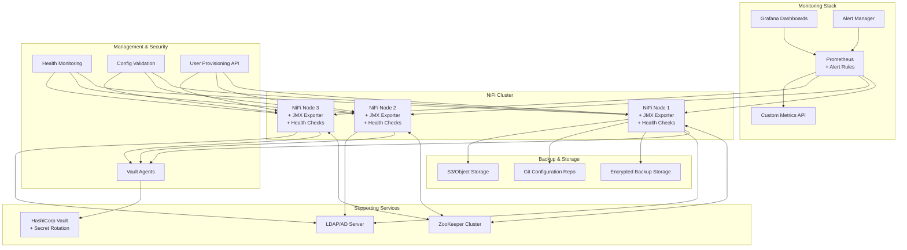

# Apache NiFi Ansible Role - Enhanced Enterprise Edition

**Table of Contents**

* [Overview](#overview)
* [Key Features](#key-features)
* [Supported Operating Systems/Platforms](#supported-operating-systemsplatforms)
* [Role Variables](#role-variables)
* [Tags](#tags)
* [Dependencies](#dependencies)
* [Example Playbooks](#example-playbooks)
* [Testing Instructions](#testing-instructions)
* [Known Issues and Gotchas](#known-issues-and-gotchas)
* [Security Implications](#security-implications)
* [Monitoring and Alerting](#monitoring-and-alerting)
* [Backup and Recovery](#backup-and-recovery)
* [Version Control and GitOps](#version-control-and-gitops)

## Overview

This role installs and configures **Apache NiFi**, a powerful data flow management system with comprehensive enterprise features. This enhanced version provides production-ready capabilities including advanced security, automated backup/recovery, comprehensive monitoring, user management, and GitOps integration.

## Key Features

### 🔧 **Installation & Configuration**
* **Flexible installation methods:** Package-based (APT) or tarball installation
* **Cluster (HA) support:** Multi-node clusters with ZooKeeper coordination
* **Environment-specific configurations:** Development, staging, and production profiles
* **Configuration validation:** Automated syntax and connectivity testing
* **Template management:** Automated NiFi flow template deployment

### 🔒 **Enhanced Security Features**
* **HashiCorp Vault integration:** Secure secrets management with automatic rotation
* **Sensitive properties encryption:** Automated encryption key generation and management
* **Security hardening:** CIS-compliant security settings and system hardening
* **TLS/HTTPS support:** Production-ready secure deployments
* **LDAP/AD authentication:** Enterprise directory integration
* **Automated user provisioning:** Bulk user and group creation via API
* **Role-based access control (RBAC):** Template-based policy management

### 📊 **Monitoring & Observability**
* **Enhanced Prometheus integration:** JMX metrics export and custom metrics collection
* **Performance monitoring:** JVM monitoring, GC logging, and NiFi-specific metrics
* **Health checks:** Automated health monitoring with configurable alerts
* **Structured logging:** JSON-formatted logs with automatic rotation
* **Alerting rules:** Pre-configured Prometheus alerts for common issues
* **Custom metrics endpoint:** RESTful metrics API for external monitoring

### 💾 **Backup & Disaster Recovery**
* **Automated backup procedures:** Scheduled backups of all critical components
* **Encryption support:** Optional backup encryption with secure key management
* **Restore automation:** Automated restore with validation and rollback
* **Retention management:** Configurable backup lifecycle policies
* **Cross-region backup:** Support for remote backup storage

### 🚀 **Template & Configuration Management**
* **Flow template deployment:** Automated deployment and version management
* **Configuration drift detection:** Monitor unauthorized changes
* **Environment promotion:** Automated configuration promotion between environments
* **Validation framework:** Comprehensive configuration testing

### 🔗 **Version Control & GitOps**
* **Git integration:** Automatic configuration backup to repositories
* **Configuration as Code:** Infrastructure-as-code workflows
* **Change tracking:** Comprehensive audit trail of all changes
* **Automated rollback:** Quick recovery from configuration issues

### Architecture Diagram



## Supported Operating Systems/Platforms

* **Debian** – 11 (Bullseye) and 12 (Bookworm)
* **Ubuntu** – 20.04 LTS (Focal Fossa) and 22.04 LTS (Jammy Jellyfish)

## Role Variables

### Core Installation Variables

| Variable | Default | Description |
|----------|---------|-------------|
| `apache_nifi_version` | `"2.0.0"` | NiFi version to install |
| `apache_nifi_install_method` | `"package"` | Installation method: `package` or `tarball` |
| `apache_nifi_environment` | `"production"` | Environment: `development`, `staging`, `production` |
| `apache_nifi_user` | `"nifi"` | System user for NiFi service |
| `apache_nifi_home` | `"/opt/nifi"` | NiFi installation directory |

### Security & Vault Integration

| Variable | Default | Description |
|----------|---------|-------------|
| `apache_nifi_vault_integration` | `false` | Enable HashiCorp Vault integration |
| `apache_nifi_vault_url` | `""` | Vault server URL |
| `apache_nifi_vault_secret_path` | `"secret/nifi"` | Vault secret path |
| `apache_nifi_sensitive_props_key` | `""` | Sensitive properties encryption key |
| `apache_nifi_security_hardening` | `true` | Enable security hardening |

### User Management

| Variable | Default | Description |
|----------|---------|-------------|
| `apache_nifi_auto_provision_users` | `false` | Enable automated user provisioning |
| `apache_nifi_users` | `[]` | List of users to create |
| `apache_nifi_groups` | `[]` | List of groups to create |
| `apache_nifi_rbac_templates` | `[]` | RBAC policy templates |

### Monitoring & Observability

| Variable | Default | Description |
|----------|---------|-------------|
| `apache_nifi_prometheus_integration` | `false` | Enable Prometheus monitoring |
| `apache_nifi_prometheus_jmx_exporter` | `true` | Enable JMX Prometheus exporter |
| `apache_nifi_health_checks` | `true` | Enable automated health checks |
| `apache_nifi_alerting_enabled` | `false` | Enable alerting rules |

### Backup & Recovery

| Variable | Default | Description |
|----------|---------|-------------|
| `apache_nifi_backup_enabled` | `false` | Enable automated backups |
| `apache_nifi_backup_schedule` | `"0 2 * * *"` | Backup schedule (cron) |
| `apache_nifi_backup_encrypt` | `false` | Enable backup encryption |
| `apache_nifi_backup_retention_days` | `7` | Backup retention period |

### Template Management

| Variable | Default | Description |
|----------|---------|-------------|
| `apache_nifi_template_deployment` | `false` | Enable flow template deployment |
| `apache_nifi_config_validation` | `true` | Enable configuration validation |
| `apache_nifi_version_control` | `false` | Enable Git integration |

## Tags

* `nifi` - All NiFi-related tasks
* `security` - Security and Vault integration
* `users` - User management and RBAC
* `monitoring` - Monitoring and health checks
* `backup` - Backup and recovery
* `templates` - Template deployment
* `validation` - Configuration validation

## Dependencies

Optional dependencies based on enabled features:

* `security_identity/vault` - For Vault integration
* `monitoring_observability/prometheus` - For monitoring

## Example Playbooks

### Basic Production Deployment

```yaml
---
- hosts: nifi_servers
  become: true
  roles:
    - apache_nifi
  vars:
    apache_nifi_version: "2.0.0"
    apache_nifi_environment: "production"
    
    # Security
    nifi_enable_https: true
    apache_nifi_security_hardening: true
    
    # Monitoring
    apache_nifi_prometheus_integration: true
    apache_nifi_health_checks: true
    
    # Backup
    apache_nifi_backup_enabled: true
    apache_nifi_backup_encrypt: true
```

### Enterprise Cluster with Full Features

```yaml
---
- hosts: nifi_cluster
  become: true
  roles:
    - apache_nifi
  vars:
    # Core Configuration
    apache_nifi_version: "2.0.0"
    apache_nifi_environment: "production"
    
    # Clustering
    nifi_cluster_enabled: true
    nifi_zookeeper_connect: "zk1:2181,zk2:2181,zk3:2181"
    
    # Security & Vault
    apache_nifi_vault_integration: true
    apache_nifi_vault_url: "https://vault.company.com:8200"
    apache_nifi_vault_role_id: "{{ vault_nifi_role_id }}"
    apache_nifi_vault_secret_id: "{{ vault_nifi_secret_id }}"
    apache_nifi_security_hardening: true
    
    # User Management
    apache_nifi_auto_provision_users: true
    apache_nifi_users:
      - username: "data_engineer"
        identity: "CN=data_engineer,OU=Engineering,DC=company,DC=com"
        groups: ["engineers", "analysts"]
      - username: "admin_user"
        identity: "CN=admin_user,OU=IT,DC=company,DC=com"
        groups: ["administrators"]
    
    apache_nifi_groups:
      - name: "engineers"
        policies: ["view the user interface", "access the controller", "modify the controller"]
      - name: "analysts"
        policies: ["view the user interface", "access the controller", "query provenance"]
      - name: "administrators"
        policies: ["view the user interface", "access the controller", "modify the controller", "access restricted components"]
    
    # Enhanced Monitoring
    apache_nifi_prometheus_integration: true
    apache_nifi_prometheus_jmx_exporter: true
    apache_nifi_prometheus_custom_metrics: true
    apache_nifi_health_checks: true
    apache_nifi_alerting_enabled: true
    apache_nifi_alerting_rules:
      - name: "nifi_high_memory"
        expr: "jvm_memory_heap_used / jvm_memory_heap_max > 0.85"
        for: "10m"
        severity: "warning"
        summary: "NiFi high memory usage detected"
    
    # Backup & Recovery
    apache_nifi_backup_enabled: true
    apache_nifi_backup_schedule: "0 2 * * *"
    apache_nifi_backup_encrypt: true
    apache_nifi_backup_retention_days: 14
    apache_nifi_backup_location: "/backup/nifi"
    
    # Template Management
    apache_nifi_template_deployment: true
    apache_nifi_templates:
      - name: "data_ingestion_standard"
        source: "files/templates/data_ingestion.xml"
        description: "Standard data ingestion flow"
        auto_deploy: true
      - name: "monitoring_flow"
        source: "files/templates/monitoring.xml"
        description: "System monitoring flow"
        auto_deploy: true
    
    # Version Control
    apache_nifi_version_control: true
    apache_nifi_git_repository: "https://github.com/company/nifi-config.git"
    apache_nifi_git_branch: "main"
    apache_nifi_git_username: "nifi-service"
    apache_nifi_git_token: "{{ github_token }}"
    apache_nifi_config_drift_detection: true
    
    # Performance Tuning
    apache_nifi_jvm_heap_size: "4g"
    apache_nifi_jvm_monitoring: true
    apache_nifi_performance_metrics: true
    
    # Custom Properties
    apache_nifi_custom_properties:
      nifi.content.repository.implementation: "org.apache.nifi.controller.repository.FileSystemRepository"
      nifi.provenance.repository.buffer.size: "100000"
      nifi.flowfile.repository.partitions: "256"
```

### Development Environment

```yaml
---
- hosts: nifi_dev
  become: true
  roles:
    - apache_nifi
  vars:
    apache_nifi_environment: "development"
    nifi_enable_https: false
    apache_nifi_security_hardening: false
    apache_nifi_health_checks: true
    apache_nifi_config_validation: true
    apache_nifi_prometheus_integration: true
    apache_nifi_backup_enabled: false
```

## Testing Instructions

### Molecule Testing

```bash
# Test all scenarios
molecule test

# Test specific scenarios
molecule test -s default
molecule test -s podman

# Development testing
molecule converge
molecule verify
```

### Manual Testing

```bash
# Health check
sudo -u nifi /opt/nifi/conf/scripts/health_check.sh

# Configuration validation
sudo -u nifi python3 /opt/nifi/conf/scripts/validate_config.py

# Backup test
sudo -u nifi /opt/nifi/conf/scripts/backup_nifi.sh

# Restore test
sudo -u nifi /opt/nifi/conf/scripts/restore_nifi.sh latest

# Connectivity tests
curl -k https://nifi-server:9443/nifi-api/access/config

# Metrics endpoint
curl http://nifi-server:9998/metrics
```

## Known Issues and Gotchas

1. **Vault Integration:** Ensure Vault is accessible and properly configured before enabling integration
2. **Initial Admin Setup:** Configure the initial admin user before running user provisioning
3. **Cluster Timing:** ZooKeeper must be available before starting NiFi nodes
4. **Certificate Management:** Pre-existing keystores/truststores are required for HTTPS
5. **Backup Encryption:** Requires pre-configured encryption keys
6. **Git Integration:** Requires proper Git credentials and repository access

## Security Implications

### Enhanced Security Features

* **Secrets Management:** Integration with HashiCorp Vault for secure secret storage
* **Encryption:** Sensitive properties and backup encryption
* **Access Control:** Automated RBAC with user/group provisioning
* **Hardening:** CIS-compliant security settings
* **Monitoring:** Security event monitoring and alerting
* **Audit:** Comprehensive change tracking and backup

### Security Best Practices

1. Use Vault for all sensitive data
2. Enable TLS with proper certificates
3. Implement regular security updates
4. Monitor access logs and security events
5. Use network segmentation
6. Encrypt backups and use secure storage
7. Implement proper key management
8. Regular security assessments

## Monitoring and Alerting

### Metrics Collection

* **JMX Metrics:** Comprehensive JVM and NiFi metrics
* **Custom Metrics:** Application-specific performance metrics
* **Health Checks:** Automated system health monitoring
* **Log Aggregation:** Structured logging with retention policies

### Alerting Rules

Pre-configured alerts for:
* Service availability
* Memory and CPU usage
* Queue backpressure
* Cluster node failures
* Security events
* Backup failures

### Dashboards

* NiFi cluster overview
* Performance metrics
* Security dashboard
* Backup status
* Error tracking

## Backup and Recovery

### Backup Features

* **Automated Scheduling:** Configurable backup schedules
* **Encryption:** Optional backup encryption with secure keys
* **Compression:** Efficient backup compression
* **Retention:** Automated cleanup based on retention policies
* **Validation:** Backup integrity checking

### Recovery Procedures

* **Automated Restore:** Script-based restoration process
* **Validation:** Pre-restore validation and testing
* **Rollback:** Quick rollback capabilities
* **Point-in-time Recovery:** Restore to specific backup points

### Backup Components

* Configuration files
* Flow definitions
* Repositories (FlowFile, Content, Provenance)
* User and authorization data
* Templates and custom components

## Version Control and GitOps

### Git Integration

* **Configuration Tracking:** Automatic backup of configurations to Git
* **Change Detection:** Monitor for configuration drift
* **Version History:** Complete audit trail of changes
* **Rollback:** Easy rollback to previous configurations

### GitOps Workflow

1. Configuration changes committed to Git
2. Automated validation and testing
3. Deployment to staging environment
4. Production deployment after approval
5. Continuous monitoring and drift detection

### Change Management

* Automated change detection
* Configuration validation
* Rollback procedures
* Audit logging
* Compliance reporting

This enhanced Apache NiFi role provides enterprise-grade capabilities for production deployments with comprehensive security, monitoring, backup, and management features.
