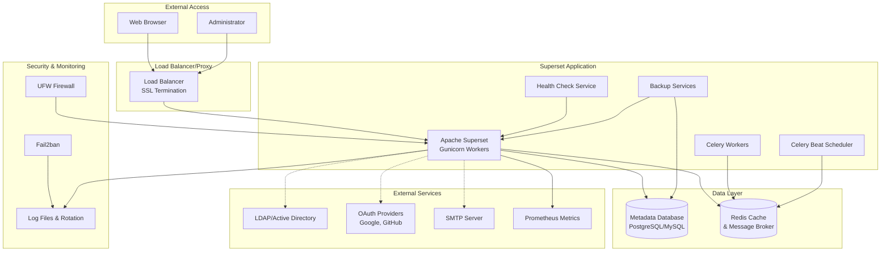

# Ansible Role: Apache Superset (Enhanced)

*Ansible role for installing and configuring **Apache Superset**, an open-source data exploration and visualization platform with enterprise features.*

**Table of Contents**

* [Overview](#overview)
* [Supported Operating Systems/Platforms](#supported-operating-systemsplatforms)
* [Role Variables](#role-variables)
* [Tags](#tags)
* [Dependencies](#dependencies)
* [Example Playbook](#example-playbook)
* [Testing Instructions](#testing-instructions)
* [Known Issues and Gotchas](#known-issues-and-gotchas)
* [Security Implications](#security-implications)
* [Cross-Referencing](#cross-referencing)

## Overview

The **Apache Superset** role sets up the Superset data visualization web application on a target host with comprehensive enterprise features. Apache Superset is a Flask-based web UI for exploring and visualizing data, with a rich set of charts and dashboards. 

This enhanced role automates the installation of Superset (via pip in a Python 3 virtual environment) and configures it to run as a systemd service using Gunicorn (a WSGI web server) by default. It creates a dedicated system user (`superset`) with no login shell to run the service, installs required system libraries (for Python build and database drivers), and generates the Superset configuration file with your specified settings.

### Key Features

- **🔒 SSL/TLS Support**: Built-in HTTPS configuration with self-signed or custom certificates
- **⚙️ Celery Worker Management**: Automatic setup of Celery workers and beat scheduler for background tasks
- **🗄️ Database Management**: Connection validation, auto-creation, and backup capabilities
- **🔐 Authentication Integration**: LDAP, OAuth (Google, GitHub, etc.), and local authentication
- **📊 Monitoring & Logging**: Comprehensive logging, health checks, and metrics collection
- **🛡️ Security Enhancements**: Firewall management, fail2ban integration, CSP headers, rate limiting
- **💾 Backup & Recovery**: Automated database and configuration backups with retention policies
- **🚀 Performance Tuning**: Advanced caching, Gunicorn optimization, and connection pooling

The role also initializes the Superset metadata database (applying migrations) and creates an administrator user on first run (using credentials provided by variables). Optionally, you can load example dashboards and data for demo or development by enabling the examples flag.

In a typical deployment, Superset requires a **metadata database** to store dashboards, charts, and user accounts (by default this role uses a local SQLite file, but you can point it to an external PostgreSQL/MySQL database for production). Superset's web server will listen on a configurable port (default **8088** on all interfaces) and can be secured with SSL/TLS. Superset can also use **Redis** as a caching layer and message broker for background tasks (via Celery). 



After applying this role, the Superset service will be up and running as a daemon with all configured features enabled. You may also consider deploying complementary services such as a dedicated metadata database (PostgreSQL, etc.) and a reverse proxy or load balancer in front of Superset for production use. See the **Cross-Referencing** section for related roles and recommendations.

## Supported Operating Systems/Platforms

This role is tested on and designed for **Debian-based** Linux distributions:

* **Debian**: 11 (*Bullseye*) and 12 (*Bookworm*)
* **Ubuntu**: 20.04 LTS (*Focal*) and 22.04 LTS (*Jammy*)

Other Debian derivatives may work if they use `apt` and have similar package names. The role uses APT for package management and assumes Python 3 is available, so non-Debian systems (RHEL, CentOS, Alpine, etc.) are **not supported** without modification. Ensure you run this role on a supported OS to avoid compatibility issues with package names and systemd service configuration.

## Role Variables

<details><summary>Click to see all role variables.</summary>

### Core Configuration

| Variable                                  | Default Value                                         | Description                                                                                                                                                                                                                                                                                                                                                                                                                                                                                                                                                                                                           |
| ----------------------------------------- | ----------------------------------------------------- | --------------------------------------------------------------------------------------------------------------------------------------------------------------------------------------------------------------------------------------------------------------------------------------------------------------------------------------------------------------------------------------------------------------------------------------------------------------------------------------------------------------------------------------------------------------------------------------------------------------------- |
| **`superset_version`**                    | "latest"                                            | Version of **Apache Superset** to install (via pip). The role will install this specific version of the `apache-superset` Python package in the virtual environment. By default it uses "latest", which pulls the newest available release from PyPI. Pin this to a specific version for repeatable deployments.                                                                                                                                                                                                                                                                                                    |
| **`superset_user`**                       | "superset"                                          | System username under which Superset will run. The role creates this user (and group) if not present, with no login shell and no home directory. Running the service as a dedicated unprivileged user enhances security (isolating Superset from other processes).                                                                                                                                                                                                                                                                                                                                                    |
| **`superset_group`**                      | "superset"                                          | System group for Superset. Typically the same name as the user. Files and processes for Superset will be owned by this group.                                                                                                                                                                                                                                                                                                                                                                                                                                                                                         |
| **`superset_install_dir`**                | "/opt/superset"                                     | Path to the main installation directory for Superset. The role will create this directory to hold the application files and virtual environment.                                                                                                                                                                                                                                                                                                                                                                                                                                                                      |
| **`superset_venv_dir`**                   | "{{ superset_install_dir }}/venv"                   | Path to the Python virtual environment directory where Superset and its Python dependencies will be installed. By default, this is a `venv` directory under the install path. All pip installations (Superset itself and any additional packages) go into this venv.                                                                                                                                                                                                                                                                                                                                                  |
| **`superset_config_dir`**                 | "/etc/superset"                                     | Directory for Superset configuration and related files. A Python config file (`superset_config.py`) will be placed here. The role ensures this directory exists with proper ownership (`superset:superset`) and permissions (default 0750).                                                                                                                                                                                                                                                                                                                                                                           |

### SSL/TLS Configuration

| Variable                     | Default Value                            | Description                                                                  |
| ---------------------------- | ---------------------------------------- | ---------------------------------------------------------------------------- |
| **`superset_ssl_enabled`**   | false                                    | Enable SSL/TLS support for Superset. When enabled, Gunicorn will serve HTTPS |
| **`superset_ssl_cert_path`** | "/etc/ssl/certs/superset.crt"          | Path to SSL certificate file. Self-signed certificate generated if not exists |
| **`superset_ssl_key_path`**  | "/etc/ssl/private/superset.key"        | Path to SSL private key file                                                |
| **`superset_ssl_ca_path`**   | ""                                       | Path to SSL CA certificate file (optional)                                  |
| **`superset_ssl_protocols`** | "TLSv1.2 TLSv1.3"                      | Allowed TLS protocol versions                                                |
| **`superset_ssl_ciphers`**   | "ECDHE+AESGCM:ECDHE+CHACHA20:DHE+..."  | SSL cipher suite configuration                                               |

### Celery Configuration

| Variable                               | Default Value              | Description                                                     |
| -------------------------------------- | -------------------------- | --------------------------------------------------------------- |
| **`superset_celery_enabled`**          | false                      | Enable Celery worker support for background tasks              |
| **`superset_celery_workers`**          | 2                          | Number of Celery worker processes to start                     |
| **`superset_celery_beat_enabled`**     | false                      | Enable Celery beat scheduler for periodic tasks                |
| **`superset_celery_worker_log_level`** | "info"                     | Log level for Celery workers                                   |
| **`superset_celery_worker_concurrency`** | 4                          | Number of concurrent worker threads                             |
| **`superset_celery_result_backend`**   | "{{ superset_celery_broker_url }}" | Result backend URL for Celery                                  |
| **`superset_celery_beat_schedule`**    | {}                         | Dictionary of scheduled tasks for Celery beat                  |

### Database Management

| Variable                              | Default Value                | Description                                                        |
| ------------------------------------- | ---------------------------- | ------------------------------------------------------------------ |
| **`superset_db_auto_create`**         | false                        | Automatically create database if it doesn't exist                 |
| **`superset_db_validate_connection`** | true                         | Validate database connection before starting Superset             |
| **`superset_db_backup_enabled`**      | false                        | Enable automated database backups                                 |
| **`superset_db_backup_schedule`**     | "0 2 * * *"                  | Cron schedule for database backups (daily at 2 AM)              |
| **`superset_db_backup_retention_days`** | 7                          | Number of days to retain database backups                         |
| **`superset_db_backup_path`**         | "/var/backups/superset"      | Directory to store database backups                               |

### Authentication Configuration

| Variable                              | Default Value              | Description                                                        |
| ------------------------------------- | -------------------------- | ------------------------------------------------------------------ |
| **`superset_auth_type`**              | "AUTH_DB"                  | Authentication type: AUTH_DB, AUTH_LDAP, AUTH_OAUTH                |
| **`superset_ldap_enabled`**           | false                      | Enable LDAP authentication                                        |
| **`superset_ldap_server`**            | ""                         | LDAP server hostname or IP                                         |
| **`superset_ldap_use_tls`**           | true                       | Use TLS for LDAP connections                                      |
| **`superset_ldap_bind_user`**         | ""                         | LDAP bind user DN                                                  |
| **`superset_ldap_bind_password`**     | ""                         | LDAP bind user password                                            |
| **`superset_ldap_basedn`**            | ""                         | LDAP base DN for user searches                                    |
| **`superset_ldap_search`**            | ""                         | LDAP search filter                                                 |
| **`superset_oauth_enabled`**          | false                      | Enable OAuth authentication                                        |
| **`superset_oauth_providers`**        | []                         | List of OAuth provider configurations                              |

### Monitoring and Logging

| Variable                         | Default Value                     | Description                                                    |
| -------------------------------- | --------------------------------- | -------------------------------------------------------------- |
| **`superset_log_level`**         | "INFO"                            | Application log level                                          |
| **`superset_log_file`**          | "/var/log/superset/superset.log"  | Main log file path                                             |
| **`superset_log_max_bytes`**     | 104857600                         | Maximum log file size before rotation (100MB)                 |
| **`superset_log_backup_count`**  | 5                                 | Number of rotated log files to keep                           |
| **`superset_enable_access_log`** | true                              | Enable access logging                                          |
| **`superset_access_log_file`**   | "/var/log/superset/access.log"    | Access log file path                                           |
| **`superset_metrics_enabled`**   | false                             | Enable Prometheus metrics collection                           |
| **`superset_health_check_enabled`** | true                              | Enable health check monitoring                                |

### Security Configuration

| Variable                           | Default Value | Description                                                  |
| ---------------------------------- | ------------- | ------------------------------------------------------------ |
| **`superset_firewall_enabled`**    | false         | Enable UFW firewall management                               |
| **`superset_firewall_allowed_ips`** | []            | List of IPs allowed through firewall                        |
| **`superset_fail2ban_enabled`**    | false         | Enable fail2ban for brute force protection                  |
| **`superset_csp_enabled`**         | false         | Enable Content Security Policy headers                      |
| **`superset_rate_limiting_enabled`** | false         | Enable rate limiting                                         |
| **`superset_rate_limit_per_minute`** | 100           | Rate limit requests per minute                               |

### Performance and Caching

| Variable                          | Default Value                | Description                                              |
| --------------------------------- | ---------------------------- | -------------------------------------------------------- |
| **`superset_cache_config`**       | SimpleCache configuration    | Main cache configuration dictionary                      |
| **`superset_results_cache_config`** | SimpleCache configuration    | Query results cache configuration                        |
| **`superset_thumbnail_cache_config`** | SimpleCache configuration    | Dashboard thumbnail cache configuration                  |
| **`superset_gunicorn_timeout`**   | 300                          | Gunicorn worker timeout in seconds                      |
| **`superset_gunicorn_keepalive`** | 2                            | Gunicorn keepalive timeout                               |
| **`superset_gunicorn_max_requests`** | 1000                         | Maximum requests per worker before restart              |
| **`superset_gunicorn_preload_app`** | true                         | Preload application code before forking workers         |
| **`superset_gunicorn_worker_class`** | "sync"                       | Gunicorn worker class (sync, gevent, eventlet)          |

### Email Configuration

| Variable                      | Default Value            | Description                                    |
| ----------------------------- | ------------------------ | ---------------------------------------------- |
| **`superset_email_enabled`**  | false                    | Enable email functionality for reports/alerts |
| **`superset_smtp_host`**      | ""                       | SMTP server hostname                           |
| **`superset_smtp_port`**      | 587                      | SMTP server port                               |
| **`superset_smtp_use_tls`**   | true                     | Use TLS for SMTP connections                  |
| **`superset_smtp_username`**  | ""                       | SMTP authentication username                   |
| **`superset_smtp_password`**  | ""                       | SMTP authentication password                   |

### Backup Configuration

| Variable                                | Default Value                   | Description                                         |
| --------------------------------------- | ------------------------------- | --------------------------------------------------- |
| **`superset_config_backup_enabled`**    | false                           | Enable configuration file backups                  |
| **`superset_config_backup_schedule`**   | "0 3 * * *"                     | Cron schedule for config backups (daily at 3 AM)  |
| **`superset_config_backup_path`**       | "/var/backups/superset-config"  | Directory to store configuration backups           |
| **`superset_config_backup_retention_days`** | 30                              | Number of days to retain configuration backups     |

</details>

## Tags

This role defines several Ansible tags that allow you to run or skip subsets of tasks:

* **`superset`** – A general tag applying to all tasks in this role
* **`superset_install`** – Tasks for installing system dependencies and creating users
* **`superset_venv`** – Tasks for setting up the Python virtual environment
* **`superset_config`** – Tasks for generating configuration files
* **`superset_ssl`** – SSL/TLS configuration tasks
* **`superset_database`** – Database management and validation tasks
* **`superset_auth`** – Authentication configuration tasks
* **`superset_monitoring`** – Monitoring and logging setup tasks
* **`superset_security`** – Security enhancement tasks
* **`superset_backup`** – Backup and recovery tasks
* **`superset_celery`** – Celery worker management tasks
* **`superset_db`** – Database initialization tasks
* **`superset_service`** – Systemd service management tasks

## Dependencies

This role has enhanced dependencies for the new features:

### Required Collections
- `community.crypto` - For SSL certificate management
- `community.general` - For UFW firewall and other utilities
- `community.postgresql` - For PostgreSQL database operations
- `community.mysql` - For MySQL database operations

### Optional Role Dependencies
The following roles can be used in conjunction with this role for complete enterprise setup:

- **`security_identity.letsencrypt.letsencrypt_setup`** - For Let's Encrypt SSL certificates (when `superset_ssl_enabled: true`)
- **`monitoring_observability.prometheus`** - For Prometheus metrics collection (when `superset_metrics_enabled: true`)
- **`data_systems.postgresql`** - For PostgreSQL database setup (when using PostgreSQL)
- **`security_identity.openldap.open_ldap_setup`** - For LDAP server setup (when `superset_ldap_enabled: true`)

### System Requirements
- Python 3.7+
- Internet access for package installation
- Sufficient disk space for backups (if enabled)
- Redis server (if using caching or Celery)
- External database server (for production deployments)

## Example Playbook

Here's a comprehensive example showing how to use this role with enhanced features:

```yaml
---
- hosts: superset_servers
  become: yes
  vars:
    # Core Configuration
    superset_version: "3.0.0"
    superset_secret_key: "{{ vault_superset_secret_key }}"
    superset_admin_password: "{{ vault_superset_admin_password }}"
    
    # Database Configuration
    superset_database_uri: "postgresql://superset:{{ vault_superset_db_password }}@db01.example.com/superset"
    superset_db_validate_connection: true
    superset_db_backup_enabled: true
    superset_db_backup_schedule: "0 2 * * *"
    superset_db_backup_retention_days: 14
    
    # SSL/TLS Configuration
    superset_ssl_enabled: true
    superset_ssl_cert_path: "/etc/ssl/certs/superset.crt"
    superset_ssl_key_path: "/etc/ssl/private/superset.key"
    
    # Celery Configuration
    superset_celery_enabled: true
    superset_celery_workers: 4
    superset_celery_beat_enabled: true
    superset_celery_broker_url: "redis://redis01.internal:6379/1"
    
    # Caching Configuration
    superset_redis_url: "redis://redis01.internal:6379/0"
    
    # Authentication Configuration
    superset_ldap_enabled: true
    superset_ldap_server: "ldap.company.com"
    superset_ldap_bind_user: "cn=superset,ou=service,dc=company,dc=com"
    superset_ldap_bind_password: "{{ vault_ldap_password }}"
    superset_ldap_basedn: "ou=users,dc=company,dc=com"
    
    # Security Configuration
    superset_firewall_enabled: true
    superset_firewall_allowed_ips:
      - "10.0.0.0/8"
      - "192.168.1.0/24"
    superset_fail2ban_enabled: true
    superset_csp_enabled: true
    superset_rate_limiting_enabled: true
    
    # Monitoring Configuration
    superset_metrics_enabled: true
    superset_health_check_enabled: true
    superset_log_level: "INFO"
    
    # Email Configuration
    superset_email_enabled: true
    superset_smtp_host: "smtp.company.com"
    superset_smtp_username: "superset@company.com"
    superset_smtp_password: "{{ vault_smtp_password }}"
    
    # Backup Configuration
    superset_config_backup_enabled: true
    superset_config_backup_retention_days: 90
    
    # Performance Tuning
    superset_gunicorn_workers: 8
    superset_gunicorn_worker_class: "gevent"
    superset_gunicorn_timeout: 300
    
    # Feature Flags
    superset_feature_flags:
      DASHBOARD_NATIVE_FILTERS: true
      DASHBOARD_CROSS_FILTERS: true
      ALERT_REPORTS: true
      ROW_LEVEL_SECURITY: true

  pre_tasks:
    - name: Install required collections
      community.general.ansible_galaxy_install:
        type: collection
        name: "{{ item }}"
      loop:
        - community.crypto
        - community.postgresql
        - community.mysql
      delegate_to: localhost
      run_once: true

  roles:
    - role: data_systems.postgresql
      when: "'postgresql' in superset_database_uri"
      vars:
        postgresql_databases:
          - name: superset
        postgresql_users:
          - name: superset
            password: "{{ vault_superset_db_password }}"
            priv: "superset:ALL"
    
    - role: apache_superset

  post_tasks:
    - name: Wait for Superset to be ready
      uri:
        url: "{{ 'https' if superset_ssl_enabled else 'http' }}://{{ ansible_fqdn }}:{{ superset_gunicorn_bind.split(':')[1] }}/health"
        method: GET
        status_code: 200
      retries: 30
      delay: 10
```

## Testing Instructions

Enhanced testing with Molecule supports testing all new features:

```bash
# Test basic installation
molecule test

# Test with SSL enabled
molecule test --scenario-name ssl

# Test with Celery workers
molecule test --scenario-name celery

# Test with LDAP authentication
molecule test --scenario-name ldap

# Test security features
molecule test --scenario-name security
```

## Known Issues and Gotchas

### Enhanced Features Considerations

1. **SSL Certificates**: Self-signed certificates are generated by default. For production, use proper certificates or integrate with the `letsencrypt` role.

2. **Celery Workers**: Ensure Redis/RabbitMQ is available before enabling Celery. Workers require proper resource allocation.

3. **Database Backups**: Ensure sufficient disk space for backups. Consider using dedicated backup storage.

4. **LDAP Integration**: Test LDAP connectivity before enabling. Ensure proper firewall rules for LDAP traffic.

5. **Security Features**: fail2ban and firewall rules may block legitimate traffic if misconfigured.

6. **Performance Impact**: Enabling all monitoring and security features may impact performance. Monitor resource usage.

## Security Implications

This enhanced role includes comprehensive security features:

### Built-in Security Features
- **SSL/TLS Encryption**: End-to-end encryption for web traffic
- **Authentication Integration**: Enterprise SSO via LDAP/OAuth
- **Rate Limiting**: Protection against DoS attacks
- **Firewall Management**: Automated network access control
- **Fail2ban Integration**: Brute force attack protection
- **Content Security Policy**: XSS and injection attack mitigation
- **Secure File Permissions**: Restricted access to configuration files
- **Process Isolation**: Service runs under dedicated user account

### Security Best Practices
1. Always change default passwords and secret keys
2. Use external databases for production (not SQLite)
3. Enable SSL/TLS for all communications
4. Implement proper backup encryption
5. Monitor security logs regularly
6. Keep Superset and dependencies updated
7. Use network segmentation and firewall rules
8. Implement proper user access controls

## Cross-Referencing

This role integrates with several other roles in the repository:

### Related Infrastructure Roles
- **`data_systems.postgresql`** - For PostgreSQL database backend
- **`data_systems.redis`** - For caching and Celery message broker
- **`security_identity.letsencrypt`** - For SSL certificate management
- **`security_identity.openldap`** - For LDAP authentication server
- **`monitoring_observability.prometheus`** - For metrics collection
- **`monitoring_observability.grafana`** - For metrics visualization
- **`load_balancing_ha.haproxy`** - For load balancing multiple instances

### Integration Examples
```yaml
# Full stack deployment
- role: data_systems.postgresql
- role: data_systems.redis  
- role: security_identity.letsencrypt
- role: monitoring_observability.prometheus
- role: apache_superset
- role: load_balancing_ha.haproxy
```

### Recommended Architecture
For production deployments, consider this architecture:
1. **Load Balancer** (HAProxy/Nginx) for SSL termination and distribution
2. **Multiple Superset Instances** for high availability
3. **External PostgreSQL** for metadata storage
4. **Redis Cluster** for caching and Celery
5. **LDAP/OAuth** for enterprise authentication
6. **Prometheus/Grafana** for monitoring
7. **Backup Strategy** with offsite storage

This enhanced role provides a comprehensive foundation for enterprise Superset deployments with security, monitoring, and operational features required for production use.
