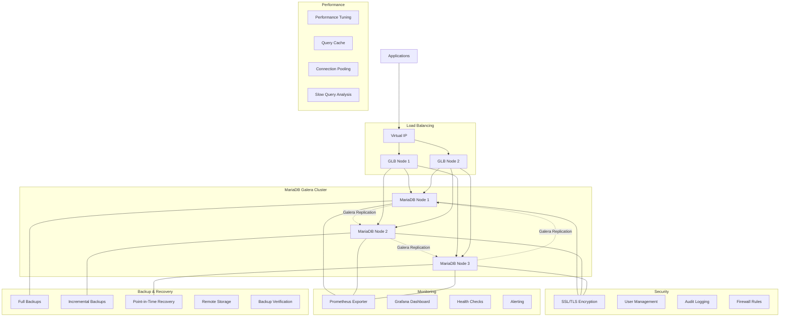

# MariaDB Ansible Roles Collection

This collection provides comprehensive MariaDB database management with advanced security, performance optimization, monitoring, and backup capabilities.

## Available Roles

### 1. [mariadb_security](mariadb_security/README.md)
**Comprehensive security hardening for MariaDB**
- SSL/TLS encryption for client and Galera cluster communication
- Advanced user management with role-based access control (RBAC)
- Password validation plugins and security hardening
- Audit logging configuration
- Certificate management for SSL connections
- Firewall integration (UFW)
- Encryption at rest

### 2. [mariadb_performance_tuning](mariadb_performance_tuning/README.md)
**Performance optimization and tuning**
- Query cache configuration and tuning
- InnoDB optimization (buffer pool sizing, log file configuration)
- Connection pooling setup (ProxySQL integration)
- Slow query logging and analysis tools
- Performance schema configuration
- Binary logging optimization
- Galera-specific performance tuning
- Filesystem-level optimizations

### 3. [mariadb_monitoring](mariadb_monitoring/README.md)
**Comprehensive monitoring and alerting**
- Galera cluster health monitoring (wsrep status checks)
- Performance metrics collection (Prometheus exporters)
- Log aggregation setup (ELK stack integration)
- Split-brain detection and recovery procedures
- Node synchronization monitoring
- Grafana dashboard deployment
- Custom health check scripts
- Nagios/NRPE integration

### 4. [mariadb_advanced_backups](mariadb_advanced_backups/README.md)
**Advanced backup strategies and verification**
- Point-in-time recovery setup with binary logs
- Incremental backups using Mariabackup/Xtrabackup
- Compressed backups to save storage space
- Encrypted backups for sensitive data
- Cross-datacenter backup replication
- Backup integrity testing (restore verification)
- Automated backup validation scripts
- Backup corruption detection
- Recovery time testing

### 5. [mariadb_backups](mariadb_backups/README.md) *(Existing)*
**Basic backup functionality**
- Simple mysqldump-based backups
- Compressed backup storage
- Basic scheduling

### 6. [mariadb_galera_loadbalancer_install](mariadb_galera_loadbalancer_install/README.md) *(Existing)*
**Galera Load Balancer (GLB) setup**
- TCP load balancing for Galera clusters
- High availability configuration
- Health checking

## Architecture Overview



## Quick Start

### Basic Galera Cluster with Security
```yaml
---
- name: Deploy Secure MariaDB Galera Cluster
  hosts: mariadb_cluster
  become: true
  vars:
    # Security configuration
    mariadb_users:
      - name: "app_user"
        password: "SecurePassword123!"
        hosts: ["localhost", "10.0.0.%"]
        privileges: "app_db.*:ALL"
        require_ssl: true
    
    # Performance tuning
    mariadb_innodb_buffer_pool_ratio: 0.7
    mariadb_query_cache_enabled: true
    
    # Monitoring
    mariadb_prometheus_exporter_enabled: true
    mariadb_galera_monitoring_enabled: true
    
    # Advanced backups
    mariadb_backup_strategy: "mariabackup"
    mariadb_pitr_enabled: true
    mariadb_backup_encryption_enabled: true
    
  roles:
    - mrlesmithjr.mariadb_galera_cluster  # External role for cluster setup
    - mariadb_security
    - mariadb_performance_tuning
    - mariadb_monitoring
    - mariadb_advanced_backups

- name: Deploy Galera Load Balancers
  hosts: galera_loadbalancers
  become: true
  vars:
    glb_servers: "{{ groups['mariadb_cluster'] | map('regex_replace', '$', ':3306') | list }}"
  roles:
    - mariadb_galera_loadbalancer_install
```

### Performance-Optimized Setup
```yaml
---
- name: High-Performance MariaDB Setup
  hosts: mariadb_performance
  become: true
  vars:
    # Memory optimization (80% RAM for InnoDB)
    mariadb_innodb_buffer_pool_ratio: 0.8
    mariadb_query_cache_ratio: 0.1
    
    # Connection pooling
    mariadb_connection_pooling_enabled: true
    mariadb_thread_handling: "pool-of-threads"
    
    # Performance monitoring
    mariadb_performance_schema_enabled: true
    mariadb_slow_query_log_enabled: true
    mariadb_long_query_time: 1
    
  roles:
    - mariadb_performance_tuning
    - mariadb_monitoring
```

### Security-Hardened Setup
```yaml
---
- name: Security-Hardened MariaDB
  hosts: mariadb_secure
  become: true
  vars:
    # SSL/TLS Configuration
    mariadb_ssl_enabled: true
    mariadb_galera_ssl_enabled: true
    
    # Security hardening
    mariadb_remove_anonymous_users: true
    mariadb_remove_test_database: true
    mariadb_password_validation_enabled: true
    
    # Audit logging
    mariadb_audit_enabled: true
    mariadb_audit_log_policy: "ALL"
    
    # Firewall
    mariadb_firewall_enabled: true
    mariadb_firewall_allowed_ips:
      - "10.0.0.0/24"
      - "192.168.1.0/24"
    
  roles:
    - mariadb_security
```

## Role Dependencies

- **mariadb_security**: Requires MariaDB server installed
- **mariadb_performance_tuning**: Requires MariaDB server installed
- **mariadb_monitoring**: Requires MariaDB server running
- **mariadb_advanced_backups**: Requires MariaDB server with proper user privileges
- **mariadb_galera_loadbalancer_install**: Requires running Galera cluster

## Installation Requirements

### Ansible Collections
```bash
ansible-galaxy collection install community.mysql
ansible-galaxy collection install community.crypto
ansible-galaxy collection install community.general
ansible-galaxy collection install ansible.posix
```

### External Roles
```bash
ansible-galaxy install mrlesmithjr.mariadb_galera_cluster
```

## System Requirements

- **Operating Systems**: Debian 11+, Ubuntu 20.04+
- **Python**: Python 3.6+
- **Ansible**: 2.13+
- **MariaDB**: 10.5+

## Feature Matrix

| Feature | Security | Performance | Monitoring | Advanced Backups | GLB | Basic Backups |
|---------|----------|-------------|------------|------------------|-----|---------------|
| SSL/TLS Encryption | ✅ | | | | | |
| User Management/RBAC | ✅ | | | | | |
| Password Validation | ✅ | | | | | |
| Audit Logging | ✅ | | | | | |
| InnoDB Optimization | | ✅ | | | | |
| Query Cache Tuning | | ✅ | | | | |
| Connection Pooling | | ✅ | | | | |
| Slow Query Analysis | | ✅ | ✅ | | | |
| Performance Schema | | ✅ | ✅ | | | |
| Prometheus Metrics | | | ✅ | | | |
| Galera Health Monitoring | | | ✅ | | | |
| Split-brain Detection | | | ✅ | | | |
| Log Aggregation | | | ✅ | | | |
| Point-in-Time Recovery | | | | ✅ | | |
| Incremental Backups | | | | ✅ | | |
| Backup Encryption | | | | ✅ | | |
| Backup Verification | | | | ✅ | | |
| Remote Storage | | | | ✅ | | |
| Load Balancing | | | | | ✅ | |
| Basic mysqldump | | | | | | ✅ |

## Best Practices

1. **Security First**: Always deploy the security role before others
2. **Performance Tuning**: Monitor before and after performance changes
3. **Backup Strategy**: Test restore procedures regularly
4. **Monitoring**: Set up monitoring before going to production
5. **Galera Clusters**: Always use odd number of nodes (3, 5, 7)
6. **SSL Certificates**: Use proper CA-signed certificates in production
7. **Resource Planning**: Allocate sufficient memory for InnoDB buffer pool

## Support and Troubleshooting

Each role includes:
- Comprehensive documentation in individual README files
- Molecule testing scenarios
- Common troubleshooting scenarios
- Performance tuning guidelines
- Security best practices

For issues specific to each role, refer to the individual role documentation.
