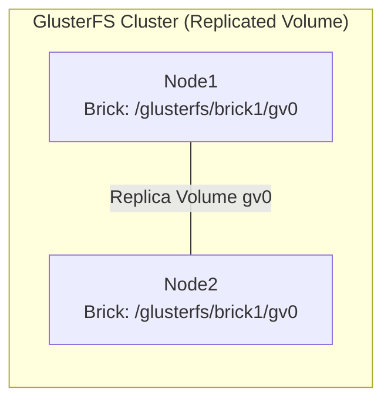

# Ansible Role: GlusterFS Setup

**Table of Contents**

* [Overview](#overview)
* [Supported Operating Systems/Platforms](#supported-operating-systemsplatforms)
* [Role Variables](#role-variables)
* [Tags](#tags)
* [Dependencies](#dependencies)
* [Example Playbook](#example-playbook)
* [Testing Instructions](#testing-instructions)
* [Known Issues and Gotchas](#known-issues-and-gotchas)
* [Security Implications](#security-implications)

## Overview

The **GlusterFS Setup** role installs and configures a GlusterFS storage cluster on multiple hosts. It sets up the GlusterFS server daemon (glusterd) on all target nodes by installing the `glusterfs-server` package and enabling the service. The role creates a brick directory on each node (the filesystem location where Gluster will store data) and ensures it has proper ownership and permissions. After installation, the role joins all specified nodes into a trusted Gluster cluster (peering each node with the others). It then creates a replicated Gluster volume across the clustered nodes using the provided volume name and brick directory, and starts the volume so it is ready for use. By default, the volume is created with a replica count equal to the number of nodes (meaning every file is replicated to all nodes). This role focuses on server-side setup; it does **not** handle mounting the Gluster volume on clients.



Use this role when you need a distributed, replicated storage volume across multiple Linux hosts for high availability. For example, two or more web servers can share the same content directory by storing it on a GlusterFS volume. After running this role on all GlusterFS server nodes, the storage volume (named per `glusterfs_volume_name`) will be available to mount on client machines (with the appropriate Gluster client installed).

## Supported Operating Systems/Platforms

This role is designed for **Debian**-family Linux distributions (APT-based systems) and has been tested on:

* **Debian**: 11 (Bullseye) and 12 (Bookworm)
* **Ubuntu**: 20.04 LTS (Focal) and 22.04 LTS (Jammy)

It uses the `apt` package manager to install GlusterFS, so **Red Hat/CentOS and other YUM/DNF-based systems are not supported** without modification. Ensure your target hosts run a supported OS and that the GlusterFS packages are available in the repositories (on Ubuntu/Debian, `glusterfs-server` is typically in the default apt sources or the Universe component).

## Role Variables

<details><summary>Click to see default role variables.</summary>

| Variable                    | Default Value             | Description |
| --------------------------- | ------------------------- | -------------------------------------------------------------------------------------------------------------------------------------------------------------------------------------------------------------------------------------------------------------------------------------------------------------------------------------------------------------------------------------------------------------------------------------------------- |
| **`glusterfs_volume_name`** | `"gv0"`                   | Name of the GlusterFS volume to create and start. By default, "gv0" is used, which stands for "Gluster Volume 0". You can change this to any name (e.g. `"data_volume"`) to identify your storage volume. |
| **`glusterfs_brick_dir`**   | `"/glusterfs/brick1/gv0"` | Filesystem path for the GlusterFS brick directory on each server. This is where Gluster will store data on each node. By default it is a directory under `/glusterfs/brick1` (including the volume name). **Note:** Ensure this path exists on all nodes or let the role create it. The role will create the directory if absent. In production, you might use a dedicated mount (disk/partition) for this directory to avoid filling the OS disk. |
| **`glusterfs_nodes`**       | `["server1", "server2"]`  | List of hostnames or IP addresses of the GlusterFS nodes in the cluster. All listed nodes will peer with each other. The first entry in this list is treated as the primary node for volume creation (the role runs the volume creation step only on the first node). **This should be overridden** with the actual inventory hostnames of your cluster. |

</details>

## Tags

This role does not define any task tags. All tasks will run by default when the role is invoked, since no `tags:` are applied to individual tasks.

## Dependencies

None. This role has no dependencies on other roles. It also does not require any Ansible Galaxy collections beyond the default modules included with Ansible (it uses `ansible.builtin` modules only).

## Example Playbook

To use the role, include it in a play that runs on all GlusterFS server nodes. For instance, given an inventory group `gluster_servers` containing the hosts that will form the Gluster cluster:

```yaml
- hosts: gluster_servers
  become: yes  # ensure we have root privileges for installation and service management
  vars:
    glusterfs_nodes: ["node1.example.com", "node2.example.com"]  # define the cluster members
    glusterfs_volume_name: "data"        # custom volume name (optional)
    glusterfs_brick_dir: "/data/brick1"  # custom brick directory on each node (optional)
  roles:
    - glusterfs_setup
```

In the above example, two hosts (`node1.example.com` and `node2.example.com`) will be set up as GlusterFS servers with a replicated volume named "data". Adjust the variables as needed for your environment. After running the playbook, you can mount the Gluster volume on any client or on the servers themselves (install the Gluster client package on those machines and use a `mount -t glusterfs ...` command, or configure an entry in `/etc/fstab`).

## Testing Instructions

This role can be tested using **Molecule** (Ansible’s role testing framework). A Molecule scenario for `glusterfs_setup` is typically provided in this repository (e.g. under `molecule/glusterfs_setup/`). The Molecule configuration is set up to launch multiple instances (two or more) to simulate a Gluster cluster.

**Example Molecule usage:**

1. **Prepare the environment** – Ensure you have Molecule and a suitable driver (such as Docker) installed. Navigate to the repository root (where the `molecule/` directory is located).
2. **Create and converge** – Run `molecule converge -s default` (assuming the scenario name is "default") to create test instances and apply the role. Molecule will provision two container instances (by default) representing the GlusterFS nodes and then run this role on them.
3. **Verify** – After convergence, run `molecule verify` to execute any verification tests (if configured). You can also manually verify the setup by logging into one of the test instances (`molecule login --host instance-1`) and running commands like `gluster peer status` or `gluster volume info` to check that the cluster formed and the volume exists.
4. **Cleanup** – Run `molecule destroy` to tear down the test instances when done.

During testing, ensure that the instances can reach each other (Molecule’s default Docker network allows this by default). The role’s idempotence can be verified by running `molecule converge` again on the same scenario: it should complete without errors. (Gluster will output errors about peers already probed or volume already created, but the role is designed to ignore those and proceed, as noted below.)

## Known Issues and Gotchas

* **Hostname Resolution:** The `glusterfs_nodes` list must contain identifiers that are reachable from each node. By default it uses placeholder names like `"server1"` and `"server2"` – you **must** override these with real hostnames or IPs in your inventory or playbook. If using hostnames, ensure they resolve (e.g., via DNS or `/etc/hosts`) on all nodes. Failure to resolve the names will cause the peer probe step to hang or fail.
* **Cluster Reconfiguration:** This role is primarily for initial cluster setup, not ongoing cluster changes. Re-running the role on an existing Gluster cluster is safe (it uses `ignore_errors: true` on peer probe and volume creation tasks), but those tasks will simply report that the peer or volume already exists and then continue. The role will not automatically add new nodes to an existing volume or rebalance data. If you need to expand the cluster (e.g., add bricks or nodes to an existing volume), additional manual steps using the Gluster CLI (or a different role) are required.
* **Brick Directory and `force` Usage:** The volume creation command in this role includes the `force` flag. This bypasses Gluster's safety check about using the root partition or a non-empty directory as a brick. Make sure the `glusterfs_brick_dir` is empty (or a dedicated filesystem) when you first run this role. Using `force` ensures the volume is created even if the brick path is on the root filesystem, but in production you should use a separate disk or partition for Gluster bricks to avoid filling up the OS disk.
* **No Client Setup:** This role does not install the GlusterFS client software or mount the volume on any client machines. It strictly configures the GlusterFS servers. If you want to use the storage from application servers or other hosts, you will need to install the appropriate Gluster client (for Debian/Ubuntu, the package is typically `glusterfs-client`) and then manually mount the Gluster volume on those systems (e.g., via an entry in `/etc/fstab` or using an auto-mount mechanism).
* **Firewall Considerations:** The role does not open any firewall ports. GlusterFS requires TCP port **24007** for the Gluster management daemon (glusterd) and additional ports (typically 24008 and a range of high ports for brick data) to be accessible between the cluster nodes (and from clients, if clients will mount the volume). Ensure that any firewalls (host-based or network firewalls) are configured to allow Gluster traffic among the cluster members and clients. Without proper firewall rules, peers may not be able to connect or the volume might not be mountable from client machines.
* **Idempotency Warnings:** On subsequent runs of the playbook, you might see Gluster CLI warnings or errors (e.g., "Peer is already in cluster" or "Volume already exists"). These are expected, since the role doesn’t check for existing cluster state before issuing the commands. Because the tasks ignore these errors, the play will not fail. However, be aware that these messages indicate the cluster is already configured. This is generally harmless. If you require fully silent idempotency, you would need to enhance the role with pre-checks (for example, using `gluster peer status` or `gluster volume info` to decide whether to run certain tasks).

## Security Implications

* **Network Exposure:** By default, GlusterFS communication between nodes (and between clients and servers) is unencrypted and unauthenticated. All data and control traffic travels in plain text on the network. **Use a trusted, private network** for Gluster traffic, or enable encryption manually if needed. Do not expose GlusterFS ports to untrusted networks (such as the public Internet). If security is a concern, consider configuring GlusterFS with TLS and authentication (this role does not cover those settings).
* **Firewall & Access Control:** This role does not modify firewall settings, so whatever ports are open on your system before running the role remain open after. You should restrict access to GlusterFS ports (24007, 24008, etc.) to only the machines that need to communicate with the cluster. Use an external firewall role or manual firewall rules to close unnecessary ports. Additionally, note that GlusterFS itself allows setting volume-level access controls (e.g., restricting which clients can mount a volume), but this role does not configure those options.
* **Brick Directory Permissions:** The brick directory on each node is created with owner `root` and mode `0755`. This means local users on a server could list the directory contents. In practice, typically only administrators have shell access to storage nodes. If your environment has untrusted local users, you may tighten this directory’s permissions to `0750` (ensuring the Gluster process can still access it). All file data written via Gluster will be owned by the user that wrote it (or `nobody`/`nogroup` for NFS mounts), but since glusterd runs as root, it can access all files. The default permissions are standard and appropriate for most cases, assuming a secure multi-user environment.
* **Running as Root:** The GlusterFS server daemon (glusterd) runs as the `root` user. This is necessary for binding to privileged ports and managing filesystem data, but it means a vulnerability in GlusterFS could potentially lead to a full system compromise. To mitigate risks, keep the GlusterFS software updated to the latest security patches. Only peer trusted nodes together in your cluster (the role uses `gluster peer probe` without authentication, so it trusts that all nodes in `glusterfs_nodes` are intended members). For additional security, consider enabling GlusterFS features like TLS encryption and authorization with pre-shared keys or certificates – these are not configured by this role, but can be applied manually or via an extended playbook.

****: Content from the role’s **defaults/main.yml**, showing the default variables for volume name, brick directory, and nodes.
****: Excerpt from **tasks/main.yml**, illustrating use of the `apt` module to install the `glusterfs-server` package.
****: Excerpt from **tasks/main.yml**, showing creation of the brick directory with mode `0755` by the `ansible.builtin.file` module.
****: Excerpt from **tasks/main.yml**, showing enabling and starting of the `glusterfs-server` service via `systemd`.
****: Excerpt from **tasks/main.yml**, showing the task that probes other peers in the cluster using the `gluster peer probe` command for each host in `glusterfs_nodes` (with errors ignored if already probed).
****: Excerpt from **tasks/main.yml**, showing the task that creates the Gluster volume on the first node (using all specified nodes as bricks, with replica count equal to the number of nodes, and using `force` to ensure creation).

