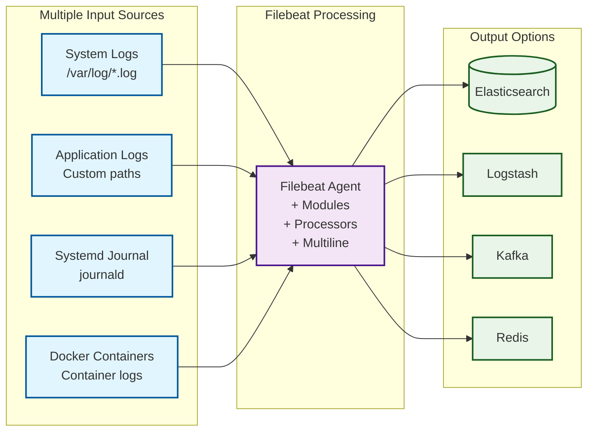

# Ansible Role: Configure Filebeat OS

*Enhanced Ansible role to install and comprehensively configure Filebeat for forwarding OS-level system logs and application logs to various outputs including Elasticsearch, Logstash, Kafka, and Redis with advanced security, monitoring, and performance features.*

**Table of Contents**

* [Overview](#overview)
* [Supported Operating Systems/Platforms](#supported-operating-systemsplatforms)
* [Role Variables](#role-variables)
* [New Features](#new-features)
* [Tags](#tags)
* [Dependencies](#dependencies)
* [Example Playbooks](#example-playbooks)
* [Testing Instructions](#testing-instructions)
* [Known Issues and Gotchas](#known-issues-and-gotchas)
* [Security Implications](#security-implications)
* [Cross-Referencing](#cross-referencing)

## Overview

The **Configure Filebeat OS** role sets up Elastic Filebeat on target servers with comprehensive configuration options to collect and ship logs to various outputs. This enhanced version supports multiple output types, SSL/TLS security, authentication, multiline processing, Filebeat modules, custom processors, performance tuning, and monitoring capabilities.

The role ensures that Filebeat is installed and configured with production-ready settings including keystore management for sensitive credentials, SSL certificate handling, performance optimization, and health monitoring. It supports both simple deployments for basic log forwarding and complex enterprise deployments with advanced security and processing requirements.



*Diagram: Enhanced Filebeat configuration supporting multiple input sources, advanced processing, and various output destinations with security and monitoring features.*

## Supported Operating Systems/Platforms

This enhanced role supports both **Debian/Ubuntu** and **Red Hat/CentOS** Linux distributions:

### Debian-based Systems (APT)
* **Debian**: 11 (Bullseye) and 12 (Bookworm)
* **Ubuntu**: 20.04 LTS (Focal) and 22.04 LTS (Jammy)

### Red Hat-based Systems (YUM/DNF)
* **CentOS**: 7, 8, 9
* **RHEL**: 7, 8, 9
* **Rocky Linux**: 8, 9
* **AlmaLinux**: 8, 9

The role automatically detects the OS family and uses the appropriate package manager. Both systemd and traditional init systems are supported, with automatic detection and configuration.

## Role Variables

The main variables used by this role (defined in `defaults/main.yml`) provide comprehensive customization of Filebeat's configuration. **All variables have sensible defaults and typically only need changing if your environment requires specific customization.**

### Basic Configuration

| Variable                     | Default Value           | Description                                                                                               |
| ---------------------------- | ----------------------- | --------------------------------------------------------------------------------------------------------- |
| **`filebeat_version`**       | `""`                    | Specific version to install. If empty, installs latest available                                         |
| **`filebeat_config_dir`**    | `"/etc/filebeat"`       | Filebeat configuration directory                                                                          |
| **`filebeat_data_dir`**      | `"/var/lib/filebeat"`   | Filebeat data directory                                                                                   |
| **`filebeat_log_dir`**       | `"/var/log/filebeat"`   | Filebeat log directory                                                                                    |

### Service Management

| Variable                     | Default Value           | Description                                                                                               |
| ---------------------------- | ----------------------- | --------------------------------------------------------------------------------------------------------- |
| **`filebeat_service_enabled`** | `true`               | Whether to enable Filebeat service on boot                                                               |
| **`filebeat_service_state`** | `"started"`             | Desired state of Filebeat service (started/stopped)                                                      |

### Output Configuration

| Variable                                  | Default Value           | Description                                                                                                                                                                                                                                                          |
| ----------------------------------------- | ----------------------- | -------------------------------------------------------------------------------------------------------------------------------------------------------------------------------------------------------------------------------------------------------------------- |
| **`filebeat_output_type`**                | `"elasticsearch"`       | Output type: elasticsearch, logstash, kafka, redis, file                                                                                                                                                                                                            |
| **`filebeat_output_elasticsearch_hosts`** | `["localhost:9200"]`    | List of Elasticsearch hosts (with port) to which Filebeat will send logs                                                                                                                                                                                            |
| **`filebeat_output_logstash_hosts`**      | `[]`                    | List of Logstash hosts for logstash output                                                                                                                                                                                                                          |
| **`filebeat_output_kafka_hosts`**         | `[]`                    | List of Kafka brokers for kafka output                                                                                                                                                                                                                              |
| **`filebeat_output_redis_hosts`**         | `[]`                    | List of Redis hosts for redis output                                                                                                                                                                                                                                |

### Security & Authentication

| Variable                                  | Default Value           | Description                                                                                                                                                                                                                                                          |
| ----------------------------------------- | ----------------------- | -------------------------------------------------------------------------------------------------------------------------------------------------------------------------------------------------------------------------------------------------------------------- |
| **`filebeat_ssl_enabled`**                | `false`                 | Enable SSL/TLS for output connections                                                                                                                                                                                                                                |
| **`filebeat_ssl_certificate_authorities`** | `[]`                   | List of CA certificate file paths                                                                                                                                                                                                                                   |
| **`filebeat_ssl_certificate`**            | `""`                    | Client certificate file path                                                                                                                                                                                                                                         |
| **`filebeat_ssl_key`**                    | `""`                    | Client private key file path                                                                                                                                                                                                                                         |
| **`filebeat_ssl_verification_mode`**      | `"full"`                | SSL verification mode: full, strict, certificate, none                                                                                                                                                                                                              |
| **`filebeat_username`**                   | `""`                    | Username for basic authentication                                                                                                                                                                                                                                    |
| **`filebeat_password`**                   | `""`                    | Password for basic authentication                                                                                                                                                                                                                                    |
| **`filebeat_api_key`**                    | `""`                    | API key for authentication                                                                                                                                                                                                                                           |
| **`filebeat_use_keystore`**               | `false`                 | Use Filebeat keystore for storing sensitive values                                                                                                                                                                                                                  |
| **`filebeat_keystore_keys`**              | `{}`                    | Dictionary of keys to add to keystore                                                                                                                                                                                                                               |

### Input Configuration

| Variable                                  | Default Value           | Description                                                                                                                                                                                                                                                          |
| ----------------------------------------- | ----------------------- | -------------------------------------------------------------------------------------------------------------------------------------------------------------------------------------------------------------------------------------------------------------------- |
| **`filebeat_input_type`**                 | `"log"`                 | Primary input type: log, journald, docker                                                                                                                                                                                                                           |
| **`filebeat_paths`**                      | `["/var/log/*.log"]`    | List of file paths for Filebeat to monitor                                                                                                                                                                                                                          |
| **`filebeat_journald_enabled`**           | `false`                 | Enable systemd journal input                                                                                                                                                                                                                                         |
| **`filebeat_docker_enabled`**             | `false`                 | Enable Docker container logs input                                                                                                                                                                                                                                   |

### Multiline & Advanced Processing

| Variable                                  | Default Value           | Description                                                                                                                                                                                                                                                          |
| ----------------------------------------- | ----------------------- | -------------------------------------------------------------------------------------------------------------------------------------------------------------------------------------------------------------------------------------------------------------------- |
| **`filebeat_multiline_enabled`**          | `false`                 | Enable multiline pattern matching for stack traces and multi-part logs                                                                                                                                                                                              |
| **`filebeat_multiline_pattern`**          | `"^[[:space:]]"`        | Regex pattern for multiline detection                                                                                                                                                                                                                               |
| **`filebeat_modules_enabled`**            | `[]`                    | List of modules to enable (e.g., system, nginx, apache)                                                                                                                                                                                                            |
| **`filebeat_processors_enabled`**         | `false`                 | Enable processors for data enrichment                                                                                                                                                                                                                               |
| **`filebeat_add_host_metadata`**          | `false`                 | Add host metadata processor                                                                                                                                                                                                                                          |

### Performance & Monitoring

| Variable                                  | Default Value           | Description                                                                                                                                                                                                                                                          |
| ----------------------------------------- | ----------------------- | -------------------------------------------------------------------------------------------------------------------------------------------------------------------------------------------------------------------------------------------------------------------- |
| **`filebeat_queue_events`**               | `4096`                  | Number of events the queue can store                                                                                                                                                                                                                                |
| **`filebeat_bulk_max_size`**              | `50`                    | Maximum number of events to bulk together                                                                                                                                                                                                                           |
| **`filebeat_worker`**                     | `1`                     | Number of workers for output                                                                                                                                                                                                                                         |
| **`filebeat_monitoring_enabled`**         | `false`                 | Enable internal monitoring and stats                                                                                                                                                                                                                                |
| **`filebeat_http_enabled`**               | `false`                 | Enable HTTP endpoint for health checks and metrics                                                                                                                                                                                                                  |
| **`filebeat_logging_level`**              | `"info"`                | Logging level: critical, error, warning, info, debug                                                                                                                                                                                                               |

**Note:** This role now supports comprehensive Filebeat configuration including SSL/TLS security, multiple output types (Elasticsearch, Logstash, Kafka, Redis), multiline log processing, Filebeat modules, custom processors, performance tuning, and monitoring. See the `examples/` directory for complete configuration patterns and the full variable list in `defaults/main.yml` for all available options.

## New Features

This enhanced version of the Configure Filebeat OS role includes the following major improvements:

### Security & Authentication
- **TLS/SSL Configuration**: Full support for encrypted transport to all output types
- **Authentication Support**: Username/password, API keys, and keystore integration
- **Certificate Management**: Automatic SSL certificate and CA deployment
- **Keystore Integration**: Secure storage of sensitive credentials using Filebeat's keystore

### Advanced Configuration
- **Filebeat Modules**: Automatic enabling of system, nginx, apache, and other modules
- **Multiline Processing**: Support for stack traces and multi-part log entries
- **Custom Processors**: add_host_metadata, add_docker_metadata, and custom processors
- **Index Lifecycle Management**: ILM configuration for log retention policies

### Multiple Output Types
- **Elasticsearch**: Enhanced with load balancing and SSL
- **Logstash**: Full configuration support with failover
- **Kafka**: High-throughput message streaming
- **Redis**: In-memory data structure store output

### Monitoring & Operations
- **Health Monitoring**: Built-in HTTP endpoint for health checks and metrics
- **Performance Tuning**: Advanced harvester, queue, and output optimization
- **Service Management**: Explicit service enablement and state management
- **Logging Configuration**: Comprehensive control over Filebeat's own logging

### Flexibility & Extensibility
- **Multiple Input Types**: Log files, systemd journal, Docker containers
- **Field Enrichment**: Custom fields, tags, and metadata
- **Conditional Processing**: Processors with conditional logic
- **Cross-Platform**: Support for both Debian and Red Hat families

## Tags

This role supports the following Ansible tags for selective execution:

- **`filebeat-install`**: Only run package installation tasks
- **`filebeat-config`**: Only run configuration tasks
- **`filebeat-ssl`**: Only run SSL certificate deployment tasks
- **`filebeat-keystore`**: Only run keystore configuration tasks
- **`filebeat-service`**: Only run service management tasks

## Dependencies

**Enhanced Dependencies Management:**

### Required System Packages
The role now automatically handles all dependencies:

- **Elastic Repository**: Automatically configures Elastic's APT/YUM repository
- **SSL Support**: Installs required SSL/TLS packages
- **Service Management**: Ensures systemd compatibility

### Optional Dependencies
- **Docker**: Required only if `filebeat_docker_enabled` is true
- **Systemd**: Required for journal input (`filebeat_journald_enabled`)

The role includes comprehensive dependency checking and will fail gracefully with clear error messages if requirements are not met.

## Example Playbooks

### Basic Configuration
```yaml
- hosts: all
  become: yes
  vars:
    filebeat_output_elasticsearch_hosts: ["elk.example.com:9200"]
    filebeat_service_enabled: true
    filebeat_logging_level: "info"
  roles:
    - configure_filebeat_os
```

### Security-Enhanced Configuration
```yaml
- hosts: all
  become: yes
  vars:
    # SSL/TLS Configuration
    filebeat_ssl_enabled: true
    filebeat_ssl_certificate: "/path/to/filebeat.crt"
    filebeat_ssl_key: "/path/to/filebeat.key"
    filebeat_ssl_certificate_authorities: ["/path/to/ca.crt"]
    
    # Keystore Authentication
    filebeat_use_keystore: true
    filebeat_keystore_keys:
      ES_USERNAME: "filebeat_user"
      ES_PASSWORD: "secure_password"
    
    # Enhanced Security
    filebeat_config_file_mode: "0600"
    filebeat_monitoring_enabled: true
  roles:
    - configure_filebeat_os
```

### High-Performance Configuration
```yaml
- hosts: all
  become: yes
  vars:
    filebeat_output_type: "kafka"
    filebeat_output_kafka_hosts: 
      - "kafka1.example.com:9092"
      - "kafka2.example.com:9092"
    
    # Performance Tuning
    filebeat_queue_events: 16384
    filebeat_bulk_max_size: 500
    filebeat_worker: 4
    filebeat_compression_level: 6
    
    # Monitoring
    filebeat_monitoring_enabled: true
    filebeat_http_enabled: true
  roles:
    - configure_filebeat_os
```

See the `examples/` directory for complete configuration patterns including advanced multiline processing, module configuration, and complex processor setups.

## Testing Instructions

This enhanced role includes comprehensive testing with **Molecule** covering multiple scenarios:

### Available Test Scenarios

1. **`default`**: Basic functionality testing
2. **`security`**: SSL/TLS and authentication testing
3. **`advanced`**: Multiline, modules, and processor testing
4. **`performance`**: High-throughput and monitoring testing

### Running Tests

```bash
# Run all test scenarios
molecule test

# Run specific scenario
molecule test -s security
molecule test -s advanced
molecule test -s performance

# Test with different platforms
molecule test -s default -- --platform debian
molecule test -s default -- --platform centos
```

### Test Coverage

The test suite validates:
- Package installation across OS families
- Configuration file generation and validation
- SSL certificate deployment
- Keystore creation and key management
- Service enablement and startup
- Output connectivity testing
- Performance metric collection
- Health endpoint functionality

## Known Issues and Gotchas

### Enhanced Considerations

**SSL/TLS Configuration:**
- Certificate paths must be accessible to the Ansible controller
- Private keys require proper file permissions (0400)
- CA certificates must be in PEM format

**Keystore Management:**
- Keystore creation requires Filebeat to be installed first
- Keys are stored in encrypted format and cannot be retrieved
- Keystore file permissions are automatically set to 0600

**Multi-Output Limitations:**
- Only one output type can be active at a time
- Switching output types requires service restart
- ILM is only supported with Elasticsearch output

**Performance Considerations:**
- High queue sizes increase memory usage
- Multiple workers increase CPU usage
- Docker input requires additional disk I/O monitoring

### Compatibility Notes

**Red Hat/CentOS Specific:**
- SELinux policies may need adjustment for custom paths
- Firewall rules may need configuration for output connections
- Some modules may require additional packages

**Docker Integration:**
- Requires Docker socket access (/var/run/docker.sock)
- Container log paths vary by Docker version
- May conflict with other container log shippers

## Security Implications

### Enhanced Security Features

**Keystore Security:**
- All sensitive credentials stored in encrypted keystore
- Keystore file protected with 0600 permissions
- No plaintext passwords in configuration files

**SSL/TLS Enhancements:**
- Support for mutual TLS authentication
- Configurable verification modes for different security levels
- Automatic certificate permission management

**Configuration Security:**
- Configuration files default to restrictive permissions (0600)
- Support for dropping root privileges (advanced configuration)
- Secure defaults for all security-related settings

**Network Security:**
- No listening ports opened by default
- All connections are outbound only
- Support for encrypted communication to all output types

**Monitoring Security:**
- HTTP endpoint can be restricted to localhost
- Stats endpoint provides no sensitive information
- Optional authentication for monitoring endpoints

## Cross-Referencing

### Related Roles in this Repository

- **[security/ssl_certificates](../../security/ssl_certificates/README.md)**: SSL certificate management for secure Filebeat connections
- **[monitoring/elasticsearch](../../monitoring/elasticsearch/README.md)**: Elasticsearch deployment for log storage
- **[monitoring/kibana](../../monitoring/kibana/README.md)**: Kibana setup for log visualization
- **[infrastructure/docker](../../infrastructure/docker/README.md)**: Docker configuration for container log collection

### Integration Examples

**With ELK Stack:**
```yaml
- import_playbook: deploy_elasticsearch.yml
- import_playbook: deploy_kibana.yml
- hosts: all
  roles:
    - configure_filebeat_os
```

**With Security Hardening:**
```yaml
- hosts: all
  roles:
    - security_baseline
    - ssl_certificates
    - configure_filebeat_os
```

The enhanced Configure Filebeat OS role provides enterprise-grade log shipping capabilities with comprehensive security, monitoring, and performance features suitable for production environments.
