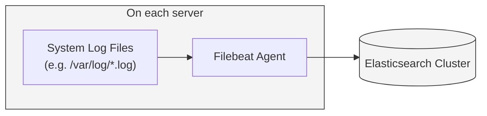

# Ansible Role: Configure Filebeat OS

*Ansible role to install Filebeat and configure it to forward OS-level system logs to a central Elasticsearch (ELK) stack for log aggregation and analysis.*

**Table of Contents**

* [Overview](#overview)
* [Supported Operating Systems/Platforms](#supported-operating-systemsplatforms)
* [Role Variables](#role-variables)
* [Tags](#tags)
* [Dependencies](#dependencies)
* [Example Playbook](#example-playbook)
* [Testing Instructions](#testing-instructions)
* [Known Issues and Gotchas](#known-issues-and-gotchas)
* [Security Implications](#security-implications)
* [Cross-Referencing](#cross-referencing)

## Overview

The **Configure Filebeat OS** role sets up Elastic Filebeat on target servers to collect and ship general system logs to an Elasticsearch cluster (or ELK stack). It ensures that Filebeat is installed and then replaces the default `/etc/filebeat/filebeat.yml` with a configuration to harvest OS logs (by default, all `*.log` files under `/var/log/`) and forward them to a specified Elasticsearch endpoint (default is `localhost:9200`). By applying this role, you gain centralized visibility into each server’s syslogs, authentication logs, and other system log files, which can be crucial for monitoring, debugging, and security auditing.

In practice, this role is typically applied to all servers (or all servers you wish to monitor) after basic system setup. It can be run after a baseline configuration (for example, after a “base” hardening role) to enable log forwarding. Once active, Filebeat will run as a background service on each host and continuously send new log events to Elasticsearch in near real-time. This helps offload logs from the individual machine and centralize them for search and analysis (for instance, via Kibana or other log management tools).



*Diagram: Filebeat on each host harvests local log files and sends them to a central Elasticsearch cluster for storage and analysis.*

## Supported Operating Systems/Platforms

This role is tested on and designed for **Debian** and **Ubuntu** Linux distributions, using the APT package manager for installation:

* **Debian**: 11 (Bullseye) and 12 (Bookworm)
* **Ubuntu**: 20.04 LTS (Focal) and 22.04 LTS (Jammy)

Other Debian-based systems similar to the above releases are likely compatible. The role uses the `apt` module to install Filebeat, so non-APT-based systems (e.g., Red Hat/CentOS or other RPM-based OS) are **not supported** without modifications. Ensure you run this role on a supported OS to prevent package installation failures. (In unsupported environments, you would need to add equivalent installation steps for yum or other package managers manually.)

## Role Variables

The main variables used by this role (defined in `defaults/main.yml`) allow basic customization of Filebeat’s input and output. **All variables have sensible defaults and typically only need changing if your environment is non-standard.**

| Variable                                  | Default Value        | Description                                                                                                                                                                                                                                                          |
| ----------------------------------------- | -------------------- | -------------------------------------------------------------------------------------------------------------------------------------------------------------------------------------------------------------------------------------------------------------------- |
| **`configure_filebeat_os_output_elasticsearch_hosts`** | `["localhost:9200"]` | List of Elasticsearch hosts (with port) to which Filebeat will send logs. By default it sends to a local Elasticsearch instance on port 9200. Change this to the hostname/IP and port of your ELK server or cluster.                                                 |
| **`configure_filebeat_os_input_type`**                 | `"log"`              | Type of Filebeat input to configure. The default `"log"` input type tells Filebeat to treat the specified paths as log files. (Generally this should remain `"log"` for standard file tailing. Other input types are used only in specialized scenarios.)            |
| **`configure_filebeat_os_paths`**                      | `["/var/log/*.log"]` | List of file paths for Filebeat to monitor. By default it includes all `.log` files in `/var/log/`, covering syslog, auth.log, kern.log, etc. You can extend this list to include additional log locations (e.g., application logs in custom directories) as needed. |

**Note:** If you need to further customize Filebeat (for example, to enable SSL/TLS, set authentication credentials, or use Logstash output), you may need to modify the Filebeat configuration template or add additional variables. The above variables cover basic local log harvesting and direct Elasticsearch output. Refer to Elastic’s Filebeat documentation for advanced configuration options not exposed via these defaults.

## Tags

This role does not define any custom Ansible tags. All tasks in **configure_filebeat_os** run whenever the role is invoked (there are no optional task blocks controlled by tags). You can apply your own tags at the play level if you need to include or skip this entire role, but within the role, every task is untagged and will always execute by default.

## Dependencies

**None.** This role has no strict dependencies on other Ansible roles or collections. It uses only built-in Ansible modules (`apt`, `template`, `service`, etc.) and manages Filebeat directly. However, there are a few practical prerequisites to note:

* *Elastic APT Repository:* The Filebeat package is part of Elastic’s package repositories and is not included in the default upstream Debian/Ubuntu repos. **Before running this role**, ensure that the Elastic APT repository is configured on the target hosts (and the GPG key installed) so that `apt` can find and install the `filebeat` package. If this repository is not set up, the installation task will fail because the package won’t be found. (Consult Elastic’s documentation on how to add the repository and GPG key, or pre-install the Filebeat .deb on hosts as needed.)

* *Systemd/Service Manager:* The role assumes the target system uses a systemd-compatible init system (which is true for Debian 11+/Ubuntu 20.04+). The handler will attempt to restart the `filebeat` service after updating the config. No special adjustments are needed unless your OS has a different service manager.

Aside from the above, no other roles or system packages are required. If you run this role after a “base” setup role, all necessary requirements (Python installed, apt updated, etc.) should already be in place.

## Example Playbook

Here is a simple example of how to use the `configure_filebeat_os` role in a playbook, including some variable overrides to tailor its behavior:

```yaml
- hosts: all
  become: yes  # Run as root to allow installation and file config
  vars:
    configure_filebeat_os_output_elasticsearch_hosts: ["elk.example.com:9200"]   # Point to central ELK server
    configure_filebeat_os_paths:                                                 # Customize log paths: include default and an app log directory
      - "/var/log/*.log"
      - "/var/myapp/logs/*.log"
  roles:
    - configure_filebeat_os
```

In the above example:

* We target **all hosts** and use `become: yes` because installing packages and writing to `/etc/filebeat` require root privileges.
* We override `configure_filebeat_os_output_elasticsearch_hosts` to send logs to an external Elasticsearch node at `elk.example.com:9200` instead of the default localhost. In a real environment, replace this with your logging server’s address (and ensure that host is reachable and accepting Filebeat data).
* We extend `configure_filebeat_os_paths` to include an additional path (`/var/myapp/logs/*.log`) alongside the standard system logs. This ensures Filebeat will also ship logs from a custom application directory in addition to the usual `/var/log/*.log` files.
* Finally, we include the `configure_filebeat_os` role. This will install Filebeat (if not already installed), drop the configuration file with the above settings, and restart the Filebeat service to apply changes.

You could also set these variables in your inventory (`group_vars` or `host_vars`) instead of directly in the playbook. After running this play, each server will have Filebeat running and forwarding its logs to the specified Elasticsearch endpoint.

## Testing Instructions

This role can be tested using **Molecule** (with the Docker driver) and **Testinfra/pytest** for verification. A Molecule scenario (e.g., `molecule/configure_filebeat_os`) can be used to automate the testing of the role in an isolated container environment. To run tests for this role, follow these general steps:

1. **Install Molecule and dependencies:** Ensure you have Molecule installed (`pip install molecule[docker]`) and Docker available on your system. Also install any testing frameworks Molecule uses (such as `pytest` and `testinfra`) if not already present. These tools will set up containers and assert the role’s outcomes.

2. **Prepare test environment:** (If the role had external dependencies, you would install them here, but this role has none.) Instead, make sure the test container image you plan to use has access to the Filebeat package. For Debian/Ubuntu images, this may involve pre-configuring the Elastic APT repo inside the container. In a custom Molecule scenario for this role, steps to add the Elastic repo (or to use an image that already has Filebeat available) should be included to allow `apt` to succeed in installing Filebeat.

3. **Run Molecule test suite:** From the repository root (where the `molecule/` directory resides), execute the Molecule test for this role. For example:

   ```bash
   molecule test -s configure_filebeat_os
   ```

   This will spin up a Docker container (by default, likely a Debian base image) and apply a test playbook that includes the **configure_filebeat_os** role. Molecule will then run verification steps to ensure the role did what was expected:

   * **Converge phase:** Applies the role inside a fresh container. The playbook will install Filebeat and drop the configuration as per defaults.
   * **Verify phase:** Uses Testinfra to check outcomes. For instance, it can verify that the Filebeat package is installed, the `/etc/filebeat/filebeat.yml` file exists and contains the expected configuration values, and that the `filebeat` service is running and enabled.
   * **Cleanup:** Destroys the test container after verification. (You can disable this if you want to inspect the container manually with `molecule converge` and `molecule login`.)

4. **Review results:** Check the output of `molecule test` for any failures. A successful run will end with an "OK" or similar message after the verify step and will remove the container. If tests failed (for example, Filebeat was not running or configuration file content was wrong), you can troubleshoot by running `molecule converge -s configure_filebeat_os` to apply the role without destroying the container, then `molecule login -s configure_filebeat_os` to shell into the container and inspect the state (logs, config file, service status). Adjust the role as needed and re-run tests until they pass.

*Note:* Because Filebeat relies on an external repository, your Molecule scenario or Docker image must account for that (as noted in step 2). For instance, you might use a custom Docker image that already has Filebeat installed, or incorporate tasks in Molecule’s prepare phase to add the Elastic apt repository. This ensures that the `apt install filebeat` task succeeds in the test environment.

## Known Issues and Gotchas

Keep the following caveats in mind when using the **configure_filebeat_os** role:

* **Elastic repo requirement:** *Filebeat package not found.* As mentioned, Filebeat is not in the default OS repositories for Debian/Ubuntu. If you run this role on a system where the Elastic apt repository is not configured, the installation will fail. You must add Elastic’s repository and GPG key (or manually install the Filebeat package) before or as part of running this role. (For example, Elastic provides a deb repository at `artifacts.elastic.co` – ensure this is set up on the target hosts.)

* **Existing config is overwritten:** This role will overwrite `/etc/filebeat/filebeat.yml` with its own template every time it runs. Any manual edits or existing Filebeat configuration on the host will be lost. Make sure that any required custom settings (such as special inputs, modules, or outputs) are incorporated via this role’s variables or by modifying the template. If you had previously enabled Filebeat modules or made changes to the config file, re-applying this role will reset those changes to the role’s defaults. Always backup or version-control your config if you plan to adjust it outside of this role.

* **Limited log path pattern:** By default, only log files under `/var/log/` with a `.log` extension are harvested. This covers most system logs, but it may miss others:

  * Logs in non-standard locations (e.g., some applications might log to `/opt/app/logs/` or similar) won’t be captured unless you expand `configure_filebeat_os_paths`.
  * Files that don’t end in `.log` (for instance, some syslogs on certain systems or custom log file names) are not included by the wildcard. You should adjust the pattern or add specific paths for such cases.
  * Compressed or archived logs (`*.gz` files) are not read by Filebeat by default, so old rotated logs won’t be sent (only active logs). This is usually desired behavior but is worth noting.

  Make sure to extend or modify the `configure_filebeat_os_paths` variable if your environment uses log file locations beyond the default. Alternatively, if other roles add Filebeat configuration for specific logs (see Cross-Referencing below), ensure those roles run *after* this one so their additions aren’t overwritten by the template.

* **Elasticsearch output only (by default):** This role configures Filebeat to send data directly to an Elasticsearch endpoint (no Logstash or Kafka in between). If your architecture uses Logstash or another intermediary, you will need to adjust the Filebeat config accordingly (e.g., disable Elasticsearch output and enable Logstash output in the template). Out of the box, the role assumes an Elasticsearch endpoint is reachable at the specified hosts. If that endpoint is down or unreachable, Filebeat will continually retry sending (and logs will accumulate locally in the registry/offline). Ensure the `configure_filebeat_os_output_elasticsearch_hosts` is correct for your environment and that network connectivity (and firewall rules) allow Filebeat to reach the Elasticsearch server. If using TLS or authentication on Elasticsearch, additional config changes are needed – those are not handled by this role’s simple default template.

* **Filebeat modules not enabled:** This role uses a generic log input to harvest logs and does *not* enable any Filebeat modules (such as the System module) automatically. The System module in Filebeat can parse syslog/auth.log in a structured way, but enabling it would require running `filebeat modules enable system` and adjusting the config. Here we opt for simplicity by capturing the raw log files. If you prefer to use Filebeat’s modules for parsing, you will need to enable them manually (or via a custom task) after this role runs, and be aware that enabling a module might conflict with the generic input if both target the same files. In most cases, the default approach (raw log forwarding) is sufficient for centralizing logs, and parsing can be done on the Elasticsearch/Kibana side if needed.

* **Service startup on boot:** The role restarts Filebeat as part of the run (to load the new config) and assumes the service will be enabled. However, it does *not explicitly set* the service to start on boot in its tasks. On Debian/Ubuntu, installing the `filebeat` package usually auto-enables the service (via systemd presets). If you find that Filebeat is not starting on reboot, you may need to manually enable it (e.g., `systemctl enable filebeat`) or ensure you ran the separate **filebeat** role that handles service enablement. In our role’s context, the service will be running after the play, but double-check persistence across reboots in your environment.

## Security Implications

Deploying Filebeat for system log forwarding has a few security considerations. While it improves your security visibility (by centralizing logs for analysis and alerting), you should be aware of the following changes and ensure they align with your security policies:

* **Filebeat service privileges:** By default, Filebeat runs with root privileges (or as a highly privileged user) on the host in order to read all system logs. This role does not change that default. Running the agent as root means it can read potentially sensitive log files (auth logs, etc.) and if compromised, could be used to access or exfiltrate those logs. It’s important to keep Filebeat up-to-date to avoid vulnerabilities. If your policy requires least privilege, you *can* run Filebeat under a service account, but you must grant that account read access to the log files (for example, adding a `filebeat` user to the `adm` group on Ubuntu so it can read `/var/log` files). Configuring Filebeat to drop privileges is advanced and not handled by this role, so weigh the security benefit versus complexity before doing so.

* **Configuration file permissions:** The Filebeat config `/etc/filebeat/filebeat.yml` is deployed with world-readable permissions (`0644`) by this role. This is generally fine for an unmodified config, but if you add sensitive information (like Elasticsearch credentials or API keys) to that file, those credentials would be readable by all local users. We recommend tightening the file permissions if credentials are stored in it (e.g., change to `0640` and assign an appropriate group, such as a `filebeat` or `adm` group). Alternatively, consider using Filebeat’s keystore feature for secure variables, or use Ansible Vault to template sensitive values so they aren’t in plaintext on disk.

* **Network exposure:** Filebeat does not open any listening ports on the host by default (it only initiates outbound connections), so it doesn’t directly increase the host’s attack surface to external actors. The agent will connect out to the Elasticsearch hosts over HTTP/HTTPS (TCP port 9200, by default). Ensure your firewall allows outbound traffic to the logging server, and ideally restricts it to just the necessary address/port. If you are sending logs over an untrusted network or the Internet, you should enable TLS encryption in the Filebeat output configuration (and authentication, such as Elastic API keys or username/password). The default configuration **does not** enable SSL/TLS – it assumes either a secure network or that you will configure security at the Elastic side.

* **Central log data security:** Once logs are sent to the central server, their security is only as strong as your Elasticsearch/ELK security. System logs can contain sensitive information (usernames, IP addresses, maybe even clear-text passwords or keys if they were accidentally logged). It’s critical to secure the ELK stack: enable authentication on Elasticsearch, use role-based access control to restrict who can view logs, and protect Kibana with proper authentication. Treat your logging infrastructure as sensitive, since it aggregates data from across your systems. The benefit of this role is improved visibility, but it also means a compromise of the ELK server could potentially expose logs from all servers. Use TLS on the ELK endpoints and secure credentials as needed.

* **No impact on local users/accounts:** This role does not create or remove any user accounts on the system. (The installation of Filebeat might create a system user account named `filebeat` on some distributions, but typically on Debian/Ubuntu the service runs as root unless configured otherwise. If a `filebeat` user is created, it will have limited rights and is only meant for running the service.) There are also no changes to SSH or sudoers made by this role. The security context of existing system users is unchanged, aside from the fact that their actions (as recorded in logs) will now be forwarded off the machine.

* **Log integrity and trust:** By shipping logs to a central location, you gain the ability to detect tampering (since an attacker would have to reach the central log server to cover their tracks). However, ensure time synchronization (via NTP) on your hosts; otherwise log timestamps may not line up between different servers. Also, consider that an attacker with root access could stop or alter the Filebeat service to prevent log forwarding. This role does not include any intrusion detection for Filebeat’s status, so monitoring the central ELK to ensure each host is actively sending data is a good practice (e.g., set up alerts if a host’s logs stop coming in).

In summary, this role improves visibility and can aid security monitoring, but it should be accompanied by securing the log transport (SSL), protecting the log storage, and maintaining the Filebeat agent’s integrity on each host.

## Cross-Referencing

This repository contains other roles and playbook components that relate to system logging and Filebeat. Depending on your needs, you might consider these in conjunction with **configure_filebeat_os**:

* **[base](../base/README.md)** – The Base role is a general hardening and setup role for Debian/Ubuntu. It does not include Filebeat by default, but it mentions **configure_filebeat_os** as an optional add-on for central logging. If you are already using the Base role to prepare your servers (updates, Fail2Ban, etc.), you can layer this Filebeat role afterwards to ship the logs that Base ensures are being generated and monitored. (Base + Filebeat OS together give you local log protection via Fail2Ban and off-site log aggregation for analysis.)

* **[filebeat](../filebeat/README.md)** – This is a related role in the repository that also installs and configures Filebeat. In fact, there is some functional overlap: the **filebeat** role handles installing the Filebeat package, deploying a config, and ensuring the service is started. If you are using the **filebeat** role already, you might not need **configure_filebeat_os** separately, as the main difference is in default configuration. However, the *configure_filebeat_os* role is tailored specifically to system log forwarding (with opinionated defaults for OS logs), whereas the *filebeat* role may be more basic. You can choose one approach or the other, but generally avoid running both roles on the same hosts to prevent them from clobbering each other’s config. (If you do use both, ensure their configurations are aligned or use this role *after* the base filebeat role to override settings with OS-specific inputs.)

* **Other Filebeat integration roles:** There are roles in this repository that configure Filebeat for specific services or applications. For example, **openldap_logging** and **apache_nifi** roles include Filebeat templates to ship logs from OpenLDAP and NiFi respectively (among others). These roles typically assume that Filebeat is installed (via the main filebeat role or this role) and then add additional input configuration for their service logs. For instance, the `apt_mirror` role appends its cron log path to Filebeat’s config so that apt-mirror activities are also collected. If you have such services in your environment, consider using those roles – they complement **configure_filebeat_os** by extending log coverage beyond just OS logs. Ensure that those roles run *after* this role so that their filebeat config additions persist (or alternatively, merge their config changes into this role’s template via variable overrides).

* **ELK/Monitoring stack roles:** Sending logs from hosts is only one side of the equation – you need a receiver. Pair this client role with the server-side components delivered in `src/roles/data_systems`: `elasticsearch` for storage, `logstash` for Beats ingestion, and `kibana` for visualization. Ensure the endpoint you configure in `configure_filebeat_os_output_elasticsearch_hosts` (or `filebeat_logstash_hosts` for Logstash output) matches the hosts managed by those roles, and that they’re reachable from your fleet. Managed services remain an alternative if you are not hosting ELK yourself.

Each of the above considerations will help you integrate **configure_filebeat_os** smoothly into your overall infrastructure. For more details on related roles, see their respective README files. By combining this role with others (base system prep, service-specific logging, and your ELK stack), you can achieve a robust logging pipeline: logs generated on each host are not only stored locally and acted upon (Fail2Ban) but also centralized for search, alerting, and long-term retention.
