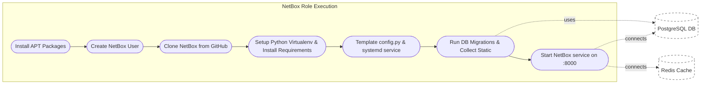

# Ansible Role: NetBox

**Table of Contents**

* [Overview](#overview)
* [Supported Operating Systems/Platforms](#supported-operating-systemsplatforms)
* [Role Variables](#role-variables)
* [Tags](#tags)
* [Dependencies](#dependencies)
* [Example Playbook](#example-playbook)
* [Testing Instructions](#testing-instructions)
* [Known Issues and Gotchas](#known-issues-and-gotchas)
* [Security Implications](#security-implications)
* [Cross-Referencing](#cross-referencing)

## Overview

**NetBox** is an open-source IPAM/DCIM tool (Infrastructure Resource Modeling) used as a “Source of Truth” for networks and data centers. This Ansible role automates the installation and configuration of a NetBox application server. It handles installing required packages and Python modules, fetching NetBox’s code from the official repository, configuring NetBox’s settings, and running it as a systemd service. Key features and tasks include:

* **Dependency Installation:** Installs all necessary system packages and libraries (Git, Python 3, build tools, etc.) required to run NetBox on Debian/Ubuntu systems. It also creates a dedicated system user (e.g. **`netbox`**) under which the application will run.
* **NetBox Deployment:** Clones the official NetBox Git repository (by default from `netbox-community/netbox.git` on the **`master`** branch) into the target installation directory. The role then creates a Python virtual environment and installs NetBox’s Python dependencies (from `requirements.txt`) inside it.
* **Application Configuration:** Renders a `configuration.py` from template with site-specific settings: database connection details, Redis cache settings, allowed hostnames, and a Django secret key. It also sets up logging to file with rotation (logs to `/var/log/netbox/netbox.log`, rotating at ~10MB with 5 backups). A systemd service unit is templated and installed to manage the NetBox Gunicorn service.
* **Service Setup:** The role runs database migrations and collects static files to finalize the setup. It ensures the NetBox service is enabled and started via systemd, listening on port **`8000`** by default. The service runs under the unprivileged **`netbox`** user and group.
* **External Services Integration:** This role **does not install PostgreSQL or Redis** – it assumes a PostgreSQL database and a Redis instance are already available (which may be on the same host or external). You provide the connection info via variables, and the role configures NetBox to use them. This design allows you to host the DB/cache on separate servers or use existing roles for those services. (See **Dependencies** and **Cross-Referencing** below for more on setting up the database and Redis.)
* **Idempotent & Multi-Server Aware:** The role can be safely re-run to apply updates (it will pull the latest code for the specified version/branch and reapply config/migrations). In a multi-app-server deployment, it runs migrations and static collection **only on the first host** in the group (to avoid race conditions). Combined with serial deployment, this enables zero-downtime or controlled rolling upgrades across multiple NetBox servers.



*(Diagram: **NetBox role flow** – The role installs NetBox and its requirements, configures settings, and brings up NetBox as a service. It assumes a functioning **PostgreSQL** database and **Redis** cache (dashed boxes) are available; migrations and runtime operations will connect to those.)*

## Supported Operating Systems/Platforms

This role is tested on and supported with the following Linux distributions (64-bit):

* **Debian** – 11 (Bullseye) and 12 (Bookworm)
* **Ubuntu** – 20.04 LTS (Focal Fossa) and 22.04 LTS (Jammy Jellyfish)

> **Note:** These Debian/Ubuntu-based systems are the primary targets for this role. The tasks use Debian/Ubuntu-specific package names and paths (e.g. APT packages, default file locations), so other Unix-like systems (Red Hat, CentOS, etc.) are **not officially supported** without modifications. You may need to adjust package names and service configuration if attempting to use this role on non-Debian platforms.

## Role Variables

Below is a list of important variables for this role, along with their default values (defined in **`defaults/main.yml`**) or expected user-supplied values, and descriptions:

<!-- markdownlint-disable MD033 -->

<details>
<summary>Role Variables (defaults)</summary>

| Variable                   | Default Value                                                               | Description                                                                                                                                                                                                                                                                                                                                                             |
| -------------------------- | --------------------------------------------------------------------------- | ----------------------------------------------------------------------------------------------------------------------------------------------------------------------------------------------------------------------------------------------------------------------------------------------------------------------------------------------------------------------- |
| **`netbox_git_repo`**      | `"https://github.com/netbox-community/netbox.git"`                          | Git repository URL for NetBox source code. By default it clones the official NetBox repository. You can change this if you maintain a fork or want to use a local mirror.                                                                                                                                                                                               |
| **`netbox_branch`**        | `"master"`                                                                  | Git branch, tag, or commit to check out from the NetBox repo. The default `"master"` is the development branch – for a stable install, you should override this to a specific release tag (e.g. `"v3.5.6"`). Using a fixed tag ensures repeatable deployments and avoids unexpected changes from the moving development branch.                                         |
| **`netbox_systemd_unit`**  | `"/etc/systemd/system/netbox.service"`                                      | Filesystem path where the NetBox systemd service unit will be installed. Typically you shouldn’t need to change this. If running multiple instances or custom service naming is required, you could adjust the path/name.                                                                                                                                               |
| **`netbox_python`**        | `"python3"`                                                                 | Python interpreter to use for creating the virtual environment. Defaults to `"python3"`, which on Debian/Ubuntu points to the system’s Python 3.x. If your system has multiple Python versions, you can specify the exact binary (e.g. `"python3.10"`).                                                                                                                 |
| **`netbox_venv`**          | `"/opt/netbox/venv"`                                                        | Path to the Python virtual environment that will be created for NetBox. All NetBox Python packages will be installed here. You can change this if you prefer a different location for the venv.                                                                                                                                                                         |
| **`netbox_uwsgi_socket`**  | `"/run/netbox/netbox.sock"`                                                 | Filesystem path to a uWSGI/Gunicorn socket file (not actively used by default). The provided systemd service uses a TCP socket (port 8000) rather than this UNIX socket. However, this variable is defined in case you want to configure Nginx to proxy via a socket instead of TCP.                                                                                    |
| **`netbox_media_root`**    | `{{ netbox_install_dir }}/netbox/media` (e.g. `/opt/netbox/netbox/media`)   | Filesystem path to NetBox’s media files directory (where uploaded images/attachments are stored). By default it’s constructed from the install dir (`netbox_install_dir`) plus `/netbox/media`. If you install NetBox in a non-standard location, or if media files are stored elsewhere, update this so the role knows where to find the media folder.                 |
| **`netbox_static_root`**   | `{{ netbox_install_dir }}/netbox/static` (e.g. `/opt/netbox/netbox/static`) | Filesystem path to NetBox’s static files directory (collected static assets). Defaults to `<install_dir>/netbox/static`. Usually you won’t change this – it’s where `collectstatic` outputs files to be served by the web server.                                                                                                                                       |
| **`netbox_install_dir`**   | *Not set* (required)                                                        | Base directory where NetBox will be installed (git clone destination). **This must be provided** in your inventory. In a typical installation this is set to `/opt/netbox`. All NetBox application files (and the virtualenv, if using the default path) will reside under this directory.                                                                              |
| **`netbox_user`**          | *Not set* (required)                                                        | Name of the system user that will own NetBox files and run the NetBox service. **Must be provided** (commonly `"netbox"`). The role will create this user if it doesn’t exist. It’s a system account with no login shell, used to run Gunicorn and manage files.                                                                                                        |
| **`netbox_allowed_hosts`** | *Not set* (required)                                                        | A list of hostnames or addresses that NetBox will accept requests from (Django **ALLOWED_HOSTS**). **Must be provided**. For example, this could be your NetBox server’s DNS name (e.g. `"netbox.example.com"`) and any other hostnames or IPs you plan to use to access it. If a request’s Host header isn’t in this list, NetBox will reject it.                     |
| **`netbox_secret_key`**    | *Not set* (required)                                                        | Django secret key for the NetBox application. **Must be provided** – no default for security. This should be a long, random string of characters kept secret. All NetBox instances in the same environment should share the same `SECRET_KEY` (so that user sessions and tokens remain valid across multiple app servers). Store this securely (e.g. in Ansible Vault). |
| **`postgres_host`**        | *Not set* (required) (usually `"localhost"`)                                | Hostname or IP address of the PostgreSQL server that hosts the NetBox database. **Must be provided.** For a single-server install, this is `"localhost"` (the database runs locally). For an external DB server, use its address or hostname.                                                                                                                           |
| **`postgres_port`**        | *Not set* (required) (usually `5432`)                                       | Port number for PostgreSQL connection. Defaults to `5432` in most setups, but the role does not assume it – you need to specify it if your DB uses a non-standard port. (5432 is the default for PostgreSQL.)                                                                                                                                                           |
| **`postgres_db`**          | *Not set* (required) (usually `"netbox"`)                                   | Name of the PostgreSQL database for NetBox. Often this is simply `"netbox"`. This database should exist on the DB server (you can create it using a DB role or manually). The role will run schema migrations against this database.                                                                                                                                    |
| **`postgres_user`**        | *Not set* (required) (usually `"netbox"`)                                   | PostgreSQL username for NetBox. Typically `"netbox"` (a dedicated DB user). This user must have privileges to connect to the `postgres_db` and perform schema migrations (usually it’s the owner of the DB).                                                                                                                                                            |
| **`postgres_password`**    | *Not set* (required)                                                        | Password for the above PostgreSQL user. **Must be provided** (no default for security). It is inserted into NetBox’s config, so ensure you supply it (preferably via Vault/encrypted vars). The role does **not** create the database or user, it just uses these credentials – you should set up the DB and user beforehand (see **Dependencies**).                    |
| **`redis_host`**           | *Not set* (required) (usually `"localhost"` or a cache server)              | Hostname or address of the Redis server for NetBox caching and background tasks. **Must be provided.** In a simple install this is `"localhost"` (Redis on the same machine). If using an external Redis, provide its hostname. NetBox uses this for caching and job queue (RQ).                                                                                        |
| **`redis_port`**           | *Not set* (required) (usually `6379`)                                       | Port for Redis connection. Default Redis listens on `6379`. If your Redis uses a different port, set this accordingly. (No password is assumed by default; the config template leaves the password blank.)                                                                                                                                                              |

</details>

<!-- markdownlint-enable MD033 -->

**Notes:** Many of the above variables (especially database and secret settings) do not have defaults and **must** be defined by the user (e.g. in inventory or via extra-vars). The defaults that are provided assume a typical single-server deployment (NetBox, DB, and Redis all on one host with standard ports). In this repository’s production configuration, for example, these values are set in group variables for the NetBox hosts, and sensitive secrets are fetched from HashiCorp Vault rather than being in plain text. Adjust all variables as needed for your environment. Notably, **`netbox_branch`** should be set to a stable release tag to avoid accidentally tracking development changes, and you should ensure the **`postgres_*`** and **`redis_*`** variables point to the correct servers in your setup.

## Tags

This role does **not define any custom Ansible tags** in its tasks. All tasks will run whenever the role is invoked (there are no built-in tags to skip subsets of tasks). You can still apply your own tags when including the role in a play if you need to control when it runs relative to other tasks, but within the role, everything executes by default.

## Dependencies

* **Ansible Version:** This role requires Ansible **2.13+** (tested with Ansible 2.13 and above). It uses the `ansible.builtin` FQCN syntax and the `community` module namespace, which are available in modern Ansible distributions. Using the latest Ansible is recommended for full compatibility.
* **Collections:** No specific Ansible Galaxy collections are required by this role’s tasks (it uses only built-in modules like `apt`, `git`, `template`, `pip`, `command`, `systemd`, etc.). If you follow the examples using HashiCorp Vault lookups or external roles, you may need the corresponding collections/plugins (for instance, **`community.hashi_vault`** if you use that lookup plugin, or **`community.general`** if using modules from it), but the NetBox role itself does not directly depend on them.
* **External Services:** **PostgreSQL** and **Redis** are required for NetBox but are **not installed by this role**. You must provision a PostgreSQL database (with a database and user for NetBox) and a Redis server separately. For convenience, you can use existing roles or playbooks to do this (e.g. the popular `geerlingguy.postgresql` role to install Postgres, and `geerlingguy.redis` for Redis, as this repository’s playbooks do). Ensure the database is up and the credentials provided to this role are correct before running the NetBox role.
* **System Requirements:** The target host should have **internet access** (to clone the NetBox git repo from GitHub and to download Python packages from PyPI). The role will install needed OS packages via APT, so an apt package repository must be reachable. Python 3 must be available on the target (the role installs `python3-venv` and `python3-dev`, and uses `python3` for the virtualenv). The host must be running systemd (the role defines a systemd service). Ensure you have sufficient CPU/RAM for NetBox; even though this is outside the role’s scope, a small VM (2+ CPU, 2+ GB RAM) is a reasonable minimum for a functional NetBox instance.
* **Permission to Become:** The play that includes this role should run with **privilege escalation** (`become: true`), because the role needs to install packages, create users, write to `/opt` and system directories, and manage systemd services. All these actions require root privileges on the target node.

## Example Playbook

Below is an example of how to use the `netbox` role in an Ansible playbook. In this example, we assume a single server is hosting NetBox (application, database, and redis on one host for simplicity). We supply the required variables (database details, secret key, etc.) in the playbook for clarity – in practice you might put these in an inventory file or use Ansible Vault for secrets:

```yaml
- hosts: netbox_server
  become: yes  # Ensure we have root privileges
  vars:
    netbox_install_dir: "/opt/netbox"
    netbox_user: "netbox"
    netbox_allowed_hosts: 
      - "netbox.example.com"
    netbox_secret_key: "YOUR_RANDOM_SECRET_KEY_HERE"
    postgres_host: "localhost"
    postgres_port: 5432
    postgres_db: "netbox"
    postgres_user: "netbox"
    postgres_password: "StrongDBPasswordHere"
    redis_host: "localhost"
    redis_port: 6379
  roles:
    - netbox
```

In the above play, we target a host (or group) named `netbox_server` (replace this with your actual inventory group or hostname for NetBox). We explicitly set all the mandatory variables: the installation directory, user, allowed hosts, secret key, and connection info for Postgres and Redis. When this play is run, the **NetBox role** will:

1. **Install OS Dependencies:** Update apt cache and install packages like Git, Python development libraries, PostgreSQL client libs, etc., ensuring the system can build and run NetBox’s requirements.
2. **Create NetBox User:** Create the `netbox` system user (with no login shell) that will own and run the NetBox application process.
3. **Fetch NetBox Code:** Clone the NetBox Git repository into `/opt/netbox` (or your specified `netbox_install_dir`), checking out the specified branch/tag. (If the directory already exists, it will pull updates to match the desired version.)
4. **Setup Python Virtualenv:** Create a Python 3 virtual environment in `/opt/netbox/venv` and install NetBox’s Python dependencies into it (using the `requirements.txt` from the NetBox source).
5. **Configure NetBox:** Generate the NetBox configuration file (`configuration.py`) with the provided settings (database credentials, redis, allowed hosts, secret key, logging) and place it in `/opt/netbox/netbox/netbox/configuration.py`. Also, install a systemd service unit file (`netbox.service`) to `/etc/systemd/system` and create a log directory `/var/log/netbox` with appropriate permissions.
6. **Run Migrations & Collect Static:** Execute NetBox’s Django migrations to set up the database schema, and collect static files into the static root. (These steps run only on one host if multiple hosts are in the play, to avoid conflicts.)
7. **Start NetBox Service:** Reload systemd and enable + start the `netbox` service. NetBox’s Gunicorn server will be running (listening on port 8000) as a result. The playbook completes when NetBox is up and running.

After running this play, you should have a running NetBox instance accessible (e.g. via `http://netbox.example.com:8000` or behind your proxy as configured).

> **Security note:** In this example, the database password and Django secret key are in plain text for demonstration. In a real deployment, you would not hard-code these secrets in a playbook. Instead, store them securely (for example, in an **Ansible Vault** or another secrets manager) and reference them (e.g. `postgres_password: "{{ vault_netbox_db_password }}"`). This repository’s own inventory, for instance, uses Vault lookups to supply those secrets at runtime. The goal is to keep sensitive credentials out of your playbooks.

**Usage in Multi-Host Setups:** If you have NetBox running on multiple application servers behind a load balancer, you would include all those hosts in the play. It’s recommended to set `serial: 1` in the play (as shown in the provided `deploy-netbox.yml` playbook) so that Ansible updates one server at a time. The role’s logic ensures only the first host runs the database migration and collectstatic steps to avoid concurrent operations. All hosts should share the same `netbox_secret_key` and point to the same external database and Redis. Once the playbook finishes, each server will have NetBox running and the database will be migrated (migrations having been applied by the first node). You can then put the new version into service (if doing an upgrade rolling through hosts) or simply start using NetBox (for a new install).

## Testing Instructions

It is highly recommended to test this role (and your NetBox deployment configuration) using **Molecule** with Docker, Vagrant, or another driver. Molecule can simulate the target environment in containers or VMs, allowing you to verify that the role works as expected before running it in production. Below are general steps to test the `netbox` role using Molecule (with the Docker driver as an example):

1. **Install Molecule and Docker:** On your development machine, install Molecule and the Docker driver. For example, using pip:

   ```bash
   pip install molecule[docker]
   ```

   Ensure that Docker is installed and running on your system.

2. **Initialize a Test Scenario:** If this role already includes a Molecule scenario (e.g. under `roles/netbox/molecule/`), you can use that. If not, you can create a new scenario for testing:

   ```bash
   molecule init scenario -r netbox -d docker
   ```

   This will generate a `molecule/` directory with a default Docker-based scenario for the NetBox role. You may need to edit the generated files to suit our specific role’s needs.

3. **Configure the Test Environment:** Open the Molecule scenario’s `molecule.yml` configuration and ensure the Docker image used is compatible (for example, use an Ubuntu 22.04 image to match the supported OS). In the `converge.yml` playbook, include the `netbox` role. You will also need to provide the required variables (as in the example playbook above) so the role can run. For a basic test on one container, you might install a PostgreSQL and Redis server in the same container (so that `postgres_host: localhost` and `redis_host: localhost` work). This can be done by adding tasks to the Molecule converge playbook *before* the role is applied – e.g., use the `geerlingguy.postgresql` role or simple `apt` tasks to install `postgresql` and `redis-server` inside the container, then perhaps a task to create the `netbox` database and user. Ensuring these services are running will allow the NetBox role to complete (since it can connect to the local DB and Redis). Adjust any variables as needed for the test (for instance, you might set `netbox_allowed_hosts` to `["localhost"]` for the container environment).

4. **Run the Molecule Converge:** Execute Molecule to run the role in the test scenario:

   ```bash
   molecule converge
   ```

   Molecule will launch the Docker container and apply the `converge.yml` playbook, which runs the NetBox role (and any prep tasks you included). Watch the output for any errors or failed tasks. If everything goes well, the NetBox service should be installed and started inside the container.

5. **Verify the Deployment:** After converge, you can manually test inside the container:

   * Check that the NetBox systemd service is running:

     ```bash
     docker exec -it <container_id> systemctl status netbox
     ```

     It should show the service as **active/running**. You can also verify Gunicorn processes:

     ```bash
     docker exec -it <container_id> pgrep -af gunicorn
     ```

     This should list gunicorn running with NetBox.
   * Verify that the NetBox port is listening (port 8000 inside the container):

     ```bash
     docker exec -it <container_id> ss -tunlp | grep 8000
     ```

     You should see gunicorn bound to 0.0.0.0:8000.
   * You can even do a simple web request to NetBox’s API to ensure it responds:

     ```bash
     docker exec -it <container_id> curl -s http://localhost:8000/api/ | python3 -m json.tool
     ```

     If everything is set up, you should get a JSON output of the NetBox API root (or a login page HTML if not authenticated, which still indicates the service is up).
   * Check that static files were collected:

     ```bash
     docker exec -it <container_id> ls -1 /opt/netbox/netbox/static/
     ```

     It should list asset directories (admin, django, etc.).
   * Review the log file:

     ```bash
     docker exec -it <container_id> tail -n 20 /var/log/netbox/netbox.log
     ```

     Look for any obvious error messages.

   If the role includes automated tests (e.g. using Molecule’s `verify` step with Testinfra or Ansible asserts), run:

   ```bash
   molecule verify
   ```

   to execute them. Otherwise, the above manual checks help ensure the role did what it’s supposed to.

6. **Teardown the Test Environment:** Once you finish testing, you can destroy the test container:

   ```bash
   molecule destroy
   ```

   This will remove the Docker container and clean up. Repeat the converge/verify cycle after making changes to the role or variables as needed until you are confident in the role’s operation.

By following the above steps, you can iteratively develop and test changes to the NetBox role in isolation, and ensure that when you run it on real servers it will perform as expected.

## Known Issues and Gotchas

* **Database/Redis Setup:** This role assumes that a PostgreSQL database and Redis are already installed and configured. If the role fails during migrations or startup, one of the first things to check is that the NetBox host can reach the database (`postgres_host`/`postgres_port`) and Redis (`redis_host`/`redis_port`), and that the database/user exist and credentials are correct. The role does not create the database or user; those should be set up beforehand (e.g. via a DB role or manually). A missing or misconfigured DB/Redis will cause the NetBox service to fail (e.g., you might see connection errors in logs).
* **Initial Admin User:** After installing NetBox, you will need to create an initial admin user to log into the NetBox UI. This role **does not** create any NetBox user accounts. On first setup, NetBox’s database is empty except for default data. To create a superuser account, you can run the Django management command manually:

  ```bash
  cd /opt/netbox/netbox/  # or your netbox_install_dir/netbox
  /opt/netbox/venv/bin/python3 manage.py createsuperuser
  ```

  You’ll be prompted to enter a username/password. Do this on one app server (it writes to the shared DB). Alternatively, you can automate this via an Ansible task or expect script, but it’s typically a one-time manual step.
* **Service URL and Ports:** By default, NetBox is served by Gunicorn on port **8000** over HTTP (no TLS). The role does not set up an Nginx/Apache proxy or TLS certificates. In production, you should **put NetBox behind a reverse proxy** or load balancer that handles HTTPS on port 443. If you expose port 8000 directly, it will be unencrypted and also not a standard HTTP port. A proxy can also handle things like pretty URLs and terminating SSL. Make sure to include the proxy’s address or hostname in `netbox_allowed_hosts`. If you are not using a proxy, and you want NetBox on port 80/443, you would have to either run Gunicorn as root (not recommended) or use something like authbind or iptables redirect – again, a reverse proxy is the preferred solution.
* **Firewall Considerations:** This role does not configure firewall rules. If your server has an active firewall (UFW, firewalld, iptables, security groups in cloud, etc.), you’ll need to open port 8000 (or whatever port/proxy you use for NetBox) to allowed sources, otherwise NetBox won’t be reachable. On Debian/Ubuntu, no firewall is active by default unless you enabled UFW. Be sure to restrict access appropriately (e.g., only your internal network or load balancer should be able to reach the NetBox service port).
* **Upgrades and Idempotency:** The role is designed to be idempotent and handle upgrades, but some caution is warranted:

  * If you change `netbox_branch` to a new release (e.g., upgrading NetBox), the next run of the role will fetch the new code and run migrations. This covers the basic upgrade steps. However, always read the NetBox release notes for any manual steps or config changes needed. For example, new releases might add required settings or change default values. You may need to update your inventory variables or template if a major version introduces new configuration parameters.
  * NetBox upgrades might also update Python dependencies. The role will re-run `pip install` on each run, so it should install any new requirements. If a package was removed from NetBox requirements, it will remain in the venv until manually cleaned, but that usually isn’t harmful.
  * During an upgrade on multiple app servers, run with `serial: 1` as mentioned, so that one server is upgraded (and migrates the DB) at a time. This prevents downtime of all instances at once and avoids multiple concurrent migration attempts. The role uses a conditional to only migrate from the first host, but running serially is still recommended to handle any migration locks or temporary unavailability gracefully.
* **Background Jobs (RQ Worker):** NetBox utilizes RQ (Redis Queue) workers for background tasks like webhooks, job scheduling, etc. This role’s default setup **does not** create a separate service for the NetBox RQ worker. The primary NetBox service will still function (it handles web requests), but background tasks won’t run without a worker process. If your NetBox usage involves features that require background processing (for example, webhook deliveries or long-running jobs in NetBox 3.x), you should set up a worker. Typically this is done by running `python3 manage.py rqworker` in a separate service (often via an additional systemd service unit). As a workaround, you could copy the provided `netbox.service.j2` to create a `netbox-rq.service` template, or run the worker via a supervisord/PM2 process. This role doesn’t include that by default to keep things simple. **Gotcha:** Without a running RQ worker, things like webhooks will queue up and not be processed.
* **Configuration Customization:** The `configuration.py.j2` template included in this role covers the basic and most essential settings for NetBox (database, cache, allowed hosts, secret key, logging). It does **not** expose every possible NetBox configuration option as a variable. If you need to customize additional settings (for example, LDAP authentication, email SMTP settings, enabling optional features or plugins), you will need to modify the template or add those settings via a post-task. One approach is to maintain your own fork of this role with an expanded template. Alternatively, you can use Ansible to copy in a complete `configuration.py` generated elsewhere. Keep in mind that if you alter the template, you should also adjust `netbox_allowed_hosts`, `netbox_secret_key`, etc., accordingly. Always restart the netbox service after making manual changes to the config.
* **Logging and Debugging:** The role sets NetBox’s logging level to INFO by default and writes logs to `/var/log/netbox/netbox.log`. If you run into issues, this log is a good place to check for errors (e.g., Django errors on startup, or Python tracebacks if something failed). If the service isn’t starting, run `journalctl -u netbox` to see the systemd logs for it. Common issues include missing Python packages (if requirements didn’t install properly), or misconfiguration (e.g., allowed hosts or database connectivity). The log rotation (10MB, 5 files) will keep log sizes manageable, but in a busy environment consider offloading logs to a centralized system (see Filebeat in Cross-Referencing).
* **Performance Tuning:** By default, the Gunicorn service is configured to launch **4 worker processes** (`--workers 4`). This is a reasonable default for a small to medium instance. Depending on your server’s CPU and your user load, you may wish to adjust this (more workers for more concurrency, or fewer if the server is resource-constrained). Currently, this value is hard-coded in the service template. To change it, you would have to override the `ExecStart` in `netbox.service.j2` (or after deployment, modify the unit file). Future enhancements to the role might make this tunable via a variable.
* **Idempotency Note:** The Git clone task uses `force: yes`, which means each run of the role will reset the repository to the specified branch/state. This ensures you get the latest code for that branch, but it also means any local changes in the NetBox directory will be overwritten. Do not manually edit files in the NetBox install directory; instead, manage everything through configuration and variables. If you need to pin to a specific commit or apply patches, consider forking the repo or using Git to check out that commit/tag via `netbox_branch`.
* **Cleaning Up:** The role does not currently implement any uninstall or clean-up. If you remove this role from a host, NetBox will still be installed on that host until you manually remove it (stop and disable the service, delete files, etc.). Also, old releases of NetBox (if you changed branches) will remain in the git history and virtualenv. This typically isn’t an issue (the venv packages get updated in-place), but if you need to reclaim space or start fresh, you’d have to purge `/opt/netbox` manually.

## Security Implications

This role touches on several security-sensitive areas of the system. Here’s a summary of its security-relevant actions and considerations:

* **System User and Permissions:** The role creates a dedicated system user account (`netbox`) with no login shell for running the application. This is a security best practice – NetBox processes run as an unprivileged user, limiting the impact if the service is compromised. The NetBox install directory (e.g. `/opt/netbox`) and all files within are owned by this user. The role also ensures the log directory (`/var/log/netbox`) is owned by `netbox:netbox` (mode 0755 by default). You may tighten the log directory permissions to 0750 if you want to restrict read access to logs (currently, any local user can read NetBox log files given the 0755 setting).
* **Service Access:** NetBox (Gunicorn) listens on TCP port **8000** on all interfaces by default. This port is unencrypted HTTP. **Be mindful of network exposure:** if the server has a public interface, ensure you firewall off port 8000 or bind it to localhost and put a reverse proxy in front. As delivered, the service is open on 0.0.0.0:8000, which could be a security risk if not controlled. We intentionally do not run NetBox as root on port 80/443 to avoid privilege escalation – it’s better to keep NetBox as non-root and handle ports via other means.
* **Secrets in Configuration:** Sensitive values like the database password and Django secret key are rendered into the NetBox configuration file (`configuration.py`). We take measures to protect this file: it is set with owner `netbox` and group `netbox`, and file mode **0640** (readable by `netbox` and root only). This prevents other non-privileged users on the system from reading the secrets. Make sure not to loosen these permissions. Also, as an Ansible user, ensure you supply these secrets securely (use Vault or environment variables to avoid accidental exposure in version control).
* **Database Security:** The role expects that the PostgreSQL database is configured securely by you or another role. Typically, the `postgres_host` might be `localhost` (with the DB running locally), or a remote DB server reachable over the network. Use appropriate security for your DB: enable SSL for remote connections if possible, restrict the allowed network/hosts for the NetBox DB user, and use a strong password (or peer auth if local and locked-down). The role uses the provided credentials to connect; if they are wrong or DB permissions are insufficient, migrations will fail.
* **TLS/Encryption:** As noted, traffic to NetBox (on port 8000 by default) is not encrypted. Anyone with network access to that port could potentially sniff data or perform man-in-the-middle attacks. In production, *always* use HTTPS – typically by fronting NetBox with Nginx/Apache or a load balancer that handles TLS. You might also restrict port 8000 to localhost and only allow the proxy to communicate with it, to reduce exposure.
* **Firewall and SELinux:** The role does not configure firewall settings or SELinux/AppArmor profiles. On Debian/Ubuntu, SELinux is typically not enabled by default. If you run this on a system with SELinux (or if you enable it), you might need to adjust policies to allow Gunicorn to bind to port 8000 or to allow access to required files. Similarly, set up your firewall to only allow trusted sources. These tasks are left to the operator since they depend on the environment’s specific security policies.
* **Code and Package Integrity:** This role pulls the NetBox code from the official GitHub repo and installs Python packages from PyPI. This means you implicitly trust those sources. In high-security environments, you may want to vet or mirror these sources. For instance, you could fork the NetBox repository and review changes before deploying them, or pre-download and checksum the packages. The role doesn’t do that by default (it always grabs the latest commit of the specified branch). If supply-chain security is a concern, consider pinning to specific commit hashes or using an internal PyPI index. The upside is that using official sources ensures you get authentic upstream code, but always weigh the risk of external dependencies.
* **Post-Installation Hardening:** NetBox is a Django application. Some general best practices: change the default admin password (if you import any fixtures or if an account was created), and treat the NetBox host as a sensitive server (it potentially holds credentials for devices, secrets, and an authoritative database of your infrastructure). Regularly update NetBox to pull in security fixes – this role makes it straightforward to do so by updating the branch/tag and re-running. Back up the database frequently (see the **Backup NetBox** role) to protect against data loss or corruption.
* **Operating System Hardening:** Outside the scope of this role, ensure the underlying OS is kept up to date with security patches. The role installs some development libraries (for building Python wheels). You may remove those after installation if desired (to reduce attack surface), though it’s generally fine to leave them. The presence of build tools does not directly affect NetBox security, but on production servers you usually want only necessary software installed.
* **Logs:** The NetBox log file (and potentially the PostgreSQL logs if local) may contain sensitive information (like user activity, or in worst cases, tracebacks with data). Ensure your log management strategy accounts for this (e.g., ship logs to a secure log server, restrict access, and rotate as configured). The role’s default logging config already limits log file size and number, preventing logs from filling up the disk indefinitely.
* **User Input Sanitization:** This falls on NetBox itself – as of writing, NetBox is a well-regarded project with a good security track record, but always keep NetBox updated for the latest security patches, and be mindful of who you allow to access the NetBox UI/API. Role-wise, this just means update the `netbox_branch`/tag to pull in new releases when they are available.

In summary, this role sets up NetBox in a secure manner by default (non-root user, restricted config file, etc.), but it’s up to you to operate it securely: manage your secrets carefully, use TLS, restrict network access, and keep systems updated.

## Cross-Referencing

This role is often used in conjunction with other roles and tools to build a full NetBox deployment. Here are some related roles and references:

* **Backup NetBox Role:** The same repository includes an **`backup_netbox`** role which automates backing up NetBox’s PostgreSQL database and media files. It’s a perfect complement to the NetBox role – you can schedule the backup role (via cron, AWX, etc.) to regularly dump the database and archive uploaded files. See the **Backup NetBox** role’s README for usage details and ensure you have backups before and after upgrades.
* **Database (PostgreSQL) Setup:** NetBox requires a PostgreSQL database. You can use an existing role such as **geerlingguy.postgresql** to install and configure PostgreSQL on the database server. This repository’s playbooks (e.g. `setup-db.yml`) demonstrate using that role to prepare a database server for NetBox. If you prefer, this repo also provides a more advanced **PostgreSQL** role (see `roles/postgresql`) for scenarios requiring replication or Patroni, but for a basic setup the geerlingguy role is straightforward. Key point: run the DB role **before** the NetBox role, and create a database and user matching `postgres_db` and `postgres_user` (with the password you’ll later provide to NetBox).
* **Redis Setup:** Similarly, NetBox uses Redis for caching. The playbook `setup-redis.yml` in this repo shows using **geerlingguy.redis** to install Redis on a host. You can target the same host as NetBox (for an all-in-one deployment) or a separate host/group (`netbox_cache_servers`). Ensure `redis_host` in your NetBox variables points to the correct place. There’s no internal Redis role in this repo, so using the community role or manual installation is the way to go.
* **Web Proxy (Nginx/Apache):** While this role doesn’t configure a web proxy, in practice you’ll often want one for production. You might use an Nginx role or simply manage an Nginx config via a template in your site playbook. The proxy should listen on 80/443, handle TLS, and forward requests to NetBox’s Gunicorn (either on `localhost:8000` or via the UNIX socket if you reconfigure Gunicorn to use the socket at `netbox_uwsgi_socket`). If you do so, update `ALLOWED_HOSTS` accordingly and consider enabling the proxy’s buffering, compression, etc. to optimize performance. (For example, serving static files via Nginx directly from the `netbox/static` directory can be more efficient than going through Gunicorn.)
* **Log Forwarding (Filebeat):** The NetBox role writes logs to local files. In many environments, you’ll want to ship these logs to a central log management system (ELK stack, Splunk, etc.). In our deployment, we include a **Filebeat** role on the NetBox servers. The Filebeat role (not shown in detail here) installs Elastic’s Filebeat agent and is configured to watch `/var/log/netbox/netbox.log` (and potentially other logs) and send them to Elasticsearch/Logstash. If you need this, consider adding a similar role. It’s a good practice to monitor NetBox logs for errors or unusual activity.
* **Ansible Inventory Plugin (NetBox as Source of Truth):** This is more of an Ansible feature than a role, but worth mentioning: NetBox can serve as an inventory source for Ansible (via the `netbox.netbox.nb_inventory` plugin). If you plan to use NetBox to inventory your devices and want Ansible to pull hosts from NetBox, ensure your NetBox URL and token are configured in your controller inventory settings. This is outside the scope of the role, but it’s a common integration once NetBox is up and populated.
* **Related Tools:** NetBox is often deployed alongside tools like **NetBox Docker** (for containerized deployments) or orchestrated via CI/CD. If you opt for a container approach, this role might not be needed (you’d use Docker images instead). However, for a VM/bare-metal install, this role encapsulates the official installation steps in Ansible form. Always align your usage of this role with NetBox’s official install docs for any major changes.
* **Other Roles in this Repo:** Check the repository for any other roles that might complement NetBox. For instance, there may be roles for **NGINX** or **Let’s Encrypt** if you need to set up HTTPS. If not, using well-known community roles (like `geerlingguy.nginx` or `certbot` roles) is a good alternative.
* **Issue Tracking and Support:** If you encounter bugs with this role, refer to the repository’s issue tracker. There might already be issues or notes related to NetBox deployment. For example, if a particular NetBox version changed something that the role doesn’t yet accommodate, the maintainers or community might have documented a workaround in an issue or discussion.

By combining the **NetBox** role with the above roles and tools, you can build a full-fledged NetBox deployment workflow. For instance, a site playbook might provision a database (with the Postgres role), provision a cache (Redis role), run this NetBox role, then configure a proxy (Nginx role) and set up backups (Backup NetBox role), resulting in a robust, production-ready setup. Each component is decoupled into separate roles, which keeps things modular and easier to manage.
