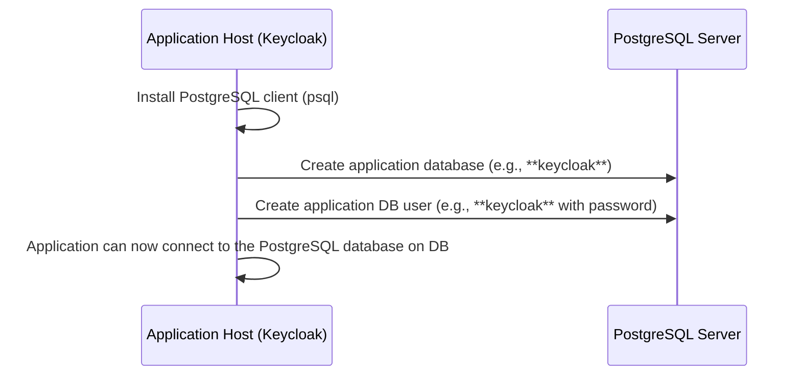

# Ansible Role: PostgreSQL Client

**Table of Contents**

* [Overview](#overview)
* [Supported Operating Systems/Platforms](#supported-operating-systemsplatforms)
* [Role Variables](#role-variables)
* [Tags](#tags)
* [Dependencies](#dependencies)
* [Example Playbook](#example-playbook)
* [Testing Instructions](#testing-instructions)
* [Known Issues and Gotchas](#known-issues-and-gotchas)
* [Security Implications](#security-implications)
* [Cross-Referencing](#cross-referencing)

## Overview

The **postgresql_client** role installs the PostgreSQL client utilities on a target host and optionally provisions a **database** and **user** for an application (primarily **Keycloak** in this context). It ensures that the `psql` client is present for interacting with PostgreSQL, and uses Ansible’s PostgreSQL modules to create a specified database and user account on a PostgreSQL server. In summary, this role helps prepare an application host to use a PostgreSQL database by:

* **Installing client packages:** Installs the PostgreSQL client software (e.g. the `postgresql-client` package on Debian/Ubuntu) so that tools like `psql` are available.
* **Creating application database:** Ensures a PostgreSQL database (e.g. the Keycloak database) exists on the specified server, using provided connection details.
* **Creating application DB user:** Ensures a login role/user exists in PostgreSQL with the given username and password, so the application can authenticate to the database.

This role **does not** install or configure a PostgreSQL server itself – it assumes you already have access to a PostgreSQL server (local or remote) where the database will be created. Typically, you would run this role on an application server (such as the Keycloak host) to set up the DB credentials that the app will use. After running **postgresql_client**, your application role (e.g. Keycloak) can connect to the newly created database with the ensured user credentials.



## Supported Operating Systems/Platforms

This role is designed for **Debian-based Linux distributions** and uses the APT package manager for installations. It has been tested (via Molecule/Docker) on:

* **Debian 12 (Bookworm)** – confirmed with automated tests.
* **Debian 11 (Bullseye)** – expected to work (same apt package names).
* **Ubuntu LTS** – e.g. 20.04 (Focal), 22.04 (Jammy), which use similar packages.

Other Debian/Ubuntu derivatives that use `apt` should also be compatible.

> **Note:** RHEL/CentOS and other RPM-based systems are *not supported out-of-the-box* by this role, since it lacks `yum/dnf` tasks. Adapting for RHEL-based systems would require adding equivalent tasks for installing packages (and ensuring the `community.postgresql` modules can run, which may involve installing Python `psycopg2` on those hosts). The role assumes a systemd-based OS for service management if any, so non-systemd environments would need adjustments.

## Role Variables

Below is a list of variables used in this role, along with default values (if set) and descriptions. These are defined in the role’s **defaults/main.yml** (or expected as inputs). **Required** variables (no default) must be provided by the user (for example, via inventory or playbook vars).

<!-- markdownlint-disable MD033 -->

<details><summary>Role Variables (defaults)</summary>

| Variable               | Default Value | Description |
| ---------------------- | ------------- | ----------------------------------------------------------------------------------------------------------------------------------------------------------------------------------------------------------------------------------------------------------------------------------------------------- |
| `keycloak_db_host`     | *required*    | **PostgreSQL host** that the role will connect to in order to create the database and user. This should be the hostname or IP address of the PostgreSQL server (e.g. `"localhost"` for a local DB, or an external server address). **No default is provided**, so you **must** specify this variable. |
| `keycloak_db_name`     | `"keycloak"`  | Name of the PostgreSQL **database** that the application will use. By default it is `"keycloak"`. The role will ensure a database with this name exists on the target server. (*For other applications, you can set this to a different name, but the variable name remains `keycloak_db_name`.*) |
| `keycloak_db_user`     | `"keycloak"`  | Name of the PostgreSQL **user/role** that the application will use to connect. Defaults to `"keycloak"`. The role will ensure this user exists. Typically, this user will be the owner of the application database. |
| `keycloak_db_password` | *required*    | Password for the PostgreSQL user specified by `keycloak_db_user`. **No default** is set for security – you should provide this (preferably using an Ansible Vault variable). This password will be used to create the user (or update it) on the database server. |

</details>

**Notes on variables:**

* The `keycloak_db_host` and `keycloak_db_password` variables are required for the role to run. If they are not provided, the role cannot connect to the database server or authenticate to create the DB/user. Ensure you supply these (for example, in your inventory or playbook).
* By default, the role assumes the PostgreSQL server is listening on the standard port **5432**. There is **no separate `keycloak_db_port` variable** in this role’s defaults, so if your database uses a non-standard port, you would need to override the module’s behavior (not natively supported via a variable in this role). In such cases, you might modify the role to pass a `port` parameter to the PostgreSQL modules or ensure the server listens on 5432.
* Although the variables are named with a `keycloak_` prefix, they can be used for any application’s database. You will still use the same variable names even if setting up a database for a different app. (For example, to create a database for an app "X", you might set `keycloak_db_name: "x"` and so on. The naming is a historical artifact of the primary use case.)

## Tags

This role does **not** define any custom Ansible tags in its tasks. All tasks will run whenever the role is invoked. (You can still apply tags at a playbook level when including the role, if you want to control execution, but there are no role-specific tags to toggle subsets of tasks.)

## Dependencies

**Ansible Collections:** This role relies on the **community.postgresql** collection for database modules. Make sure you have installed the `community.postgresql` collection (e.g., via `ansible-galaxy collection install community.postgresql`) before running the role. The standard Ansible **builtin** modules are used for package installation (APT), which are available in core Ansible.

**Python Packages:** The target host (where this role runs) needs the Python PostgreSQL driver **psycopg2** available, because the Ansible PostgreSQL modules use it under the hood. On Debian/Ubuntu, this can be satisfied by installing the system package `python3-psycopg2` (the **PostgreSQL server role** or your setup process should ensure this is present). If psycopg2 is not installed, the database tasks will error out. The role **postgresql_client** itself does *not* install psycopg2, so you may need to take care of this in a prerequisite step (e.g., via a common role or the database server role).

**Ansible Version:** Requires Ansible **2.13+** (it uses collection-based modules and newer syntax). It is recommended to use Ansible 2.15 or higher to ensure full compatibility with the included collections and modules.

**PostgreSQL Server:** This role assumes a running PostgreSQL server is accessible at `keycloak_db_host`. It does **not** install or start the database server. You should set up the PostgreSQL server separately (for example, using a dedicated **postgresql** server role or an external Ansible role) before or in parallel with this role. The target database server must allow connections and have sufficient permissions for the specified user (see **Gotchas** below). If the database server is local on the same host, you might run this role after the server is installed on that host; if it’s a remote server, ensure network connectivity (and proper credentials) are in place.

## Example Playbook

Here is an example of how to use the `postgresql_client` role in a playbook, illustrating a setup for a Keycloak application. This example creates a Keycloak database on a PostgreSQL server (which could be on the same host or remote) and then runs the Keycloak role to install the application:

```yaml
- name: Prepare Keycloak Database and Deploy Keycloak
  hosts: keycloak          # Host (or group) where Keycloak will run
  become: true

  vars:
    keycloak_db_host: "db.example.com"           # PostgreSQL server host (use "localhost" if local)
    keycloak_db_name: "keycloak"                 # Database name for Keycloak
    keycloak_db_user: "keycloak"                 # Database user for Keycloak
    keycloak_db_password: "{{ vault_keycloak_db_password }}"  # Database user password (stored in Vault)

  roles:
    - role: postgresql_client    # Install psql client and ensure DB & user exist
    - role: keycloak             # Install and configure Keycloak (uses the above DB settings)
```

In the above playbook:

* We specify the necessary database connection variables for the role. The password is pulled from an Ansible Vault variable for security.
* The **postgresql_client** role is invoked first, which will install the client tools on the Keycloak host and attempt to create the `keycloak` database and user on the PostgreSQL server at `db.example.com`.
* Next, the **keycloak** role (from this repository) is run on the same host. The Keycloak role will configure Keycloak to use the database credentials we just set up. (The Keycloak role expects that the database and user are ready, which is exactly what **postgresql_client** ensures.)

You can adapt this example for other applications by changing the variables (and roles) accordingly. For instance, to create a database for another service, you would still use `postgresql_client` but provide that service’s database name, user, and password as variables.

## Testing Instructions

It is recommended to test this role using **Molecule** (with Docker) to verify its behavior before using it in live environments. The Molecule tests can confirm that the role is idempotent and works on a fresh system. Below are general steps to run tests:

1. **Install Molecule** (and Docker). For example: `pip install molecule[docker]`. Ensure Docker is installed and running on your machine.
2. **Prepare a test scenario:** This repository may include a Molecule scenario for `postgresql_client` (for example, under `molecule/default/`). If a scenario is provided, you can use it directly. Otherwise, you can initialize one:

   ```bash
   molecule init scenario -r postgresql_client -d docker
   ```

   This will create a `molecule` directory with a default scenario for the role.
3. **Configure the scenario:** If testing locally, you might want to ensure a PostgreSQL server is available in the test environment. You can do this by either using a Docker image that has PostgreSQL, or by including an installation step in the Molecule converge playbook (e.g., using the `geerlingguy.postgresql` role to set up a database server inside the container before running this role). Ensure the `keycloak_db_*` vars in the scenario are set (at least `keycloak_db_password` and a host, which could be `localhost` for the container).
4. **Run Molecule Converge:** Execute `molecule converge` to create the Docker container(s) and apply the **postgresql_client** role. Molecule will use the playbook in the scenario (usually `molecule/default/converge.yml`) to run the role tasks inside a container (e.g., a Debian base image).
5. **Verify the results:** After convergence, you can run `molecule verify` (if there are automated tests defined, e.g., with Testinfra) to check assertions. Even without explicit tests, you can manually verify by dropping into the container:

   ```bash
   docker exec -it <container_id> bash
   ```

   Inside the container, check that the `psql` client is installed (`psql --version`) and attempt to connect to the test database or list databases to ensure the database was created. If the scenario set up a local PostgreSQL server, you should see the new database and user there.
6. **Cleanup:** Run `molecule destroy` to tear down the test container(s) when finished. Or use `molecule test` to run the entire sequence (create, converge, verify, destroy) in one go.

During testing, you may adjust variables as needed. For example, if you don’t actually have a running PostgreSQL server in the test container, the database tasks will fail – so it’s important to either mock or include a database service in the test. A simple way to test the role’s idempotence (package installation) is to comment out the DB creation tasks in the scenario if you only want to test client installation in isolation, but a full test involves having a PostgreSQL service to accept the creation of the DB and user.

## Known Issues and Gotchas

* **Database Server Accessibility:** Remember that this role does not start a PostgreSQL server — it only connects to one. If the target `keycloak_db_host` is not reachable (due to network issues or firewall rules), or if no PostgreSQL service is running there, the role will fail. For a local database (`localhost`), ensure the PostgreSQL server is installed and running on that host (you might run a PostgreSQL server role prior to this). For a remote host, make sure the host is reachable and accepting connections on port 5432 (or your configured port) from the machine running this role. Opening the appropriate firewall ports on the DB server host is outside the scope of this role (you may need to handle that in your infrastructure or another role).

* **Privileges for Database Creation:** The role attempts to create the database and user by logging in as `keycloak_db_user` with `keycloak_db_password` provided. This means that on first run, if that user does **not yet exist** in the PostgreSQL server, the connection attempt could fail. In practice, there are a few scenarios:

  * If the PostgreSQL server allows a connection as a non-existent user and then the module creates the user (for example, if using the `postgres` admin user via trust or a superuser, which is **not** what this role does by default), it would work. However, this role by design uses the application credentials directly.
  * To ensure success, the `keycloak_db_user` should either pre-exist with the ability to create a database, or the server should be configured to allow the creation of that user/database via the provided credentials. One approach is to pre-create the role with CREATEDB privilege (so that the first task “Ensure database” can succeed by creating the DB as that role). Alternatively, you might need to manually create the database/user (or run a one-time task as a superuser) if using this role in an environment with strict permissions.
  * In many cases, for development or small setups, using the same name/password for the initial connection and creation works because the module will create the user if it’s missing. But if the connection is refused (because the user doesn’t exist or lacks rights), you may have to adjust your workflow. Consider running the `Ensure Keycloak DB user` task (user creation) **before** the database creation task, or use a higher-privileged account for the creation steps. (The role isn’t currently designed for that, so this might involve a custom change or a different role for initial provisioning.)

* **Idempotence Considerations:** All tasks in this role use idempotent Ansible modules (`apt`, `postgresql_db`, `postgresql_user`). Running the role repeatedly should generally not produce changes after the first run, *except* in one case: if the PostgreSQL user’s password is provided in plain text, the `postgresql_user` module may update the password each run (depending on how the module checks existing passwords). This means you might see a “changed” status on every run for the user creation task. This typically isn’t harmful (the password is just being reset to the same value), but be aware of it in your play output. Using the `encrypted` option with a pre-hashed password could avoid this, but that adds complexity. In most scenarios, a spurious change report is acceptable.

* **No Support for Custom Port/SSL Options:** As noted, the role doesn’t have variables for `port` or SSL settings when connecting to the database. It assumes the default port (5432) and a default trust/MD5 authentication mechanism. If your setup uses a non-standard port or requires SSL/TLS enforcement, you will need to modify the role or handle those outside the role. For example, you might set an environment variable or use a `.pgpass` file for non-default port, or adjust the tasks to include `login_port` and SSL parameters. Currently, these scenarios are not handled out-of-the-box.

* **Variable Naming (Keycloak-specific):** As mentioned, the use of `keycloak_` prefix in variable names is a current design choice for this role. It might be confusing if you use the role for another application’s database. There’s no functional issue in doing so (variables are just names), but it’s a known quirk. Renaming these variables to something generic would require changing them both in the role and in any playbooks that use it. For now, just remember that `keycloak_db_name` really means “the database name this role should ensure exists,” regardless of which app uses it.

* **Ensure psycopg2 is Present:** A common pitfall is forgetting to have the Python PostgreSQL driver on the target host. If you run this role and immediately get module errors about failing to import `psycopg2`, it means the driver is missing. Install `python3-psycopg2` (for Debian/Ubuntu) or the appropriate package for your OS, or include a task in a prior role to handle this. The PostgreSQL server role often takes care of this on the DB host, but if you’re running the client role on an application host that doesn’t otherwise have PostgreSQL, you’ll need to ensure this dependency manually.

## Security Implications

* **Installation of Software:** This role will install the PostgreSQL client tools on the target system. The package is from the OS distribution (for Debian/Ubuntu, `postgresql-client` via APT). This is a standard utility and does not itself open any network ports or services. However, keep the system’s package management security in mind (ensure your apt sources are trusted, etc.). The role updates the package cache (`update_cache: true`) when installing, which means it will contact package repositories – in a secured environment, ensure this is acceptable or use an internal repository mirror.

* **Database Credentials:** You must provide a database password (`keycloak_db_password`) for the role to create the user. Treat this credential as sensitive. It is recommended to supply it via an **Ansible Vault** encrypted variable or some secure mechanism, rather than plaintext in a playbook. The role will use this password to create the DB user. After creation, the password resides in the PostgreSQL server (as the user’s credential) and is also likely stored in your application’s configuration (e.g., Keycloak’s config file) so that the app can connect. Be aware of where this secret is stored and who has access. For example, the Keycloak role will put this password into the `keycloak.conf` file for Keycloak to use – ensure proper file permissions on such config files.

* **Least Privilege:** The role-created database user (e.g. **keycloak**) is intended to be a standard, unprivileged role for the application. It is created with login rights (`LOGIN`) but is **not given superuser or replication privileges**, etc. It typically becomes the owner of its database (especially if it was the account used to create the database). This follows the principle of least privilege – the application user can only access its own database. Do not manually elevate this user’s permissions unless required, and avoid reusing this account for other purposes. If the role’s tasks are run with the application user’s credentials, that user might need CREATEDB privilege temporarily (as discussed in *Gotchas*). If you grant that, consider revoking unnecessary privileges afterward for security.

* **Remote Connection Security:** If `keycloak_db_host` is a remote server, the role will connect over the network to perform creation tasks. By default, this connection is unencrypted (unless your PostgreSQL is set up with SSL and requires/uses it by default). If the network between the application host and DB host is untrusted, consider enabling SSL for PostgreSQL and adjusting the connection parameters accordingly (this role does not handle that automatically). At a minimum, ensure that the connection is within a secure network (e.g., internal VLAN or over VPN/SSH tunnel) if possible. Also, the PostgreSQL server’s pg_hba.conf should be configured to only allow the necessary host and user to connect, reducing exposure of the database.

* **System Changes:** Besides installing a package, this role doesn’t create system users or alter OS security settings. It does create a database and role **within PostgreSQL**. These are persistent changes to your database server’s state. Make sure you have change management around database schemas if required. For example, creating a new database in a production cluster should be approved as it consumes resources. The created DB and user can be considered an application-specific schema addition.

* **Idempotency and Secret Changes:** If you ever need to rotate the database password, you can change the `keycloak_db_password` variable and rerun the role. The `postgresql_user` task will update the password for the user. This is a convenient way to enforce a new credential, but remember to also update the application configuration (Keycloak) with the new password simultaneously to avoid downtime. Also, note that Ansible will show a change has occurred (which is expected when rotating credentials).

## Cross-Referencing

The **postgresql_client** role is usually used in conjunction with other roles to fully configure an application’s database usage. Here are some related roles and resources:

* **PostgreSQL Server Role (Database Server Setup):** This repository includes a **`postgresql`** role which handles installing and configuring PostgreSQL on a server (including initialization, configuration, and optional replication/HA setup). If you need to set up the PostgreSQL **server** itself (as opposed to just the client and DB/user), refer to the **postgresql** role’s documentation. Using the server role on your database host, and **postgresql_client** on your application host, is a common pattern for splitting DB setup. (In the past, this repository relied on the popular **geerlingguy.postgresql** role for server setup, so that is an alternative if you prefer a well-known Galaxy role.)

* **Keycloak Role:** The **keycloak** role in this repository configures the Keycloak application to use an external PostgreSQL database. In its documentation, it explicitly notes that it does *not* create the database or user – instead, you should use a database provisioning role like **postgresql_client** (or an external equivalent) to prepare the database. The example playbook above shows how these roles tie together: `postgresql_client` prepares the DB, then `keycloak` runs and connects to it.

* **PostgreSQL Backup Role:** For backing up PostgreSQL databases, see the **`postgres_backup`** role in this repository. That role sets up an on-host backup routine (using `pg_dump` and cron/Systemd timers) for a given database. If you have set up a database via **postgresql_client**, you might apply **postgres_backup** on the database server to periodically dump the contents of that DB to disk for safekeeping. (Similarly, there are other backup roles like `backup_netbox` for app-specific backups, which complement the generic `postgres_backup` for database backups.)

* **Other Related Roles:** If your infrastructure uses multiple database types or additional services, you might find analogous roles in this repository or elsewhere. For example, a **`postgresql_server`** (if separate from the combined **postgresql** role) or roles for other databases like MySQL (e.g., `mariadb_server`, `mariadb_backups`) may exist. Always ensure that the client roles and server roles are used together appropriately (e.g., use the PostgreSQL client role with a PostgreSQL server role). Additionally, consider using a "common" role on all hosts to set up prerequisites (the QiMata repository has a **common/base** role for baseline configuration). Running the common setup before this role can ensure things like apt caches are updated, python is in place, etc., which can help avoid issues during database provisioning.
