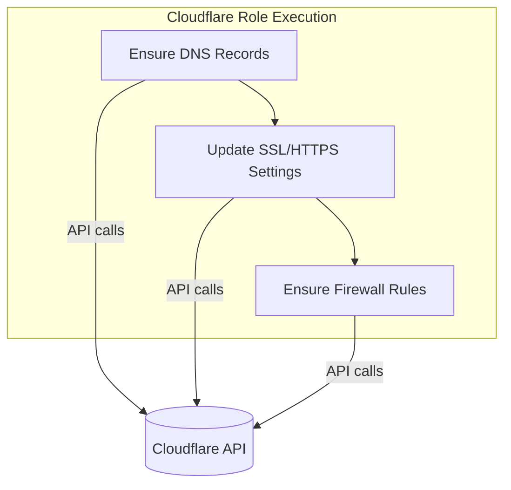

# Ansible Role: Cloudflare

**Table of Contents**

* [Overview](#overview)
* [Supported Operating Systems/Platforms](#supported-operating-systemsplatforms)
* [Role Variables](#role-variables)
* [Tags](#tags)
* [Dependencies](#dependencies)
* [Example Playbook](#example-playbook)
* [Testing Instructions](#testing-instructions)
* [Known Issues and Gotchas](#known-issues-and-gotchas)
* [Security Implications](#security-implications)
* [Cross-Referencing](#cross-referencing)

## Overview

The **Cloudflare** role manages DNS and security settings for a Cloudflare zone via Cloudflare’s API. It does **not** install any software on your servers; instead, it ensures your Cloudflare account’s configuration (DNS records, SSL/TLS mode, HTTP redirection, and firewall rules) matches the desired state defined in Ansible. This allows you to treat your Cloudflare configuration as code and integrate it into your deployment process. Key capabilities include:

* **DNS record management:** Ensures specified DNS records (A, CNAME, etc.) exist in the given Cloudflare zone (and updates them if they differ). You can enable or disable Cloudflare proxy (orange cloud) per record.
* **SSL and HTTPS settings:** Enforces the zone’s SSL encryption mode (e.g. Flexible, Full, Strict) and toggles the *“Always Use HTTPS”* setting on Cloudflare, so that all HTTP requests are redirected to HTTPS.
* **Firewall access rules:** Adds IP Access Rules (zone-level firewall rules) to block, challenge, or whitelist traffic based on IP addresses, IP ranges, or country of origin. This can proactively block unwanted traffic at Cloudflare’s edge.
* **Idempotent operation:** The role only creates or updates resources if they are not already in the desired state. Re-running the role is safe; changes are applied only when needed (e.g. a DNS record is missing or a setting differs). No Cloudflare settings are removed or turned off unless explicitly configured in the playbook (see Gotchas below).

By using this role, you can automate your “front door” configurations on Cloudflare (DNS and basic WAF settings) alongside your server configuration. For example, when you deploy a new web application, this role can automatically publish its DNS records and enforce HTTPS. This role is typically run on the Ansible **control node** (not on the target servers) using a localhost or bastion host context, since all actions are API calls to Cloudflare.



## Supported Operating Systems/Platforms

**Control Node:** This role runs on the Ansible control machine (using `connection: local`), so it is platform-independent as long as the control node can run Ansible and reach the Cloudflare API. It has been used on Linux (e.g. Ubuntu) control nodes. The target host in your inventory is typically a placeholder (like `localhost`) for API operations, not an actual remote server.

**Managed Hosts:** No software is installed on any remote hosts by this role. You can target a dummy group (e.g. `[cloudflare]`) containing `localhost` with `ansible_connection=local`. Therefore, there are no specific OS requirements for managed hosts – any system that doesn’t need Cloudflare configuration can be in your play without affecting it. (If you include this role in a play with real hosts, consider using `delegate_to: localhost` or running it in a separate play limited to the control node.)

## Role Variables

Below is a list of variables used by the Cloudflare role, along with default values (where applicable) and their descriptions. Most of these are defined in the role’s **`vars/main.yml`** or expected to be provided by the user:

<!-- markdownlint-disable MD033 -->

<details>
<summary>Role Variables (defaults)</summary>

| Variable                          | Default Value     | Description                                                                                                                                                                                                                                                                                                                                                                                                                                                                                                                                                                                                                                                                                                                                                                                                                                                                                                                                                                                                           |
| --------------------------------- | ----------------- | --------------------------------------------------------------------------------------------------------------------------------------------------------------------------------------------------------------------------------------------------------------------------------------------------------------------------------------------------------------------------------------------------------------------------------------------------------------------------------------------------------------------------------------------------------------------------------------------------------------------------------------------------------------------------------------------------------------------------------------------------------------------------------------------------------------------------------------------------------------------------------------------------------------------------------------------------------------------------------------------------------------------- |
| **`cloudflare_api_token`**        | *(required)*      | **Cloudflare API token** to authenticate API calls. This should be a **Scoped API Token** with permissions to edit DNS records, firewall rules, and zone settings for the target zone. The role does not provide a default for this; you **must** supply it (for example, via an Ansible Vault or environment variable). In practice, you can load it from an environment variable (e.g. `CLOUDFLARE_TOKEN`) as shown in the examples.                                                                                                                                                                                                                                                                                                                                                                                                                                                                                                                                                                                |
| **`cloudflare_zone`**             | *(required)*      | The **DNS zone name** (domain) to manage (e.g. `"example.com"`). This tells the role which Cloudflare zone to target when creating records or rules. No default is provided, so you must specify your zone.                                                                                                                                                                                                                                                                                                                                                                                                                                                                                                                                                                                                                                                                                                                                                                                                           |
| **`cloudflare_zone_id`**    | *(required)*      | The **Cloudflare Zone ID** for the domain. This is a 32-character unique identifier for the zone, required for certain API calls (such as SSL settings and firewall rules). You can find this in your Cloudflare dashboard. Like the token and zone, this must be provided (there is no default).                                                                                                                                                                                                                                                                                                                                                                                                                                                                                                                                                                                                                                                                                                                     |
| **`cloudflare_ssl_mode`**         | `"strict"`        | The desired **SSL/TLS encryption mode** for Cloudflare’s CDN edge to origin connection. Options are `"off"`, `"flexible"`, `"full"`, or `"strict"` (Cloudflare’s modes). The default is `"strict"`, which means Cloudflare **requires a trusted SSL certificate on your origin** and will refuse unencrypted or invalid-cert connections (most secure). Adjust this if your origin cannot meet this requirement (e.g. use `"full"` if you have a self-signed cert).                                                                                                                                                                                                                                                                                                                                                                                                                                                                                                                                                   |
| **`cloudflare_always_use_https`** | `true`            | Whether to **enable Always Use HTTPS** at the Cloudflare edge. When `true` (default), Cloudflare will redirect all HTTP requests to HTTPS for the zone. Set this to `false` if you need to allow HTTP traffic (not recommended for production).                                                                                                                                                                                                                                                                                                                                                                                                                                                                                                                                                                                                                                                                                                                                                                       |
| **`cloudflare_dns_records`**      | *Empty list* `[]` | List of **DNS records** to ensure exist in the zone. Each list item is a dictionary defining a DNS record, with keys: <br> – `record`: Name of the DNS record (e.g. `"@"` for root, or subdomain like `"www"`). <br> – `type`: DNS record type (e.g. `"A"`, `"AAAA"`, `"CNAME"`, etc.). <br> – `value`: The content value for the record (e.g. an IP address for A records, domain for CNAME, etc.). <br> – `proxied` (optional): Boolean to enable Cloudflare proxy (CDN/WAF) for this record (`true` = orange cloud, `false` = DNS-only). Defaults to `false` if not specified. <br> – `ttl` (optional): Time-to-live for DNS in seconds. Default is `1`, which Cloudflare interprets as “automatic” TTL (auto-managed). <br><br>By default this list is empty, meaning no DNS records will be managed unless you supply them. **Note:** The role will add or update these records to match the given values (using Cloudflare API); it will not remove existing records that you omit from the list (see Gotchas). |
| **`cloudflare_firewall_rules`**   | *Empty list* `[]` | List of **Cloudflare firewall access rules** to ensure are present. Each item is a rule (dictionary) with keys: <br> – `target`: The target type to filter on (e.g. `"ip"` for an IP address or range, `"country"` for country code). <br> – `value`: The value for the target (e.g. an IP/CIDR like `"198.51.100.0/24"`, or a country code `"RU"`). <br> – `mode`: The action to apply to matching traffic. Common values: `"block"`, `"challenge"` (CAPTCHA challenge), or `"whitelist"` (allow). (Cloudflare uses “whitelist” to allow traffic explicitly). <br> – `note`: A descriptive note for the rule (for your reference, e.g. `"Block traffic from Russia"`). <br><br>The role will create a new access rule for each entry that doesn’t already exist. It does **not** automatically remove or modify existing rules that are not listed here.                                                                                                                                                             |

</details>

**Note:** All sensitive variables (like `cloudflare_api_token`) should be handled securely. It’s recommended to set them via environment variables or Ansible Vault rather than plain text in playbooks. For example, this repository’s inventory uses `cloudflare_api_token: "{{ lookup('env', 'CLOUDFLARE_TOKEN') }}"` to pull the token from an environment variable.

## Tags

This role does **not define any custom Ansible tags** in its tasks. All tasks will run by default when the role is invoked. (You may still apply tags externally when including the role, if desired.) If you need to skip certain parts, you can break the role into separate plays or use conditionals, since the tasks aren’t individually tagged.

## Dependencies

* **Ansible Version:** This role requires Ansible **2.13+** (or a corresponding modern ansible-core version) to support the collections and modules used. Make sure you’re running a sufficiently new version of Ansible.

* **Collections:** The Cloudflare role relies on the *Community* maintained Cloudflare collection. Ensure the following Ansible collections are installed before running this role:

  * **`community.cloudflare`** (version 2.0.0 or higher) – Provides the `cloudflare_dns` module used for managing DNS records. You can install it with `ansible-galaxy collection install community.cloudflare`.
  * **`community.general`** – *Optional:* This repository includes `community.general` in its requirements. While the Cloudflare role primarily uses `community.cloudflare` and built-in modules (`uri`), having community.general installed is recommended for general consistency (the `community.cloudflare` collection was split from it, and other roles may need it).

* **Python Libraries:** No special Python libraries need to be manually installed on the control node aside from those pulled in by Ansible and the above collections. The role’s HTTP API tasks use Ansible’s built-in `uri` module (which uses Python’s requests or urllib under the hood). As long as you can run Ansible modules and collections, you should be set.

* **External System Packages:** None. This role does not install any packages on target machines. (It doesn’t even run on target hosts by default, as noted.) All interactions are with the Cloudflare service via API.

## Example Playbook

Here is a concise example of how to use the `cloudflare` role in a playbook to configure a zone. This example assumes you have a Cloudflare API token exported in your environment (`CLOUDFLARE_TOKEN`) and you want to manage DNS records and firewall rules for a domain:

```yaml
- name: Configure Cloudflare for Example.com
  hosts: cloudflare
  connection: local
  gather_facts: false
  vars:
    cloudflare_api_token: "{{ lookup('env', 'CLOUDFLARE_TOKEN') }}"
    cloudflare_zone: "example.com"
    cloudflare_zone_id: "abcdef1234567890abcdef1234567890"  # replace with your actual Zone ID
    cloudflare_dns_records:
      - record: "@"
        type: A
        value: "203.0.113.45"
        proxied: true     # proxy traffic through Cloudflare (CDN/WAF)
        ttl: 1            # auto TTL
      - record: "www"
        type: CNAME
        value: "@"
        proxied: true
    cloudflare_firewall_rules:
      - target: "country"
        value: "CN"
        mode: "challenge"
        note: "Challenge traffic from China"
      - target: "ip"
        value: "198.51.100.0/24"
        mode: "block"
        note: "Block a suspicious IP range"
  roles:
    - cloudflare
```

In the above playbook:

* We run the role on the **`cloudflare`** host group, which in inventory is defined to run on localhost (so the tasks execute on the control node).
* We pass in the required variables: the API token (via an environment variable lookup for security), the zone name and ID, and lists of DNS records and firewall rules we want.
* Two DNS records are ensured: the root domain (`@`) pointing to an IP address (with Cloudflare proxy enabled), and `www` as a CNAME to the root. Two firewall rules are set: challenge all traffic from China, and block a specific IP range.
* We set `gather_facts: false` because we don’t need facts from localhost for this role, and `connection: local` to ensure the tasks run on the control machine.
* When this play is run, the Cloudflare role will use the provided variables to make the necessary API calls. For instance, it will create/update the DNS records in *example.com* (if they don’t exist or differ) and push the firewall rules if they’re not already present.

You can also configure these variables in your inventory or group vars (for example, in `group_vars/cloudflare.yml` for the `cloudflare` host group) instead of directly in the playbook, if that suits your workflow better.

## Testing Instructions

It is recommended to test this role using **Molecule** (with Docker) to ensure it behaves as expected before using it in a production run. Given that this role interacts with an external API (Cloudflare), your test environment will need internet access and valid credentials. Basic steps to test:

1. **Set up Molecule** – Install Molecule and its Docker driver on your development machine (for example, via pip: `pip install molecule[docker]`). Ensure Docker is installed and running, as the default Molecule scenarios typically use Docker containers as hosts.

2. **Initialize a test scenario (if needed)** – If the role does not already include a Molecule scenario (check for a `molecule/` directory in `roles/cloudflare`), you can create one with:

   ```bash
   molecule init scenario -r cloudflare -d docker
   ```

   This will create a `molecule/default` scenario directory with a basic Docker configuration. You may need to edit `molecule.yml` and `converge.yml` to suit the Cloudflare role (e.g. add the proper vars and install required collections in the provisioner section).

3. **Configure credentials for testing** – Before running Molecule, make sure your Cloudflare API token is available to the test. The simplest approach is to export the `CLOUDFLARE_TOKEN` environment variable on your machine (Molecule will by default pass along environment variables to the container). Alternatively, update the Molecule scenario’s playbook to supply `cloudflare_api_token` (you could use an Ansible Vault or a dummy token for dry-run tests, but a real token against a test zone is ideal for a full integration test).

4. **Run the Molecule converge** – Execute `molecule converge` from the role directory (or specify the scenario). Molecule will start a Docker container (by default, a generic Linux like Ubuntu) and apply the `cloudflare` role inside it. Since the role is running with `connection: local`, it will actually execute on the container itself (which functions as the control node in this test) and perform API calls out to Cloudflare. Observe the output for any errors. Molecule will use the playbook in `molecule/default/converge.yml` which should include the `cloudflare` role.

5. **Verify the outcome** – After `molecule converge` completes, verify that the changes took effect on Cloudflare. You can do this by:

   * Logging into the Cloudflare web dashboard and checking the DNS records and firewall rules for your zone.
   * Or using the Cloudflare CLI/API or `curl` to query the DNS records and settings.
     Additionally, run `molecule converge` a second time (or use `molecule idempotence` if configured) to ensure that no changes are reported on the second run (meaning the role is idempotent). The tasks should report **OK** with zero changes if everything was applied correctly the first time.

6. **Run the full test suite (optional)** – If you want Molecule to perform a full cycle including linting, converge, verify, and destroy, run `molecule test`. (Make sure you have added any necessary verification steps in `molecule/default/verify.yml` or have tests defined, otherwise `molecule verify` will be a no-op.) For this role, verification might be manual as described above, since checking Cloudflare state may require external queries.

7. **Cleanup** – After testing, you can destroy the test container with `molecule destroy` to free up resources. If you used a real Cloudflare zone for testing, remember to remove any test DNS records or rules you no longer want, or adjust your Cloudflare dashboard as needed.

**Note:** Because this role interacts with an external service, you may incur API calls that modify real infrastructure. It’s wise to use a non-production Cloudflare zone or a subdomain for testing purposes. Also be mindful of Cloudflare API rate limits if you run tests repeatedly in a short period.

## Known Issues and Gotchas

* **No automatic deletion of removed entries:** This role does **not** remove DNS records or firewall rules from Cloudflare that you omit or remove from your variables. It only ensures that specified records/rules are present. For example, if you previously set a DNS record via this role and then take it out of `cloudflare_dns_records`, the record will still exist in Cloudflare (the role won’t delete it for you). Likewise, if you remove an entry from `cloudflare_firewall_rules`, the Cloudflare rule remains in place. Cleanup of unwanted records or rules must be done manually (or by extending the role with tasks using `state: absent` for DNS or the DELETE API for rules).

* **Cannot update or change existing firewall rules easily:** The way firewall rules are applied (using the *access rules* API) only adds new rules if an identical rule doesn’t exist. This means if you want to change a rule (say, switch an IP from “challenge” to “block”), the role as written will see a rule for that IP already exists (even if mode differs) and likely **won’t override it**, or might attempt to create a duplicate (which Cloudflare could reject as a conflict). Currently, the role doesn’t handle updating the mode or notes of existing rules. The expectation is that you’d adjust such rules manually or purge them via the Cloudflare UI/API before re-running the role with the new settings. (Enhancing the role to manage updates/removals is a possible improvement.)

* **Idempotence considerations for DNS records:** The Cloudflare DNS module (`community.cloudflare.cloudflare_dns`) will update a DNS record if the name/type match an existing record but value differs. This is good for idempotence (it avoids duplicating records). However, be aware that if multiple records with the same name/type exist (e.g. two A records for the same name), the module might update one of them unpredictably. It’s best to maintain a one-to-one mapping of names to records in your input list to avoid ambiguity. Also, if you need to *remove* a DNS record, as noted above, that’s not handled by this role automatically.

* **Cloudflare API rate limits:** Cloudflare’s API has rate limits (per minute) on certain endpoints. This role batches calls efficiently (e.g. DNS records are created in a loop, firewall rules are added one by one with checks), but if you have a very large number of records or rules, or run the role very frequently, you could hit the rate limits. If you encounter HTTP 429 errors, you may need to throttle the tasks (e.g. add delays/retries) or split changes into multiple runs.

* **Ensure correct Zone ID and Token:** A common gotcha is using the wrong zone ID or an API token without proper permissions. If the `cloudflare_zone_id` is incorrect for the zone, API calls (especially those for settings or firewall) will fail with 4xx errors. Similarly, if the token is missing a permission (for example, not allowed to edit DNS or firewall), those tasks will error (`403 Forbidden`). Double-check that the zone ID corresponds to the `cloudflare_zone` and that the token has the necessary scope. The role’s tasks will fail-fast in such cases (e.g. a failed_when is set for the firewall GET to catch non-200 responses). You may use the Ansible `--check` mode to do a dry-run, but note that it won’t truly validate API calls, it will just simulate task execution.

* **Running from multiple hosts or plays:** Because this role manages global Cloudflare state, you typically only need to run it from one host (the control node). Running the same configuration from multiple hosts in parallel could cause redundant API calls or rate-limit issues. It’s best to designate one play or host to handle Cloudflare updates. In this repository, for instance, the inventory has a group **`[cloudflare]`** with `localhost` to isolate these tasks. Use a similar pattern in your setup.

* **“Always Use HTTPS” and existing HTTP endpoints:** When `cloudflare_always_use_https` is true (default), Cloudflare will automatically redirect HTTP to HTTPS for all URLs in the zone. If you have any services that do not support HTTPS on the origin, they will effectively become inaccessible over HTTP. This is generally a desired security posture, but be aware during initial setup that if something isn’t ready for HTTPS, you might want to leave this off until your service is prepared. In practice, most sites behind Cloudflare will want this on. Just remember to test that your web service works over HTTPS (with a valid certificate) before enabling this to avoid downtime.

* **Cloudflare SSL mode pitfalls:** Using `cloudflare_ssl_mode: "strict"` is the most secure choice, but it requires that your origin server presents a certificate that Cloudflare trusts. This could be a publicly signed certificate (e.g. Let’s Encrypt) or a Cloudflare Origin CA certificate installed on your server. If your origin has no cert or only an invalid/self-signed cert, Strict mode will cause HTTPS requests to fail (Cloudflare will not proxy to an insecure origin). In such cases, consider using `"full"` (which encrypts to origin but doesn’t require validation) as a temporary measure, or better, install a valid cert on your server. This role does not install origin certificates or manage them; that should be handled by roles on the server side (e.g. a Let’s Encrypt role).

* **Proxied vs. DNS-only records:** For any record where `proxied: true`, traffic will go through Cloudflare’s network (with benefits of CDN caching, WAF, hiding your origin IP, etc.). If you set `proxied: false`, the DNS record will expose your origin server’s IP directly. Sometimes this is necessary (for non-HTTP services, or if you specifically want direct traffic), but keep in mind the security implications — your origin’s IP becomes known and could be targeted directly, bypassing Cloudflare. As a best practice, keep web service records proxied unless there’s a reason not to. Also, certain records like MX, SRV, TXT cannot be proxied by Cloudflare and the module will automatically treat them as DNS-only.

## Security Implications

Using the Cloudflare role can significantly enhance the security of your infrastructure’s edge, but you should be aware of what is being changed and ensure it aligns with your security policies:

* **Cloudflare as a Security Layer:** By applying this role, you are effectively outsourcing some security functions to Cloudflare’s edge network. Features like **Always Use HTTPS** and **firewall rules** mean that some security enforcement (encryption and traffic filtering) happens **before traffic even reaches your servers**. This is beneficial: it can reduce load on your servers and block attacks upstream. However, it also means you need to trust that your Cloudflare configuration is correct and secure. Misconfigurations (e.g. overly broad firewall rules, or forgetting to proxy a sensitive DNS record) could expose you to risk or accidentally block legitimate users.

* **Protection of API credentials:** The Cloudflare API token used by this role is a highly sensitive secret. If an attacker obtained it, they could alter your DNS records (potentially redirecting your traffic), disable security settings, or otherwise tamper with your domain. Treat this token like a password: store it in an encrypted Ansible Vault or as an environment variable that isn’t logged. The role’s tasks use the token in API calls; ensure your playbook output does not inadvertently log the token. By default, Ansible’s `uri` module will not print the Authorization header, but be cautious about adding debug statements. Limit the token’s scope to only the permissions needed (e.g. one zone, DNS edit, firewall edit) to minimize impact if it were compromised.

* **DNS Changes and Impact:** When the role creates or updates DNS records, those changes propagate according to DNS TTLs. Lower TTLs (like the default “auto” which is often 300 seconds on Cloudflare) mean changes take effect quickly. This is great for agility, but also means a misconfiguration (such as pointing to a wrong IP) will be quickly noticed by users. Always double-check that the IPs or targets you set in `cloudflare_dns_records` are correct for your infrastructure. Improper DNS records could lead to service downtime or data exposure (e.g. pointing a subdomain to the wrong server).

* **Strict SSL Mode (End-to-End Encryption):** Enforcing Strict mode is a strong security move (it prevents man-in-the-middle scenarios between Cloudflare and your origin), but as noted, it requires proper certificate management on your part. The security upside is huge: you get encrypted traffic all the way through. The downside is if you neglect your certificates (let them expire or misconfigure them), your site will break for all users. It’s wise to use automation for certificates (e.g. Let’s Encrypt via an Ansible role or Cloudflare’s own Origin CA certificates). If using Let’s Encrypt, ensure renewal is in place so that strict mode never encounters an expired cert.

* **Firewall Rule Effects:** The firewall rules this role sets (Cloudflare “IP Access Rules”) can mitigate a lot of unwanted traffic. For example, blocking a country outright will prevent any requests from IPs GeoIP-resolved to that country from reaching your site. This can reduce noise and attacks (e.g. blocking countries where you don’t do business to cut down malicious traffic). Security-wise, that’s effective, but be careful: legitimate users or services from that region will also be blocked. Use such rules judiciously and document why a region/IP is blocked or challenged. Cloudflare challenges (CAPTCHA) are a softer approach that still let through legitimate users who prove themselves, which is a good middle ground. Regularly review your `cloudflare_firewall_rules` list to ensure it’s up-to-date with your security posture. Also note that these rules are a coarse tool – for more granular application-layer firewalling, you might use Cloudflare’s WAF rules or another product, but those are beyond the scope of this role.

* **Origin Server Security (don’t rely solely on Cloudflare):** While Cloudflare will mask your origin IP (for proxied records) and can block a lot of malicious traffic, you should still secure your origin servers. This means running host-based firewalls (allow traffic only from Cloudflare to web ports, etc.), keeping systems patched (use roles like **Base** for baseline security), and using intrusion detection/prevention on the server if needed. Think of Cloudflare as the first line of defense; the server should have its own defenses in case someone bypasses Cloudflare or in the event of Cloudflare misconfiguration. One common practice is to configure an origin firewall (like UFW or AWS security groups) to *only* allow inbound HTTP/S from Cloudflare IP ranges – that way if someone discovers your server’s IP, they cannot reach it directly. Implementing that is outside this role’s automation (Cloudflare publishes a list of IP ranges you could feed into a firewall role).

* **No Impact on Server Users/Roles:** This role doesn’t create or modify any user accounts, system files, or ports on your servers. All changes are at the Cloudflare level. So it won’t interfere with OS-level security on your hosts (no changes to SSH, no package installations, etc.). The main security considerations are therefore about your Cloudflare account and the traffic flowing to your services. Always keep an eye on Cloudflare’s audit logs when running automation – you’ll see records of the changes made via API, which can be useful for compliance and troubleshooting.

In summary, the Cloudflare role, when used properly, improves your security by enforcing HTTPS and applying edge firewall rules, but it shifts certain responsibilities to Cloudflare (requiring careful API credential management and proper origin configuration). Use it as part of a defense-in-depth strategy: Cloudflare handles external threats and performance, and your servers and network settings handle internal security.

## Cross-Referencing

This repository contains other roles that can complement or relate to the Cloudflare role in various scenarios:

* **[bind9](../bind9/README.md)** – *Internal DNS Server Role.* While the Cloudflare role manages external DNS in the Cloudflare platform, the **BIND9** role is available if you need to run your own DNS server (for internal name resolution or as an alternative for certain domains). They serve different purposes but can coexist: e.g. BIND9 for internal DNS, Cloudflare for public DNS. If your infrastructure uses both, ensure they are configured consistently (Cloudflare will be authoritative for your public domain, whereas BIND9 might handle `.internal` or other zones).

* **[base](../base/README.md)** – *Baseline Server Hardening.* The Base role sets up firewalls, fail2ban, and other security measures on your servers. It doesn’t directly interact with Cloudflare, but it’s highly relevant for overall security. For instance, Base can install and configure UFW (if enabled) on your servers – you could then manually restrict inbound web traffic to Cloudflare’s IP ranges for an extra layer of protection, as noted above. Running the Base role on your hosts alongside using Cloudflare on the edge gives a layered defense (Cloudflare filters traffic before it hits your servers, and Base hardens the servers themselves).

* **Application roles (web services)** – After you configure Cloudflare, you will typically deploy application/server roles that host your actual websites or APIs. Roles in this repo like **[apache_airflow](../apache_airflow/README.md)**, **[amundsen_frontend](../amundsen_frontend/README.md)**, **[keycloak](../keycloak/README.md)**, etc., set up web applications. These roles assume that DNS is already pointed to the servers where they run. You can use the Cloudflare role to automate creating the necessary DNS records for those services (for example, adding an A record for `airflow.example.com` pointing to your Airflow server). In your playbooks, consider running the Cloudflare role either before or after deploying such applications to update DNS as needed. This tight integration ensures that once a service is up, it’s reachable at the intended domain, with Cloudflare providing CDN and security in front of it.

* **Let’s Encrypt integration** – This repository includes a `letsencrypt_godaddy` role for automating Let’s Encrypt DNS challenge with GoDaddy. While there isn’t a dedicated Cloudflare equivalent role here, you can achieve a similar outcome using Cloudflare’s DNS challenge if needed. For instance, the **letsencrypt_setup** role could be extended or configured to use the Cloudflare DNS challenge by installing the `python3-certbot-dns-cloudflare` plugin. This isn’t directly provided, but keep in mind that if you use Cloudflare for DNS, you have the option to obtain SSL certificates via DNS-01 challenge (which is useful for wildcard certs or cases where HTTP challenge is not feasible). This ties into the Cloudflare role insofar as you’d manage DNS records for the challenge and ensure your origin has a valid cert for Strict mode. (This is more of an advanced use-case note; see Let’s Encrypt documentation for how to use the DNS challenge with Cloudflare.)

Each of the roles mentioned above has its own documentation. Depending on your deployment, you might use the Cloudflare role in combination with them: for example, run Base on all servers, deploy your app roles (web servers, databases, etc.), and run Cloudflare role to update external DNS and security settings. By orchestrating these roles together, you can automate a full stack: from base system hardening, to application deployment, to public DNS and traffic protection via Cloudflare.

